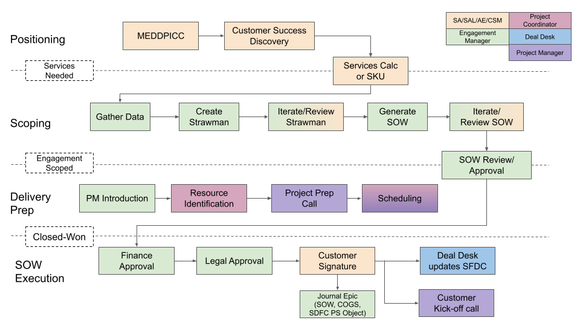
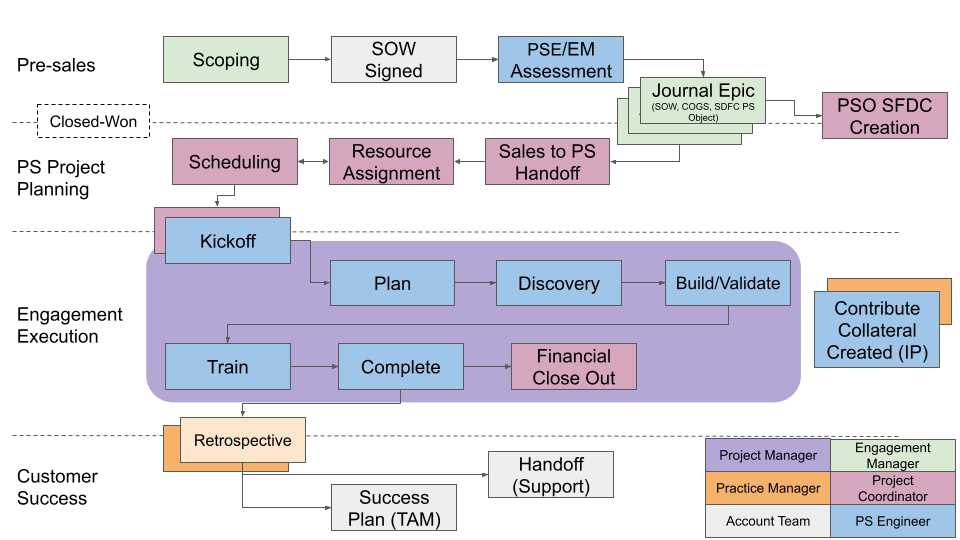

### Professional Services Delivery Methodology (PSDM)

#### Introduction

This guide will provide a high level understanding about the PS Delivery Methodology (PSDM) and the underlying reasoning why we have it and why we want to follow it.

##### What Kind of Engagements is PSDM Suited For?

PSDM is intended to be used on the large, complex, customers ([see archetype definition](./professional-services-delivery-methodology/archetype-definition/_index.md)) that are falling into one of two use case scenarios:

1. **_Large Scale Tool Adoption -_** scaling usage of GitLab across the organization (tool adoption use case), or are
2. **_DevSecOps Transformation -_** assisting customers with transformational activities (transformational use case)

Some characteristics for both use cases include:

* Large customers (Fortune 500)
* Committed to substantial investments in new technologies and personnel, as well as a deep commitment to change at all levels of the organization
* Considering tools adoption and digital transformation a strategic overhaul that seeks to maximize digital tools to improve performance, meet customer expectations, and innovate
* Trying to shorten cycle time, and increase time to market velocity
* Involving changes that **impact people, process, and technology**
* Have been sold on GitLab benefits
  * One platform
  * Simplification of the DIY toolchain and saving on license costs
  * Shift-left security
  * Enhanced developer experience

The difference between the _tool adoption use case_ and the _transformational use case_ lies in the complexity and breadth of the approach.

**Tool adoption** is frequently limited to a set number of users, departments, and work streams, making the application of the methodology more predictable. Tool adoption frequently are multi-workstream engagements that manage parallel efforts of SCM migration, CI/CD transition, Security tool consolidation and workforce enablement and training. This use case is _similar to traditional IT system rollouts_:

1. Install GitLab SM / configure SasS / configure Dedicated
2. Migrate source repositories and user data - in waves
3. Train user in groups
4. CI/CD transition - [DevSecOps Workshop](https://drive.google.com/file/d/1mZm_DiwPdtssFqBolrDqPooaH6kA5Y5u/view?usp=share_link), [CI/CD Workshop](https://drive.google.com/file/d/10RzC-e0fhvgKBRaoZlxEgUQc90Z_0IVR/view?usp=sharing), [DevSecOps App Transformation](https://drive.google.com/file/d/1TDJSVO9uvy4NqC6uksQsSc_sSgEcpacV/view?usp=drive_link), [CI/CD App Modernization](https://drive.google.com/file/d/1ib6-xhja3WJbV_46rU2iDF9I-4I8xo8M/view)
5. Security tool consolidation
6. [Training and Education](https://university.gitlab.com/)

**Transformational** activities frequently involve cross departmental analysis of cycle times, processes, technical architectures and _tying specific technical activities to desired business outcomes_ (see a simple definition for Digital Transformation [here](./professional-services-delivery-methodology/digital-transformation/_index.md)). Transformations frequently _address business goals **and** technology adoption **and** adopting new ways of working in order to achieve step change improvements in **business performance**_. This necessitates transformational activities to be focused on:

1. People
2. Process
3. Technology
4. Continuous Improvement, and
5. Key Performance Indicators - [DORA metrics](https://docs.gitlab.com/ee/user/analytics/dora_metrics.html)

#### Key Principles

##### A Word about Terminology

Just like GitLab in general, Professional Services follows a light-weight, iterative, process. The goal is to be efficient and effective while minimizing administrative burden.

Most agile, iterative, process methodologies (such as Scrum, SAFe, or PMI-DA), define a set of terms and conventions. So does GitLab, and there is a [simple mapping of agile to GitLab terminology](./professional-services-delivery-methodology/agile-to-gitlab-terminology/_index.md) that documents the differences while acknowledging that essentially their meaning is the same.

Because industry parlance and GitLab terminology only differ slightly (for example, the common industry standard term for a time-boxed development cycle is "sprint" or "iteration", whereas GitLab uses the term "milestone") PSDM uses some of the terminology interchangeably.

##### Principles

There are eight (8) key principles to make any GitLab engagement successful. These are generally acknowledged to be industry best practice, and customers that understand and fully embrace these principles are more likely to succeed. This is important for PS to stress with customers before and during engagements.

The key principles are:

1. [Optimize communication](./professional-services-delivery-methodology/optimize-communication/_index.md) – especially focused on executive, buyer, and stakeholder alignment and addressing progress towards business outcomes
2. We iterate and work in Small Batches - with [work conducted according to a cadence and organized in backlogs and iterations / sprints](./professional-services-delivery-methodology/cadence-backlog-sprints/_index.md)
3. Enable ownership and personal accountability
4. [Small Teams](./professional-services-delivery-methodology/small-teams/_index.md) equal better and faster communication
5. Localized decision making – not in terms of geography but team organization
6. Allow for [continuous improvement / continuous learning](./professional-services-delivery-methodology/retrospectives/_index.md)
7. Understand the customers' products, value streams and associated lead (wait) times - critical to optimizing cycle times and achieving business goals
8. Embrace a new way of thinking, planning, and budgeting - instead of waterfall upfront scheduling and budgeting, work through iterative, prioritized deliverables, against a fixed project budget

These principles underly a disciplined 11 step implementation approach.

#### 11 Steps to Success

It is important to point out that GitLab’s PSDM is agnostic to popular implementation and process methodologies and can seamlessly be applied regardless of what the specific customer circumstances are.The steps are:

 1. Identify, document, and conduct an engagement strategy based on the specific customer situation
 2. Build awareness and excitement at all levels - regularly communicate status to all relevant parties: executives, buyers, stakeholders
 3. Identify MVP pilot project(s) - [we always utilize one or more MVPs to prove out our engagement strategy](./professional-services-delivery-methodology/mvp/_index.md)
 4. Train the customer development team(s)
 5. [Develop product backlog and estimates for the engagement](./professional-services-delivery-methodology/cadence-backlog-sprints/_index.md)
 6. [Run iterations / sprints producing incremental value](./professional-services-delivery-methodology/good-user-stories/_index.md)
 7. [Identify metrics - make data centric decisions](https://about.gitlab.com/solutions/value-stream-management/dora/)
 8. [Gather feedback and improve](./professional-services-delivery-methodology/retrospectives/_index.md) – adjust the process
 9. Mature
10. Scale across other teams, programs, portfolios - scale in waves
11. Regularly Assess and Refine

It is recommended to encourage the customer to follow [GitLab Best Practices](./professional-services-delivery-methodology/gitlab-best-practices/_index.md).

##### Iterative Basics

##### 1. Harden Implementation Success in MVP Pilot(s)

Each engagement will successfully deliver one or several [MVP pilot(s)](./professional-services-delivery-methodology/mvp/_index.md) - depending on the size and complexity of the engagement.

MVP Pilot Phases of an engagement consist of:

1. [Discovery](./professional-services-delivery-methodology/discovery/_index.md) - The initial phase to assess capabilities  and validate assumptions to ensure we’re **building the right thing and meeting customer needs**
2. [Team Readiness](./professional-services-delivery-methodology/team-readiness/_index.md) - The process to define people, process and structures to **prepare teams operating in an iterative way**
3. [Sprint 0](./professional-services-delivery-methodology/sprint0/_index.md) - The initial sprint where the **team aligns on norms and objectives, and key technology choices**
4. [Sprinting](./professional-services-delivery-methodology/cadence-backlog-sprints/_index.md) - The execution and delivery process for teams to **deliver the GitLab engagement**

[Scaling](./professional-services-delivery-methodology/scaling/_index.md) up across the organization is achieved by breaking down the overall implementation effort into waves that will be delivered successively - after successful delivery of one or several MVP pilot(s).

##### 2. Integrate Business and IT

Integrating business and IT needs is accomplished through a disciplined decomposition of higher level Vision and Goals into Epics and User Stories, which in turn drive the technical implementation of the customer engagement.Depending on the size and complexity of the engagement, one or several Program Managers are closely coordinating with executive level stakeholders and business sponsors in order to ensure that key business goals are achieved.Lower level technical coordination and tasking is done by one or several projects managers, working with the GitLab TA/PSE Team and the customer sourced Dev Team.

 

##### 3. Adopt GitLab's Consistent Tools

Helping customers adopt the GitLab platform across the entire software development life cycle delivery on two key promises:

1. Achieving significant license savings by replacing a complex DIY tool chain
2. Enabling productivity improvements due to an enhanced developer experience, streamlined collaboration, and reduced context switching

##### 4. Optimize Internal Controls

By optimizing and automating internal controls (sign-offs / approvals), cycle times are significantly reduced and Time to Market windows are shortened. Collaboration is streamlined, context switching is eliminated, and velocity is increased. Overall productivity increases.

 
 
##### 5. Establish Thought Leadership through Continuous Value Delivery and Cost Savings

* GitLab consultants are “catalysts” who show direction and provide coaching
* Focus is on setting up systems for people to work effectively
* Small, autonomous cross-functional teams deliver value constantly using GitLab, we live our values
* Teams are empowered to make decisions and are responsible for end-to-end outcomes
* Our engagements enable customers to conduct production deployments automatically without lengthy approval processes
* Cycle times are greatly reduced and value streams are more optimized
* Cost savings are achieved due to a simplified tool chain using the GitLab platform

<!-- ## PS Process & Methodology Mapped to the Customer Journey

The Professional Services process and methodology fits within the Customer journey that is supported by Customer Success.Professional Services contributes to the customer journey from the point of **SOW Close** through the **Project Closee** phase.

-->](<PS Delivery Customer Journey Flow - Page 1 (11).png>)

<!-- [Source, GitLab Team Members Only](https://docs.google.com/presentation/d/1eC_ocJkzNkH4Vw3v4Vkd3S58a0NALYxXtnb6BZ7pJdc/edit?usp=sharing)

## PS Process Methodology Stages

The above diagram (slide 4) is meant to describe the Directly Responsible Individuals (DRIs), Activities, Outcomes, and Tools/Collateral for each stage of the methodology. We can also see clear categorization of stages in pre-sales and post-sales phases.

In the linked pages below, you can see a detailed drill down into the steps within each stage that individuals use to perform activities to deliver desired outcomes per each stage. These pages are split by the Phase of the selling process (Pre-sales vs Post-sales).

### Scoping (Pre-Sales)

For a more detailed explanation of the steps that comprise each stage of the scoping phase, check out the [Scoping (Pre-Sales)](pre-sales-methodology) page. In this page, we drill down into- and describe- specific steps in each phase of the pre-sales scoping process.

### Delivery (Post-Sales)

For a more detailed explanation of the steps that comprise each stage of the delivery phase, check out the [Delivery (Post-Sales)](post-sales-methodology) page. In this page, we drill down into- and describe- specific steps in each phase of the post-sales delivery process.

 --> -->
