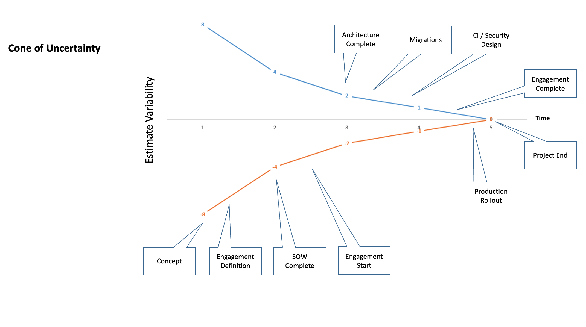
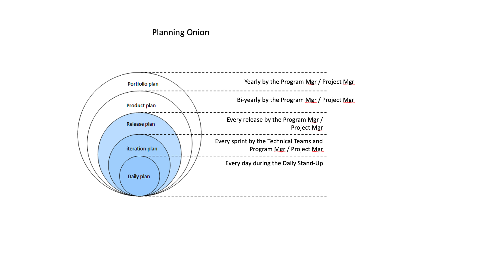
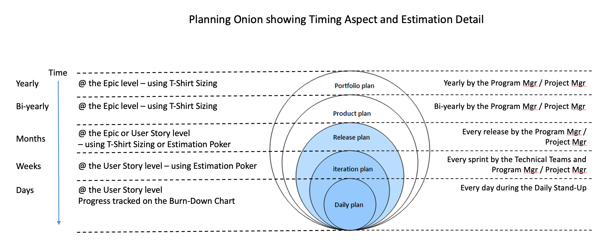
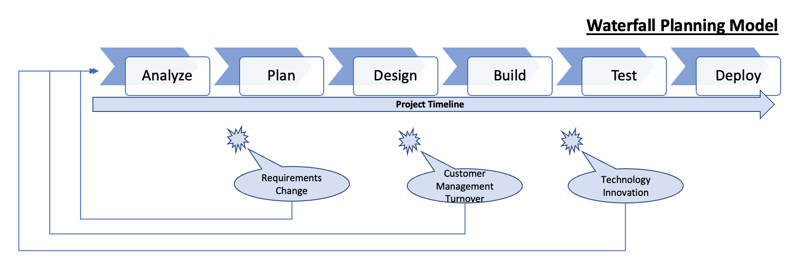
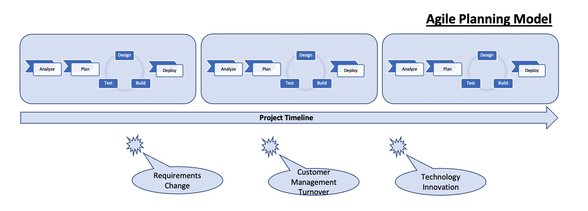
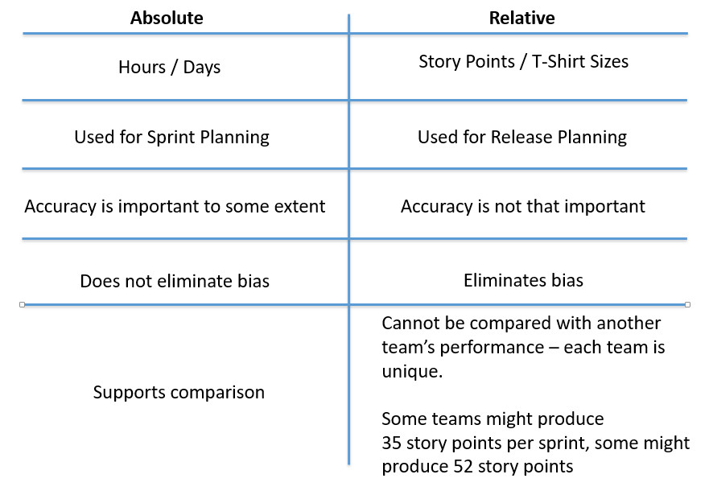
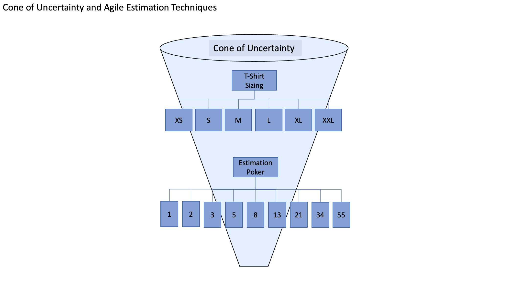
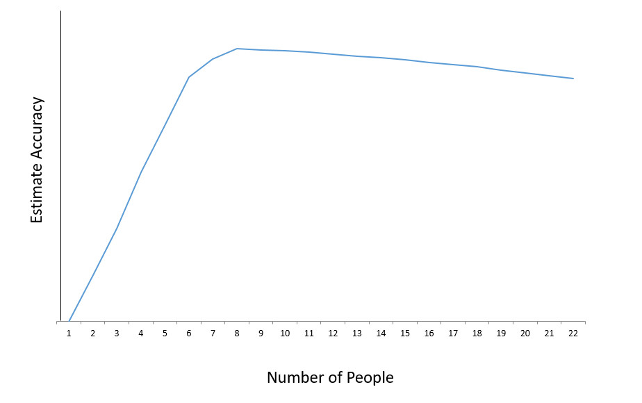
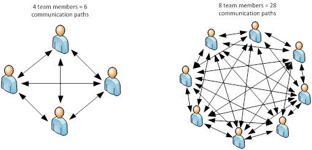

Estimation techniques and approaches is one of the key areas that sets traditional process frameworks, such as Waterfall or V-Model, apart from Agile.

What is often causing confusion are Agile terms such as Story Points, Estimation Poker, T-Shirt Sizing, Velocity – and how all those terms relate to better and more precise estimates.

This brief How-To guide will quickly summarize the key issues addressed in Agile that enable teams to better and more reliably estimate their development efforts.

Note: **We only suggest applying Estimation techniques for Projects over 2 months in duration.**

## Estimating Gitlab Professional Services Projects

We recommend the below t-shirt sizing estimation if the Gitlab and Customer Project teams decides to move forward with applying weight to Gitlab Issues:

* Sm - 1  (0-2 hrs)
* Med - 2   (2-5 hrs)
* Large -3  (5-10 hrs)
* _anything more than 10hrs should be broken into smaller tasks_ 

## Estimation Uncertainty

It is worth noting that the meaning of "estimate" can be

1. to roughly calculate or judge the value, number, quantity, or extent of something \[verb\], and
2. an approximate calculation or judgment of the value, number, quantity, or extent of something \[noun\]

Synonyms include: _calculate roughly, approximate, rough guess_ – hence the slang term "guestimate" – a mixture of guesswork and calculation.

Dwight D. Eisenhower famously said: _"Plans are worthless, but planning is everything. There is a very great distinction because when you are planning for an emergency you must start with this one thing: the very definition of "emergency" is that it is unexpected, therefore it is not going to happen the way you are planning."_[\[1\]](http://file///C:/Users/brian/Dropbox/My%20Documents/Will%20Consulting%20Group/Published%20on%20LinkedIn/Agile%20Estimation%20How%20To/Agile%20Estimation%20How%20To.docx#\_ftn1)

The point is that estimates are never precise, but in project management – especially software / IT project management – estimates regularly are baselined, cast in stone, tracked against, and then cause many political problems because it is perceived that the people that originally estimated the effort got it all wrong.

**_They did not get it wrong, they just did not know enough at the time._**

## Cone of Uncertainty

The Cone of Uncertainty is a project management term used to describe the level of uncertainty existing at different stages of a project.

Whenever you estimate an effort at the very beginning, say at the Concept phase of an idea, you are likely to be magnitudes off in terms of precision. **_This is the point in time our Engagement Managers providing scoping information!_** During the negotiation phase.

As you go through different project phases and you learn more about the actual work and challenges involved, the better (meaning the more closely approximated to the actual work effort) your estimates will become.

**_In short, we become more certain of our estimates as we learn more about what we are estimating._**

**Estimation variability decreases the closer we get to completing the project.**

The only exception to this is if you are working on a process that is 100% understood – a production line is a good example, you know exactly how long the piece will move through different stages on the production line and you can estimate exactly how long it will take to finish one instance of your product.

Production lines usually have been optimized with lots of empirical time measurements, ensuring that each production step runs smoothly. PS engagement are inherently different.

**If you are doing anything that involves uncertainty, creativity, or something that has never been before, the Cone of Uncertainty rules. This applies to most software development and IT projects.**

Even regular IT tasks such as server upgrades frequently take longer than expected – may that be that your system administrator runs out of disk space, experiences an unexpected power outage that corrupts the upgrade, or some other "emergency".

You can automate the process and make it more predictable, such as Amazon Web Services automated server requisitions in the cloud, but this usually requires process standardization which basically means it is not something that involves uncertainty, creativity, or has never been done before – to the contrary, it is something that has been done thousands of time, is known, and is well understood.

## Long and Short Term Planning Horizons

Decreasing estimation variability therefore is dependent on the planning horizon.

If I plan what I am going to do today, I most likely will have a good understanding of what my day looks like, and therefore I can estimate with high probably (or low estimate variability) that I am going to make it to an appointment at 5:00 PM this afternoon.

On the other hand, if I am trying to plan for something 5 months out, the best I can do is put down a reminder – the chances of something unforeseen happening that might change my plans are high. I might get sick, be out of town for unexpected business travel, or need to tend to my parents.

For estimation of software projects, this translates into the traditional "Planning Onion" as follows:

This "Planning Onion" basically works from the outside in to provide ever increasing levels of detail; as such it is closely related to the concept presented in the Cone of Uncertainty.

To reflect the timing aspect and estimation detail, you can think of the "Planning Onion" like this:

Finally, in terms of Agile / Scrum estimation time horizons, you can think of Long Term vs. Short Term planning horizons as follows:

Vision and Roadmap planning are Long Term Horizon activities, whereas Sprint planning falls into the Short Term Horizon activities.

## Planning and Estimation Differences between Waterfall and Agile

So, what are the actual planning and estimation differences between Waterfall and Agile?

From an estimation technique perspective, there is no reason why T-Shirt Sizing or Estimation Poker could not be used on either methodology.

**The main problem with Waterfall is that it attempts to estimate the entire project upfront, thereby committing the project to an unrealistic time line early on, without clearly understanding the scope.**

The following picture shows a traditional Waterfall process with three imaginary (but in my experience very common) "interruptions", which basically reset the project to the beginning.

1. Requirements Change – key requirements changed and force the team back to the Analysis drawing board
2. Customer Management Turnover – your customer / client management or key stakeholders changed and the "new team" wants to provide input (read "new direction") on the project which causes a reset
3. Technology Innovation – new technologies allow for better ways to deliver the project, which forces the team to re-evaluate existing analysis, design, and code and start over

**On waterfall projects, this happens all the time! You reset without delivering value.**

Using Agile on the other hand, you are able to deliver small product increments rapidly. Your planning horizons are shorter, and the Agile team basically commits to delivering a working increment at the end of every sprint.

Even if requirements change mid sprint, the product increment at the end of that sprint will be delivered. New requirements make it into the product backlog to be prioritized for later sprints.

Even if customer / client management or stakeholders change, in Agile / Scrum the project team can demonstrate working software at the end of every sprint, many times lessening the desire to "change direction" (because, after all, it works already!). Any changes requested are logged as additional requirements in the product backlog to be prioritized for later sprints.

Lastly, even technology innovation can be accommodated by including it into the product backlog to be prioritized for later sprints.

**The important thing here is that in Agile, despite interruptions, unexpected developments, and "emergencies", the team keeps delivering working software in the form of product increments at the end of every sprint – delivering real tangible value.**

Contrast that with the Waterfall methodology, where the only value created often is a large set of documents that the team struggles to keep updated.

Delivering working software also creates "facts on the ground" that are harder to ignore or debate about than if the team had merely produced a set of documents.

## Common Estimation Approaches

What are some common estimation approaches and how do they work?

## Absolute vs. Relative Estimation

One key thing to keep in mind is that Agile / Scrum teams use relative estimation. This is because it is relative to the team. What does that mean? Essentially it means that the measurement unit / granularity agreed upon for a task is specific to the Development Team estimating it. Team A could estimate it at 8 story points, Team B might estimate 5 story points. It is relative to the team and a relative estimate does not try to be 100% precise by using absolute measure.

The following picture tries to clarify the differences:

The _absolute_ measure here is milliliters (ml), which is an International System of Units fluid measure. There is no interpretation as to what it means. It is absolute. Wine bottles are classified accordingly.

The _relative_ measure might be the small, medium, large classification used in T-Shirt Sizing or the 3, 5, 8 story point Fibonacci number sequence used in Estimation Poker (more about Estimation Poker in the next section).

The following table compares and contrasts absolute vs. relative estimation techniques:

{width="544" height="380"}

## Estimation Poker

{width="523" height="285"}

As mentioned before, Estimation Poker is a relative estimation technique that favors accuracy over precision. It commonly uses the Fibonacci number sequence (1, 2, 3, 5, 8, 13, 21, 34, 55, …)[\[2\]](http://file///C:/Users/brian/Dropbox/My%20Documents/Will%20Consulting%20Group/Published%20on%20LinkedIn/Agile%20Estimation%20How%20To/Agile%20Estimation%20How%20To.docx#\_ftn2).

The Implementation Team members doing the work have to do the estimates; this is critical. You cannot have people other than the actual Implementation Team estimate the work. This is critical in order to create accountability and make sure the Implementation Team is fully committed to the estimate.

Estimation Poker self-corrects for team idiosyncrasies – meaning two teams might estimate the same work and come up with different estimates because the specific team's composition and skill set might be different.

The following 8 steps describe the basic Estimation Poker process:

### STEP 1

Identify an "anchor story" – the best understood story everybody can agree on and provides a size / effort reference

### STEP 2

Product Owner explains story

### STEP 3

Each Development Team member selects a card (secretly)

### STEP 4

Together, all Development Team members show their cards

### STEP 5

If different, the HIGH and LOW estimators briefly explain their choice and assumptions

### STEP 6

The Product Owner provides additional information, as necessary

### STEP 7

The Development Team iterates the process, up to 3 times, until consensus is reached

### STEP 8

Repeat for all stories that need to be estimated, always keeping the anchor story in mind

A common challenge is that with a Implementation Team of 7 (+/-2), you will experience disagreements. Some people will argue that a user story is a 5, others will bet it is a 13. So, what to do?

### Common Resolution Approaches

There are basically 4 ways to resolve disagreement during the estimation process:

1. You can ask the outliers to plead their case and try to convince the other Development Team members. Basically this is a negotiation back and forth until consensus is reached. This kind of open discussion works well with equally balanced team members but can be challenging with strong , Type A, personalities and unbalanced teams, for example, a team consisting of 3 very strong technical engineers and 4 entry level engineers
2. You can do a silent vote or a Fist of Five consensus model
3. Majority votes are popular because the process avoids conflict, but majority votes usually end up running the risk of creating committee decision where nobody feel responsible – you want accountability, so this is not a good approach
4. You can chose the highest estimate, but this creates the risk of estimate bloat

The best way to resolve disagreements is to have the discussion and all team member agree on the estimate.

Remember that estimation is team specific, and that the estimate is basically the Implementation Team's commitment to deliver based on this estimate – so consensus is important.

All for one, and one for all!

## T-Shirt Sizing and Affinity Estimation

{width="521" height="326"}

T-Shirt Sizing (aka Affinity Estimation) is based upon the need to estimate things quickly without necessarily having all the details available that you usually might require. Here are some examples of how T-Shirt Sizing can be use:

1. For budgeting purposes – when a Vision and Roadmap are being discussed, T-Shirt Sizing can do the trick by having some experienced developers look at the high level asks and sizing it appropriately. The same applies for staffing plans (how many PSEs do we need to hire next year?)
2. When user stories are not available – Program Manager / Project Managers are the detail level domain experts that know what their engagement is supposed to do in detail. During Estimation Poker, the Program Manager explains, discuss, and clarifies each user story. But, the reality is that oftentimes fully fleshed out user stories might not be available yet, nor will the Program Manager sometimes know 6 months ahead of the potential sprint what necessarily has to be developed. Having said that, at a minimum you should have a placeholder subject line for each user story you wish to estimate, for example, "Support HP OfficeJet 9800" – at least developers will quickly be able to grasp what is required in the larger scheme of things without knowing the exact details
3. When you have 2,986 user stories – it is not uncommon for a productive Program Manager / Project Manager to crank out hundreds and even thousands of user stories – at varying levels of detail, some fully fleshed out, and some only with a subject line. Then the challenge becomes the excessive amount of time it would take to estimate all those stories. Do you put your development effort on hold for 6 weeks simply to generate estimates with Estimation Poker?

The answer to these estimation challenges is to use T-Shirt Sizing. In order to have a somewhat comparable scheme between Estimation Poker and T-Shirt Sizing, it is suggested to use the following quantification scheme:

* XS = 1 story point
* Small = 2 story points
* Medium = 3 story points
* Large = 5 story points
* XL = 8 story points
* XXL = 13 story points
* EPIC = Program Manager / Project Manager needs to break down the Epic into more refined User Stories (for example, the EPIC might state something like "Internationalization Support". This needs to be broken down into more detailed user stories like "Provide Support for British English", "Provide Support for Spanish", in order to be able to estimate it)

Then, follow these four easy steps:

### STEP 1

Take 1 minute and have the Development Team agree on a single "small" user story. Repeat with XS, medium, large, XL, XXL, and EPIC sized stories

### STEP 2

Take 10 – 30 minutes and have the Development Team put all remaining user stories into categories of XS, small, medium, XL, XXL, and EPIC

### STEP 3

Take another 10 – 30 minutes and have the Development Team review and adjust user story categorizations as necessary – DONE!

### STEP 4

Have the Product Owner review the categorizations

This 4 step process allows the Development Team to tackle many hundreds of user stories quickly.

Regardless if you are using Estimation Poker, or T-Shirt Sizing, the Cone of Uncertainty still applies. Be aware that using T-Shirt Sizing early in the process will produce estimates with higher variability.

Depending on what you are challenged with estimating, choose the right estimation method:

* Roadmap Planning =\> Use T-Shirt Sizing
* Release Planning =\> Use T-Shirt Sizing or Estimation Poker, depending on the number of user stories
* Sprint Planning =\> Use Estimation Poker

## Estimation Team Size

The estimation team size is determined by the Agile Implementation Team size, which should be 7 (+/-2).

**The people that will do the work, need to be the ones that estimate it.**

Sometimes organizations think that adding more people to the estimation effort will make the estimate better, but that is a commonly accepted fallacy. Larger teams do not produce better estimates:

{width="600" height="377"}

**Estimation accuracy actually decreases with increasing team size.**

Extensive research has been done on team size considerations and it is generally acknowledged that the optimal team size is somewhere between 5 to 8 team members. Some teams have been shown to function well with up to 12 team members. Co-location, offshoring, partnering, and staff qualification all affect the estimation efficiency.

It is worthwhile pointing out, that sports teams are organized around this size (Soccer: 11; Basketball: 5; Baseball: 9; Football: 11). The exception seems to be Rugby, which has 15. Military squads are organized around this size as well.

What is important to understand, both for estimation efficiency as well as team dynamics, is the following:

The bigger the team, the harder it is to effectively communicate, estimate, and come to consensus. The bigger the team, the more likely something will fall through the cracks because of miscommunication. Because most of our PS engagements are conducted remotely, this problem is amplified even more.

This challenge of ever increasing communication paths with larger teams is also somewhat related to the famous "[Dunbar's number](http://en.wikipedia.org/wiki/Dunbar's_number)", which suggested a cognitive limit to the number of people with whom one can maintain stable social relationships (\~150).

## What is Velocity?

Velocity is the rate at which the Development Team can reliably deliver story points (usually packaged into time boxed sprints and resulting in a working product increment).

## Estimates Self-Correct

Using Estimation Poker, estimation variability decreases usually over the course of the first 4 to 6 sprints. I have rarely seen stable teams that did not achieve fairly accurate estimates after working together for 5 to 6 sprints.

Pleases note that "stable teams" is key here – teams need to be stable, meaning team members need to know each other, have worked with each other, and successfully formed a team – following the standard "forming–storming–norming–performing" model of group development, first proposed by [Bruce Tuckman in 1965](http://en.wikipedia.org/wiki/Tuckman's_stages_of_group_development).

These phases are all necessary and inevitable in order for the team to grow, to face up to challenges, to tackle problems, to find solutions, to plan work, and to deliver results. As most of our larger PS engagement will require extensive cross-team communication and collaboration with Customer Development Teams, it is necessary to understand and be aware of team dynamics on the customer side as well.

## Estimate Accuracy and Velocity over Time

Once a Implementation Team has gone through the "forming–storming–norming–performing" process, team velocity is established. Estimation accuracy and predictable velocity allow for longer term forecasting.

**Simply put, if your product backlog contains 450 user stories representing 2,400 story point and your Development Team is delivering at a steady velocity of 60 story points for every 2 week sprint, you are able to predict that the rest of the project will take another 40 sprints, which equals 80 weeks, or roughly 1 ½ years.**

2,400 / 60 = 40 Sprints

40 Sprints x 2 week sprint duration = 80 weeks

80 weeks / 52 weeks in a year = 1.54 years

Accordingly, calculating your burn rate becomes a trivial exercise. Simply multiply your labor cost and overhead by the duration. For example, if you know that your 7 member Development Team costs you $1,529,500 per year ($805,000 for salaries, $724,500 for overhead / fringe benefits, etc.) then you can easily figure out the cost per sprint ($1,529,500 / 26 = $58,827).

**You cannot get any better at forecasting and predictability.**

## Summary

Agile / Scrum estimation using Estimation Poker is an empirical, self-correcting, approach to short term software estimation where user stories are fully defined.

Because it is an empirical approach to project planning, you always know exactly where your project stands at any given time.

T-Shirt Sizing (Affinity Estimation) is used for higher level estimates needed for budgeting, staffing, and other longer term planning activities where not all user stories are defined in all detail and a quick assessment of upcoming work is needed.

[\[1\]](http://file///C:/Users/brian/Dropbox/My%20Documents/Will%20Consulting%20Group/Published%20on%20LinkedIn/Agile%20Estimation%20How%20To/Agile%20Estimation%20How%20To.docx#\_ftnref1) From a speech to the National Defense Executive Reserve Conference in Washington, D.C. (November 14, 1957) ; in Public Papers of the Presidents of the United States, Dwight D. Eisenhower, 1957, National Archives and Records Service, Government Printing Office, p. 818 : ISBN 0160588510, 9780160588518

[\[2\]](http://file///C:/Users/brian/Dropbox/My%20Documents/Will%20Consulting%20Group/Published%20on%20LinkedIn/Agile%20Estimation%20How%20To/Agile%20Estimation%20How%20To.docx#\_ftnref2) By definition, the first two numbers in the Fibonacci sequence are 0 and 1, and each subsequent number is the sum of the previous two
