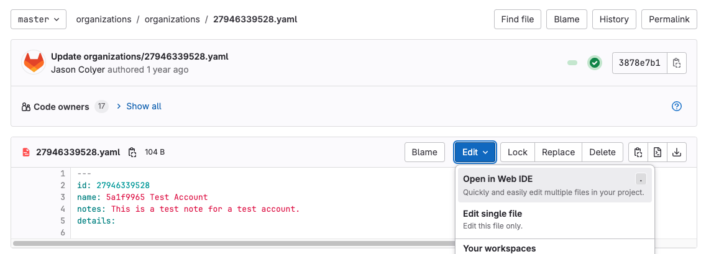

Iteration 0 starts with our internal EM>PS Transition meeting and goes through the Planning and Design Sessions with the Customer. Please reference [Iteration 0 Fundamentals](../iteration-0-fundamentals/_index.md) as we prepare for the following stages.

A reminder to [think big in discovery](../discovery/_index.md) and consider [team alignment for production readiness](../iteration-0-fundamentals/_index.md#engagement-planning). A well-rounded Iteration 0, helps us (and the Customer team) head into the Initial Planning and Design meetings with our customers confidently.

For **Transformational planning** throughout iterations, please [reference here.](../iteration-planning-per-service-offering/_index.md).

[Guidelines for PSDM management](../../_index.md#guidelines-for-psdm)

## EM>PS Transition

We use the [Scheduling Intake issue](https://gitlab.com/gitlab-com/customer-success/professional-services-group/ww-consulting/ps-plan/-/blob/master/.gitlab/issue_templates/SchedulingIntakeQuestions.md?ref_type=heads) as a guide for the meeting, as it will help us map the next steps with our Customers. The Scheduling Intake issue is created and attached to the Customer Epic.

The Delivery team can use [this template](https://docs.google.com/document/d/1bpyhc-a1z573EsyIQtUE-7HS_QauDVmQsHP25PD9i1A/edit) to facilitate the meeting to ensure all points are considered from the Scheduling Intake issue. For larger/Transformation Migrations, please be sure to reference the above.

The output of this meeting is to ensure the Delivery team is prepared, and we have a plan heading into the Customer Kickoff & Discovery & Planning sessions with our customers.

## Stakeholder Planning Meeting

During this meeting, the PM between the GitLab & Customer side meet to review the high level scope, and gather any onboarding material that is still missing. This is an opportunity to meet each other and begin to build trust. Additionally, this is an opportunity to review how we plan to manage the project our of Gitlab, along with a quick overview of our methodology. (review suggested cadences, iteration planning & review, preferred updated for status, etc.) We will take this information to our Customer kickoff and review it with the broader project teams. Please use the [Stakeholder Planning](https://docs.google.com/presentation/d/1vVJQrJeGG-yLAeso_iKkb80H5kE7wStyBAj1sj45sY4/edit#slide=id.g923452f41b_1_5) Meeting template to facilitate this meeting.

The PM will take information from this discussion & the EM\>PS transition process and continue to build out the following for our [Customer Kickoff](https://docs.google.com/presentation/d/1XUljBcQUZgQA-0fhQ5UayiEGtp4Of3xsaFGpVxdoDS4/edit#slide=id.p1):

1. Project Roadmap (workstream overview, use EM timeline as a reference point)
2. Definitions of success
3. Review the project within GitLab (provide collateral as needed) & other tools (Zoom, Slack, etc.)
4. Review & agree on Communication plan (iterations, cadence scheduling)
5. Project Burndown (google sheets)
6. RAID tracking
   1. Risks for discussion
7. Next steps

## Customer Kickoff

Before we enter Project Kickoff, the goal is to confidently be on the same understanding of Project expectations as the Customer. This is why we have spent so much effort gathering the initial information from both the account team & the Customer.

* The template for our Kickoff deck can be found [here.](https://docs.google.com/presentation/d/1XUljBcQUZgQA-0fhQ5UayiEGtp4Of3xsaFGpVxdoDS4/edit#slide=id.p1)
* Our [SteerCO template](https://docs.google.com/presentation/d/1TDKOJeuzR1uy18umu6ovy30l_A986pOEatFn_7eiNbQ/edit#slide=id.g2e563e08cf5_0_1) can be found here.
* It is recommended to use GitLab for Iteration status reporting, but if the customer prefers a deck, please reference this [template.](https://docs.google.com/presentation/d/1jSc5vAID3DMMwojyZnAnOT0aKY2UwDfH2Si-XxEHjLU/edit#slide=id.g2e5808acdbf_0_252)

output: prepared & scheduled Discovery & Planning sessions, and [Iteration Cadences](../iteration-scheduling/_index.md) are confirmed by the Customer

## Prepare Support for Issues and Escalations

To better support our engagement, we can proactively prepare the Support team by providing key project information in advance. This process enables us to pre-populate support tickets with relevant details when a customer opens them during the engagement. Throughout the engagement, product issues, bugs, or unexpected functionality may occur. Additionally, there could be corruption or environment issues on the customer’s side that were not initially scoped into the engagement, requiring involvement from Support or Product teams. By ensuring that pertinent data is readily available, we can streamline collaboration and resolve issues more efficiently as they arise. While this process is critical for any infrastructure-related project, such as implementations, it can also be valuable for other engagements where support issues may occur.

### Getting Access to ZenDesk Ticket System

If you do not have ZenDesk light (Read-Only) open an [Access Request](https://gitlab.com/gitlab-com/team-member-epics/access-requests/-/issues/new?issuable_template=Individual_Bulk_Access_Request) requesting one.

### Creating a ZenDesk Note for Support

1. Find the relavant org `.yaml` find in the [Repository](https://gitlab.com/gitlab-com/support/zendesk-global/organizations/-/tree/master/organizations) by [Searching](https://gitlab.com/search?search=&nav_source=navbar&project_id=27675679&group_id=78867384&search_code=true&repository_ref=master) for the Customer Name (It will be a hash, followed by the name in Salesforce).


1. Create a new Merge Request by Selecting the YAML from Search. Then `Edit > Open in Web IDE`


1. Add the block below after details starting with a pipe "|" (this Character indicates a multi line entry). The fields should be spaced 1 tab from details.
Include the details below and anything else that would be helpful for support to know when engaging the customer.

   ```
   ---
   id: 27946339528
   name: 5a1f9965 Test Account
   notes: This is a test note for a test account.
   details: |
      Project Manager:
      Slack Channels:
      Engineers:
      Start Date:
      Anticipated End Date:
      Summary of Engagement:
      Support should know:
      Project Plan Link:
   ```

1. Commit your changes by clicking the Source Control Button (noted with 1 change) > The drop down arrow > Create new branch and commit.


1. Hit Enter to accept the default branch name (Should by a combination with your user name)

1. Select the Create MR Button on the bottom right of the Web IDE.

1. At the close of the project repeat this step, but remove the contents added after details.
