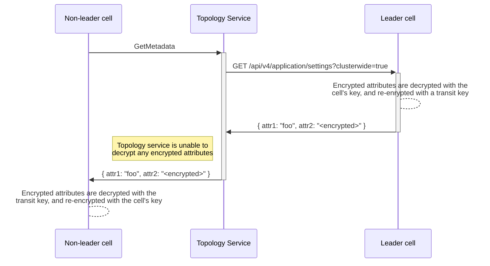
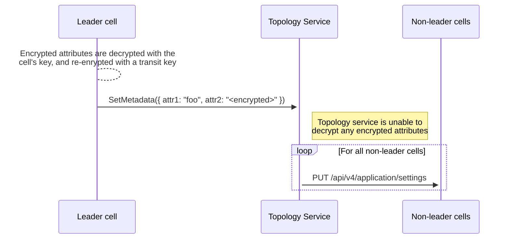

{}
This document is a work-in-progress and represents a very early state of the
Cells design. Significant aspects are not documented, though we expect to add
them in the future. This is one possible architecture for Cells, and we intend to
contrast this with alternatives before deciding which approach to implement.
This documentation will be kept even if we decide not to implement this so that
we can document the reasons for not choosing this approach.
{}

In our Cells architecture proposal we plan to share all admin related tables in GitLab.
This allows for simpler management of all Cells in one interface and reduces the risk of settings diverging in different Cells.
This introduces challenges with Admin Area pages that allow you to manage data that will be spread across all Cells.

## 1. Definition

There are consequences for Admin Area pages that contain data that span "the whole instance" as the Admin Area pages may be served by any Cell or possibly just one Cell.
There are already many parts of the Admin Area that will have data that span many Cells.
For example lists of all Groups, Projects, Topics, Jobs, Analytics, Applications and more.
There are also administrative monitoring capabilities in the Admin Area that will span many Cells such as the "Background Jobs" and "Background migrations" pages.

## 2. Data flow

## 3. Proposal

We will need to decide how to handle these exceptions with a few possible
options:

1. Move all these pages out into a dedicated per-Cell admin section. Probably
   the URL will need to be routable to a single Cell like `/cells/<cell_id>/admin`,
   then we can display these data per Cell. These pages will be distinct from
   other Admin Area pages which control settings that are shared across all Cells. We
   will also need to consider how this impacts self-managed customers and
   whether, or not, this should be visible for single-Cell instances of GitLab.
1. Build some aggregation interfaces for this data so that it can be fetched
   from all Cells and presented in a single UI. This may be beneficial to an
   administrator that needs to see and filter all data at a glance, especially
   when they don't know which Cell the data is on. The downside, however, is
   that building this kind of aggregation is very tricky when all Cells are
   designed to be totally independent, and it does also enforce stricter
   requirements on compatibility between Cells.

The following overview describes at what level each feature contained in the current Admin Area will be managed:

| Feature | Cluster | Cell | Organization |
| --- | --- | --- | --- |
| Abuse reports | ✓ | | |
| Analytics | | ✓ | |
| Applications | | ✓ | |
| Deploy keys | | ✓ | |
| Labels | | ✓ | |
| Broadcast messages | ✓ | | |
| Monitoring | | ✓ | |
| Subscription | ✓ | | |
| System hooks | | ✓ | |
| Overview | ✓ | ✓ | |
| Settings - General (1) | ✓ | ✓ | |
| Settings - Roles and permissions | | ✓ | |
| Settings - Search (1) | | ✓ | |
| Settings - Integrations (1) | ✓ | ✓ | |
| Settings - Repository (1) | ✓ | ✓ | |
| Settings - CI/CD (1) | ✓ | ✓ | |
| Settings - Security and compliance | | ✓ | |
| Settings - Analytics | | ✓ | |
| Settings - Reporting | ✓ | | |
| Settings - Templates | | ✓ | |
| Settings - Metrics (1) | ✓ | ✓ | |
| Settings - Service usage data | | ✓ | |
| Settings - Network (1) | ✓ | ✓ | |
| Settings - Appearance | ✓ | | |
| Settings - Preferences (1) | ✓ | ✓ | |

(1) Depending on the specific setting, some will be managed at the cluster-level, and some at the Cell-level.
The work to determine this is tracked at https://gitlab.com/gitlab-org/gitlab/-/issues/451957.

### 3.1. Abuse reports

Abuse reports should cluster-level data as we want bad actors to be flagged globally on all cells.

### 3.2. Analytics

Analytics are cell-level data, but we could also have cluster-level analytics on the leader cell at some point (definitely not Cell 1.0).

Pages:

- DevOps Reports
- Usage trends

### 3.3. Applications

Applications are cell-level data.

### 3.4. Deploy keys

Deploy keys are cell-level data.

### 3.5. Labels

Labels are cell-level data.

### 3.6. Broadcast messages

Broadcast messages should cluster-level data as we want to notify all users on all cells.

### 3.7. Monitoring

Monitoring are cell-level data.

Pages:

- System information
- Background migrations
- Background jobs
- Health check
- Audit events

### 3.8. Subscription

Subscription is global for a GitLab instance, so it's cluster-level data.

### 3.9 System hooks

System hooks are cell-level data.

### 3.10. Overview

Overview is cell-level data, but we could also have a cluster-level overview on the leader cell at some point (definitely not Cell 1.0).

Pages:

- Dashboard
- Organizations
- Projects
- Users
- Groups
- Topics
- Gitaly servers

### 3.11. Settings (`ApplicationSetting` model)

All `ApplicationSetting` attributes have a definition file under https://gitlab.com/gitlab-org/gitlab/-/tree/master/config/application_setting_columns
where the `clusterwide` key defines if the attribute is cluster-level or not. The definition files are consolidated and exposed in
[a dedicated documentation page](https://docs.gitlab.com/ee/development/cells/application_settings_analysis.html).

A solution will be implemented to synchronize cluster-level attributes from the leader cell to other cells upon update of such cluster-level attributes.
See the [Implementation](#implementation) section below for the details.

#### Admin UI

##### Case 1: non-cell setup or single-cell setup

No change to the Admin UI as cluster-level is equal to cell-level in this setup (since no synchronisation between cells is needed).
In other words, the single-cell is the leader cell so it's possible to edit application settings, and no synchronisation is needed.

##### Case 2: multi-cell setup

**On the leader cell:**

- Show a `cluster-level` / `cell-level` badge next to each setting with a note explaining that sync will happen in the case of a cluster-level setting
- Upon update, if any cluster-level settings were changed, schedule a job that would send a request to the Topology service (see ["Upon attribute update on the leader cell"](#upon-attribute-update-on-the-leader-cell) for details)

Note: It means that an admin who wants to edit a cluster-level setting would need to navigate to the leader cell, which is something that is only possible through
[modifying the session prefix manually](https://gitlab.com/gitlab-org/cells/http-router/-/issues/20#note_2139392832) today.
In the future, we might add a way to navigate to a given cell through the UI.

**On other cells:**

- Hide cluster-level settings and prevent update of any cluster-level settings on the backend. Show a note explaining that cluster-level settings can only be edited on the leader cell.
- Upon update, no synchronisation is needed since only cell-level settings can be changed in this case

#### Synchronisation of cluster-level attributes

Investigation issue: https://gitlab.com/gitlab-org/gitlab/-/issues/451136

##### At cell boot time

When a non-leader cell boots:

1. It sends a request to the [Topology Service](../../topology_service.md) to get all cluster-level attributes from the leader cell
1. The Topology Service sends a request to the leader cell to get all the cluster-level attributes
1. The leader cell responds to the request by sending the Topology Service all the cluster-level attributes ([see below for the handling of encrypted attributes](#special-case-of-encrypted-attributes))
1. The Topology Service forwards the attributes to the non-leader cells
1. Each non-leader cell update its local database with them



##### Periodically

On non-leader cells, a CRON-based background job would perform the same request as the one described above for boot time synchronisation to ensure no settings have drifted.

##### Upon attribute update on the leader cell

When a leader cell updates one ore many attributes at once, a background job is started that:

1. Sends the updated cluster-level attributes to the Topology Service ([see below for the handling of encrypted attributes](#special-case-of-encrypted-attributes))
1. The Topology Service forwards the attributes to each non-leader cell
1. Each non-leader cell update its local database with them



##### Special case of encrypted attributes

Encrypted attributes will need to be encrypted with a transit key that's shared by the leader cell, and the non-leader cells.

Leader cell:

1. Before sending attributes to the Topology Service, each encrypted attribute is decrypted and re-encrypted with the `db_key_transit` transit key
1. Then the leader cell sends the relevant cluster-level attributes to the Topology Service

Non-leader cell:

1. When receiving attributes, each encrypted attribute is decrypted with the `db_key_transit`, and re-encrypted with the current cell
   `db_key_base` (`config.active_record.encryption.primary_key` / `config.active_record.encryption.deterministic_key` depending on
   [the encrypted attributes implementation](https://gitlab.com/groups/gitlab-org/-/epics/15226))
1. Attributes are then updated in the current cell's local database

##### Implementation

Extend Topology Service with `MetadataService` to allow a Cell to publish information in a structured form (protobuf) to the Topology Service.

The interface would be as follows:

```proto
syntax = "proto3";

package gitlab.cells.topology_service;

import "google/protobuf/any.proto";
import "proto/cell_info.proto";

option go_package = "../proto";

message AppSetting {
  string key = 1;
  google.protobuf.Any value = 2;
}

/* Used for "At cell boot time" & "Periodically" */
message GetLeaderCellAppSettingsRequest {
  int64 from_cell_id = 1;
}

/* Used for "At cell boot time" & "Periodically" */
message GetLeaderCellAppSettingsResponse {
  repeated AppSetting app_settings = 1;
}

/* Used for "Upon attribute update on the leader cell" */
message PingCellsForAppSettingsUpdateRequest {
}

/* Used for "Upon attribute update on the leader cell" */
message PingCellsForAppSettingsUpdateResponse {
}

service MetadataService {
  // Called from non-leader cells.
  // -> Asks for cluster-wide application_settings from the leader cell
  // <- Returns cluster-wide application_settings from the leader cell
  rpc GetLeaderCellAppSettings(GetLeaderCellAppSettingsRequest) returns (GetLeaderCellAppSettingsResponse) {}

  // Called from the leader cell.
  // -> Tell non-leader cells to refresh their application_settings
  // <- Returns success of pings
  rpc PingCellsForAppSettingsUpdate(PingCellsForAppSettingsUpdateRequest) returns (PingCellsForAppSettingsUpdateResponse) {}
}
```

## 4. Evaluation

## 4.1. Pros

- No changes required in a non-cell setup
- Synchronization is both pull (from non leader-cell) and push (from leader cell)
- Clear protocol with `protobuf`
- Minimal changes to the Admin UI: hide cluster-level attributes on non-leader cells, and show cluster-level/cell-level badges on leader cell

## 4.2. Cons

- No database-level replication (impossible since we need to decrypt/re-encrypt data between cells)
- Impossible to change cluster-level attributes on non-leader cell
