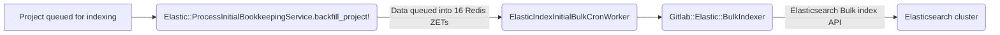
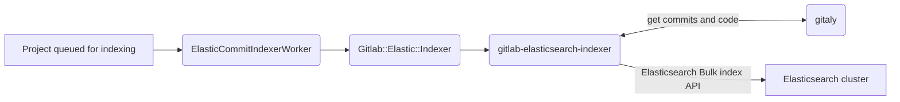
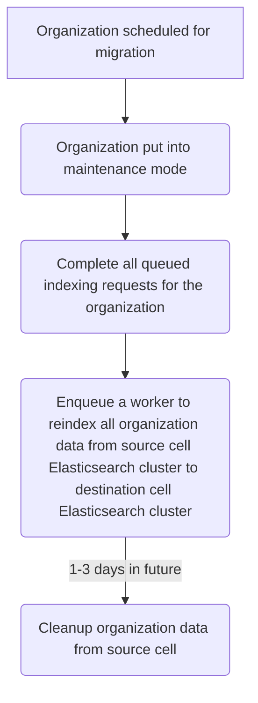

{}
This document is a work-in-progress and represents a very early state of the
Cells design. Significant aspects are not documented, though we expect to add
them in the future. This is one possible architecture for Cells, and we intend to
contrast this with alternatives before deciding which approach to implement.
This documentation will be kept even if we decide not to implement this so that
we can document the reasons for not choosing this approach.
{}

When we introduce multiple Cells, we intend to isolate all services related to those Cells. These main areas will need support for cells:

1. Infrastructure maintenance
2. Index maintenance 
3. Organization migration

## 1. Definition

The [Advanced search functionality](https://docs.gitlab.com/ee/user/search/advanced_search.html) allows users to search across the entire GitLab instance. Advanced search supports Elasticsearch and OpenSearch as the search backend.

### Infrastructure and index maintenance

Infrastructure maintenance tasks include Elasticsearch cluster version upgrades, scaling the Elasticsearch cluster, and support for incident root cause analysis and resolution. 

Index maintenance tasks include index shard resizing using the Zero-downtime reindexing feature or Split shards Elasticsearch API, enabling the Elasticsearch slowlog, or cleaning up reverted migrations from the Advanced search migrations index.

Today, most infrastructure and index maintenance tasks are performed manually by the Global Search team through the  [change request workflow](../../../../change-management.md/#change-request-workflows).

### Organization migration

Advanced search will need to support organizations being moved from one cell to another.

## 2. Data flow

### Organization migrations

Indexing a namespace or project utilizes indexing pipelines to index database records, git data, and embeddings. 

#### Database records

PostgreSQL records are indexed by queueing items into 16 Redis sorted ZSETs. A cron worker runs every minute and indexes a max of 1,000 records per ZSET for a total of 16,000 records per run. Records are indexed into Elasticsearch using the Bulk Index API. 

Initial indexing (when a namespace or project is first added to Advanced search), incremental indexing (when an indexed record is updated), and embeddings indexing are handled by separate ZSETs.

Today, there is no record of when database records indexing is completed. The mermaid chart below shows the initial indexing pipeline. The incremental and embeddings indexing pipelines have the same workflow.

#### Git data

 Non-PostgreSQL data (Code, Wikis, and Commits) are indexed using a separate indexing pipeline. Indexing status for code and wikis are stored for projects (`IndexStatus` model) and groups (`GroupIndexStatus` model) in the database.

#### Problems to solve

1. Indexing can only be paused at the instance level - indexing for every data type is paused. This will cause out of date search results on a cell if indexing is paused to migrate organization(s).

1. There is no way to know when a project's database records are fully indexed. It is not possible to know when an organization migration is complete for Advanced search.

1. The indexing pipeline could take a long time for large organizations (See [gitlab#48037](https://gitlab.com/gitlab-org/gitlab/-/issues/48037).  [Organization migration goal](../migration.md#goals) for Cells 1.0 is 24 hours, but ideally 0 for Cells 2.0.

## 3. Proposal

### Infrastructure and index maintenance

All index maintenance tasks will be initially be completed using the [Advanced search migration framework](https://docs.gitlab.com/ee/development/search/advanced_search_migration_styleguide.html). Once the migration process is verified, all index maintenance migrations will be migrated by CronWorkers. There should be a CronWorker per maintenance task:

1. Shard resize will review and adjust each index
1. Cleanup any migrations from the migrations index that do not exist in codebase
1. Enable slowlog if an ops feature flag (or application setting) is enabled

All infrastructure maintenance must be automated. We may consider using the migration framework, but other methods should be evaluated. 

To support this, the following is required:

* The indexing paused framework must be modified to allow [pausing indexing for a specific index](https://gitlab.com/gitlab-org/gitlab/-/issues/381705). This allows maintenance tasks to be performed on an index basis which reduces impact to Sidekiq, Redis, and user experience.
* Search and indexing validations must be automated.

### Organization migration

There are multiple ways to approach organization migration and each comes with a set of trade-offs

#### Use Elasticsearch APIs to move data

Organization migration could be automated with the [Elasticsearch Reindex API](https://www.elastic.co/guide/en/elasticsearch/reference/current/docs-reindex.html) to move all indexed data for an organziation to the new cell's Elasticsearch cluster. The API supports moving data between two different clusters (or hosts).

To support this, the following is required:

* The indexing paused framework must be modified to ensure that all queued indexing requests are completed once an organization is put into "maintenance mode". This is needed to ensure all indexed data is up to date before the migration.

Proposed workflow:

#### Pros

1. No additional load on GitLab instance including Sidekiq, Gitaly, and PostgreSQL.
1. Know exactly when indexing is complete.

#### Cons

1. Requires Elasticsearch as the search cluster.
1. Database ID values must remain consistent between cells. Cluster wide unique database sequences are [planned for Cells](../decisions/008_database_sequences.md).

#### Use existing indexing framework

Organization migration could be automated by using the existing indexing framework. Once an organization is put into maintenance mode and all PostgreSQL and gitaly data has been moved, the organization can be queued for indexing in the destination cell.

To support this:

#### Pros

1. Cells can use any search cluster type and version.
1. Existing framework is well tested and understood by team members.

#### Cons

1. Indexing may take too long for organizations. We need to benchmark different organization sizes.
1. There are no indicators when indexing is complete for database records. Organizations will have missing search results until indexing is complete.
1. Additional load on GitLab instance including Sidekiq, Gitaly, and PostgreSQL. Other Sidekiq jobs in the cell will impact indexing completion.

## 4. Evaluation

## 4.1. Pros

## 4.2. Cons
