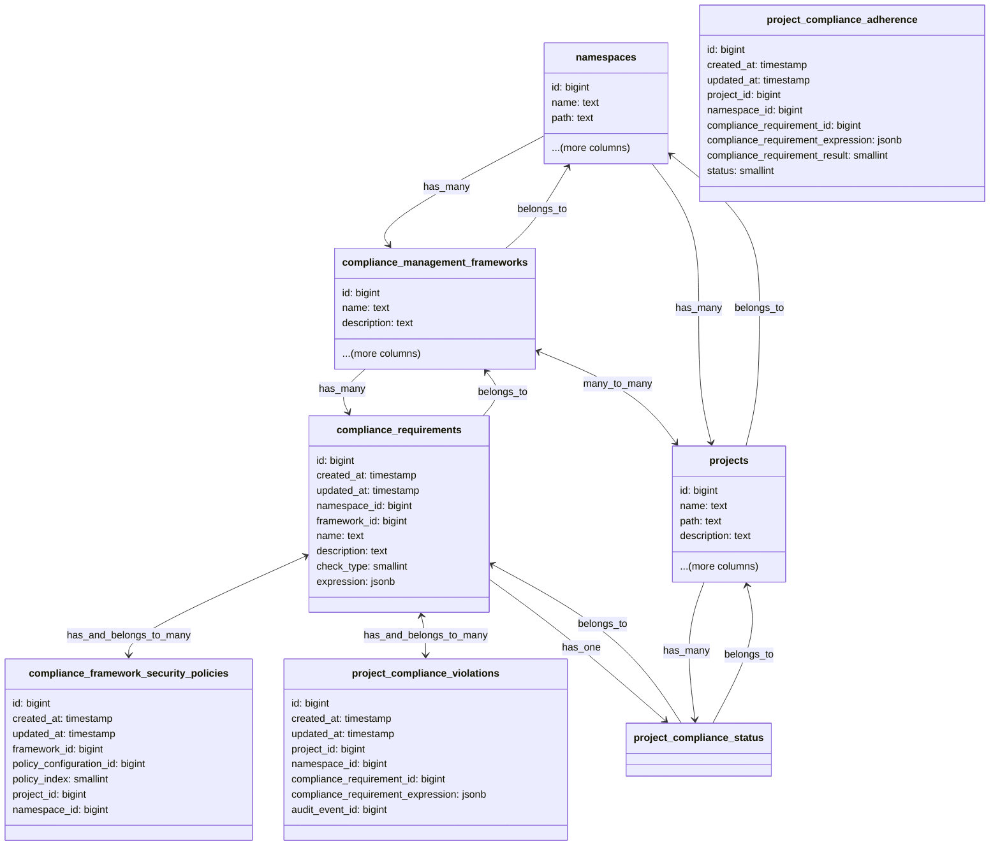

## Context

While the adherence report states the current state of a project against the configured framework and requirements/controls,
it does not show a history of the state. Most importantly it does not show where the project might not have been adhering
and there was a violation of the requirement/control.

## Approach

The violation engine is similar to the configuration checks engine, at certain trigger points the system will audit that 
the event does not violate any configured complaince requirments/controls. 

For each control defined in GitLab there will be a event trigger point. When this event is triggered for a project the violation engine will check whether the project has a compliance framework configured with that requirement controls. If the project does have this configured then the event will be logged as a violation.

For example when a Merge Request is merged the system will trigger a potential violation event. The violations engine will check if there is a control defined for the project which states all Merge Requests requiring 2 approvers, if the Merge Request has less then 2 then a violation is created from the event.

Trigger points that would generate potential violation events:

1. Creating/Editing a Project
1. Creating/Merging an MR
1. Creating/Editing an Issue

## Design Details

