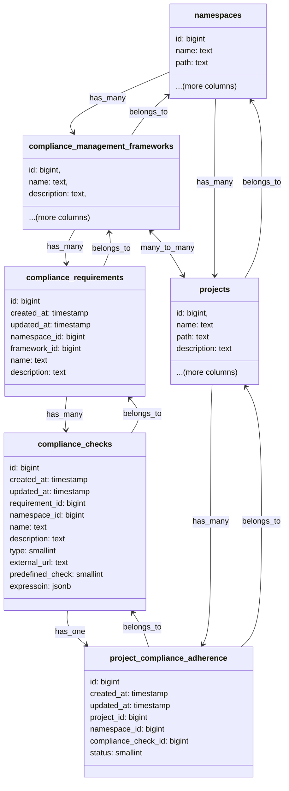

## Context

We want the ability to create custom checks so that users don't need to rely only on the exhaustive list of checks that
GitLab supports or would support in the future. Users could also have external services that might impact
whether their projects are compliant to a standard or not.

## Approach

To allow users to create checks on their own as per their requirements we need to have the following types of checks:

1. [Custom checks](#custom-checks): Enable users to create logical expressions with the all the available project settings.
1. [External checks](#external-checks): Enable users to create checks that rely on their external services like HTTP servers.
1. [Predefined checks](#predefined-checks): These checks are defined by GitLab, like "At least two approvals".

### Custom checks

1. We would allow users to create logical expressions with all the available project settings. These expressions would
be the checks against which the projects would be evaluated.
1. We would store these as a structured JSON in the compliance_checks table with 'custom' as the type.
1. As an example: Consider expression `'merge_method' = 'merge commit' AND ('project_name' LIKE "%-team" OR 'compliance_framework' != 'SOC2')`.
This expression will be saved in the database as JSON with the following structure:

```json
{
  "operator": "AND",
  "conditions": [
    {
      "field": "merge_method",
      "operator": "=",
      "value": "merge commit"
    },
    {
      "operator": "OR",
      "conditions": [
        {
          "field": "project_name",
          "operator": "LIKE",
          "value": "%-team"
        },
        {
          "field": "compliance_framework",
          "operator": "!=",
          "value": "SOC2"
        }
      ]
    }
  ]
}
```

1. We would create schema validators for validating the input and store these in the `expression` jsonb column of the
`compliance_checks` database table.
1. We would have a UI on the frontend with dropdowns to choose the field, operator and values. This is created so that
the users don't have to write complex JSON expressions on their own.
1. The above JSON would be parsed using an evaluator and the expression would be evaluated to true or false. A basic
evaluator class would look like:

```ruby
class QueryEvaluator
  def initialize(query, project)
    @query = query
    @project = project
  end

  def evaluate
    evaluate_node(@query)
  end

  private

  def evaluate_node(node)
    if node['operator']
      evaluate_operator_node(node)
    else
      evaluate_condition(node)
    end
  end

  def evaluate_operator_node(node)
    results = node['conditions'].map { |condition| evaluate_node(condition) }

    case node['operator'].upcase
    when 'AND'
      results.all?
    when 'OR'
      results.any?
    else
      raise "Unknown operator: #{node['operator']}"
    end
  end

  def evaluate_condition(condition)
    field_value = get_field_value(condition['field'])

    case condition['operator']
    when '='
      field_value == condition['value']
    when '!='
      field_value != condition['value']
    when 'LIKE'
      field_value.to_s.match?(like_to_regex(condition['value']))
    else
      raise "Unknown condition operator: #{condition['operator']}"
    end
  end

  def get_field_value(field)
    case field
    when 'merge_method'
      @project.merge_method
    when 'project_name'
      @project.name
    when 'compliance_framework'
      @project.compliance_management_frameworks.map { |f| f.name }
    else
      raise "Unknown field: #{field}"
    end
  end

  def like_to_regex(pattern)
    regex_pattern = Regexp.escape(pattern).gsub('%', '.*')
    Regexp.new("^#{regex_pattern}$", Regexp::IGNORECASE)
  end
end
```

1. We can then use the above evaluator on the stored JSON expression:

```ruby
evaluator = QueryEvaluator.new(query, project)
result = evaluator.evaluate # Returns true or false
```

### External checks

1. We would store the external HTTP/HTTPS URLs for the user's external services in the compliance_checks table with
'external' as the type.
1. We would POST the latest project settings to these external services and expect a boolean status as the response.

### Predefined checks

1. These checks are similar to the existing ones and would be created by GitLab. These would be stored in the
compliance_checks table with 'predefined' as the type.

## Workflow



1. We would update the existing table `compliance_checks` with the above schema.
1. We would create a new table `project_compliance_adherence` to store the results of the checks.
1. Unlike the current implementation we would only store results for compliance checks for the projects that have
compliance requirements and checks configured.
1. Any update to the project setting or group settings that are cascaded to the project will serve as the trigger point
and we would re-calculate the result of all the checks for that project. This means that we now need a relationship
between `compliance_checks` and `project_compliance_adherence` database tables.
1. We would query the rows in the `project_compliance_adherence` table for the given namespace and display the results
on the adherence dashboard.

## Constraints

1. We should limit the maximum number of compliance frameworks a project can have.
1. We should limit the maximum number of compliance requirements a framework can have.
1. We should limit the maximum number of compliance checks a requirement can have.
1. Without the above limitations it would be very easy for users to abuse our system leading to query timeouts
and poor user experience.

## Decision

TBD
