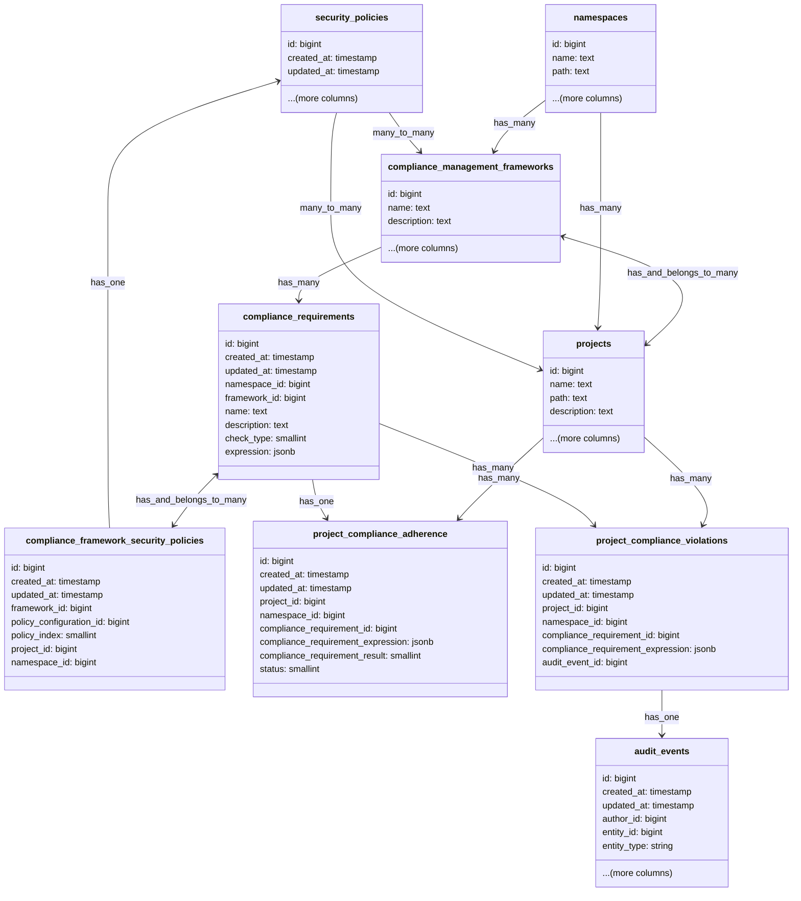

## Context

While the adherence report states the current state of a project against the configured framework and requirements,
it does not show a history of the state. Most importantly it does not show where the project might not have been adhering
and there was a violation of the requirement.

## Approach

The decision has been made to use audit events and store if at the time of the audit event the project was in violation
of the requirement.

Audit events will be created for all the possible compliance checks in GitLab. When an audit event for a project is
triggered the system will assess all the configured checks for that project and if there is a requirement for that
audit event it will store a connection between the compliance check and the audit event.

## Design Details

