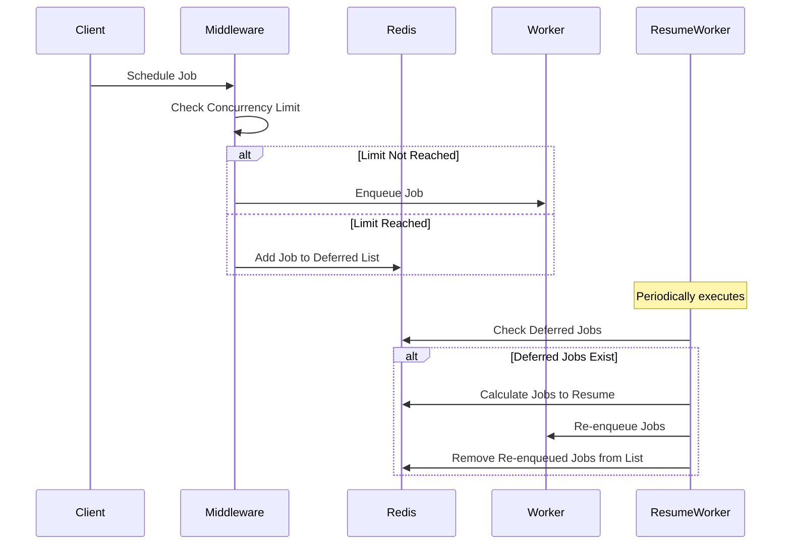

<!-- Design Documents often contain forward-looking statements -->

<!-- This renders the design document header on the detail page, so don't remove it-->


## Summary

The Concurrency Limit Middleware is a Sidekiq middleware designed to control the concurrency of specific Sidekiq workers.
By limiting the number of concurrent jobs a worker can execute, we prevent system overloads and ensure reliable operations across both
.com and self-managed instances.

## Overview

The middleware intercepts job scheduling and execution to enforce concurrency limits. When the number of concurrent jobs exceeds the defined limit,
additional jobs are deferred and stored in a separate Redis list. A dedicated cron worker, `ConcurrencyLimit::ResumeWorker`,
periodically checks and re-enqueues deferred jobs when the concurrency falls below the limit.

## How It Works

### Job Scheduling and Execution Flow

When a job is scheduled or executed, the middleware checks if the concurrency limit has been reached:

1. **Job Scheduling**:
   - If the limit is not reached, the job is scheduled as usual.
   - If the limit is reached, the job is deferred and added to a Redis list.

2. **Job Execution**:
   - If the limit is not reached, the job is executed.
   - If the limit is reached, the job is deferred and added to the Redis list.

### Resuming Deferred Jobs

The `ConcurrencyLimit::ResumeWorker` periodically:

1. Checks if there are deferred jobs.
2. Determines the number of jobs that can be re-enqueued based on the current concurrency.
3. Re-enqueues the allowed number of jobs.
4. Updates metrics and cleans up stale execution trackers.

### Flow Diagram

Below is a sequence diagram illustrating the middleware's operation:

## Setting Up Concurrency Limits

In order to see how the concurrency limit can be configured please follow this [documentation section](https://docs.gitlab.com/ee/development/sidekiq/#concurrency-limit).

## Prometheus Metrics

The middleware exposes the following Prometheus metrics to monitor its operation:

- `sidekiq_concurrency_limit_deferred_jobs_total`: Total number of jobs deferred.
- `sidekiq_concurrency_limit_queue_jobs`: Current number of jobs in the deferred queue.
- `sidekiq_concurrency_limit_max_concurrent_jobs`: Maximum number of concurrent jobs allowed.

## Considerations

- **Sustained Overload**: If there is a sustained workload over the limit, the deferred job list will grow indefinitely until the workload decreases or the limit is adjusted.
- **Zero or Negative Limits**:
  - If the limit returns `nil` or `0`, the concurrency limit is not applied.
  - Negative values pause job execution entirely.

## Future iterations

### Allowing to group workers

### Allowing to specify limits for a set of arguments
