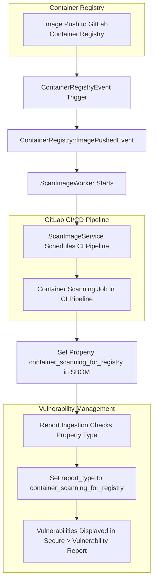



## Summary

The Container Scanning for Registry feature enables the automatic execution of a container scanning job whenever a new image is pushed to the GitLab container registry. This feature helps in identifying vulnerabilities in container images early in the development process. More details about the feature can be found in the GitLab documentation.

## Design and implementation details

### Working

1. **Trigger**: When a new image is pushed to the GitLab container registry, a CI pipeline is automatically created with a container scanning job.
2. **Report Generation**: The reports generated by this job are marked with the report type `container_scanning_for_registry`.
3. **Vulnerability Reporting**: The vulnerabilities identified by this job are displayed in a dedicated tab under the Secure > Vulnerability Report page called "Container Registry Vulnerabilities".

### Implementation Details

#### Event Triggering

- **Event Class**: When a new image is pushed to the container registry, an event is fired using the class `ContainerRegistryEvent`. 
  - **Source Code**: [ContainerRegistryEvent](https://gitlab.com/gitlab-org/gitlab/-/blob/master/lib/api/container_registry_event.rb)

#### Image Pushed Event

- **Condition**: If the image tag is a supported tag and the necessary permissions and licenses are present, it publishes another event called `ContainerRegistry::ImagePushedEvent`.
  - **Source Code**: [ImagePushedEvent](https://gitlab.com/gitlab-org/gitlab/-/blob/master/ee/lib/ee/gitlab/event_store.rb#L63)

#### CI Pipeline Creation

- **Worker**: The `ImagePushedEvent` triggers the `ScanImageWorker`, which schedules a CI pipeline via the `ScanImageService`.
  - **Source Code**: [ScanImageService](https://gitlab.com/gitlab-org/gitlab/-/blob/master/ee/app/services/app_sec/container_scanning/scan_image_service.rb#L28)

#### Container Scanning Tool Configuration

- **Environment Variable**: Based on the CI environment variable `REGISTRY_TRIGGERED: true`, the container scanning tool sets the GitLab property name to `container_scanning_for_registry` in the SBOM (Software Bill of Materials).
  - **Source Code**: [SBOM Converter](https://gitlab.com/gitlab-org/security-products/analyzers/container-scanning/-/blob/master/lib/gcs/sbom_converter.rb#L14)

#### Report Ingestion

- **Property Check**: During report ingestion, the system checks the property type and sets the `report_type` to `container_scanning_for_registry`.
  - **Source Code**: [CycloneDX Properties Parser](https://gitlab.com/gitlab-org/gitlab/-/blob/master/lib/gitlab/ci/parsers/sbom/cyclonedx_properties.rb#L21)

#### Vulnerability Creation

- **Report Type**: During the creation of vulnerabilities, the `vulnerability#report_type` is set to `container_scanning_for_registry`. This report type filter is used by the frontend to distinguish these vulnerabilities from other types.
  - **Source Code**: Vulnerability creation logic follows similar patterns within the system.

---

This architecture design document outlines the key components and workflow for implementing the Container Scanning for Registry feature in GitLab. Each step is detailed with corresponding source code links for further reference.

## Outline of the diagram

1. **Image Push Event**:
   - When a new image is pushed to the GitLab Container Registry.

2. **ContainerRegistryEvent Trigger**:
   - The `ContainerRegistryEvent` class fires an event.

3. **ContainerRegistry::ImagePushedEvent**:
   - If the image tag is supported and permissions are valid, it triggers the `ContainerRegistry::ImagePushedEvent`.

4. **ScanImageWorker**:
   - `ImagePushedEvent` starts the `ScanImageWorker`.

5. **ScanImageService**:
   - `ScanImageWorker` schedules a CI pipeline via `ScanImageService`.

6. **Container Scanning Job**:
   - CI pipeline includes a container scanning job.

7. **SBOM Configuration**:
   - Based on `REGISTRY_TRIGGERED: true`, sets the property `container_scanning_for_registry`.

8. **Report Ingestion**:
   - During ingestion, sets `report_type` to `container_scanning_for_registry`.

9. **Vulnerability Report**:
   - Vulnerabilities are displayed in the Secure > Vulnerability Report page under "Container Registry Vulnerabilities".

### Architecture Diagram

I'll create the diagram using a text-based diagram tool like Mermaid.js for easy representation.

This diagram captures the flow from the moment an image is pushed to the registry, through the event handling and CI pipeline, to the reporting and display of vulnerabilities. The various classes and services involved are highlighted at each step, providing a clear overview of the architecture.
