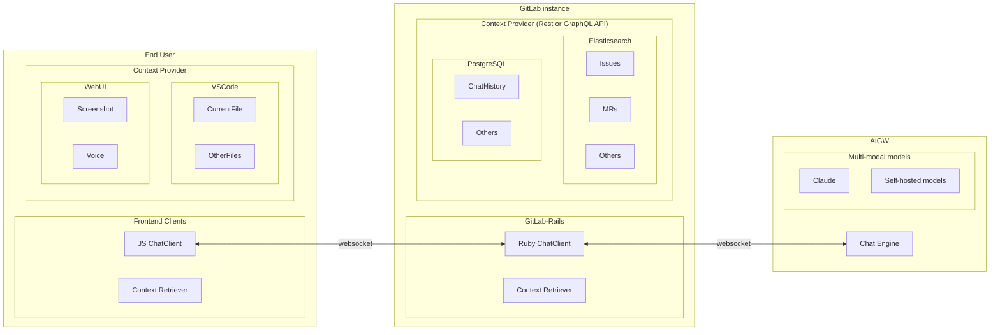

<!-- vale gitlab.FutureTense = NO -->


## Summary

This blueprint is to revamp Duo Chat architecture to make it competitive against the competitors. It addresses outstanding issues, such as multimodality, vision/audio support, advanced contexts, UX improvements, quality improvements, stability/resiliency improvements and performance/latency improvements.

## Motivation

Chat models were introduced for having a role-based conversation with a large language model. It's one of the most essential features to take advantage of transformer models, such as GPT, BERT, and Claude. These models are based on the revolutionary paper [Attention Is All You Need](https://arxiv.org/abs/1706.03762) that introduced the self-attention mechanism to understand the context better than the traditional RNN architecture.

However, Duo Chat has not fully unleashed the potential of the transformer models yet.

One of the issues is that Duo Chat has an additional layer to imitate agentic behavior for generating a response. Agents are a popular topic in the AI field, attempting to achieve AGI (Artificial General Intelligence) by leveraging transformer models, like [AutoGPT](https://github.com/Significant-Gravitas/AutoGPT), [BabyAGI](https://github.com/yoheinakajima/babyagi), and [ChatDev](https://github.com/OpenBMB/ChatDev). In fact, Duo Chat uses [ReAct](https://arxiv.org/abs/2210.03629) to have reasoning and acting capability. However, this approach often has drawbacks such as unpredictable behaviors. This is because transformer models don't have such capability at the neural network level. Despite model providers improving reasoning capability on top of the transformer models with a handful of demos, we have not seen a true successor at the same level as the transformer revolution in these AGI proposals yet.

We should unleash the true strength of transformer models in order to provide a superior chat experience that assists user's daily tasks.

### Goals

- Advanced contexts:
  - Users seem to expect that Duo Chat can answer every question about any data in GitLab. However, chat can only answer questions about 4 different things in GitLab: an epic, an issue, selected code, or gitlab documentation. Even worse, answers to such in principle supported questions disappoint users too often, e.g. 26% of answers to docs-related questions were rated poor by bash participants.
  - Growing the scope of supported context in GitLab has shown to be laborious. There is not only the engineering work to build a context retriever but also the research work to find user questions that can be turned into test cases, running tests and tweaking prompts to achieve good results.
  - Also, improving the answers to questions with supported context has shown to be difficult. While for instance our automated tests for docs-related questions suggest that only 4.7% of questions are answered poorly actual users rate 26% poorly which hints to a poor calibration of the test system.
  - Currently, the users lack transparency of which context is automatically added to their prompt. The only place where they could find this is the documentation.
  - Beyond transparency they might appreciate control to influence the predictions for better results.
  - Access control: users cannot use the chat to gain access to content that they don't have access to as chat uses the user token to fetch context. This needs to be maintained even with more elaborate RAG using elastic search.
  - Governance: project/group owners can turn off the use of AI on their data. This needs to be maintained even with more elaborate RAG using elastic search. (Consider also the case that AI use was turned on, data was embedded, and then was turned off.)
  - All access: The contectual data that can be accessed by the user, Duo Chat can retrieve the data for context stuffing.
  - Access control: Contexts are configurable to keep out unrelated or sensitive contents regardless of permission.
  - Pluggable contexts: 
  - Semantic/Keyword search: 
  - REST API/GraphQL access: 
  - The context window is the main differentiator to generate a quality response. The new context retriever has access to all authorized information. Also, these contexts are customizable per user, as each 
  persona requires a different knowledge base.
  - Private channel: Each conversation is encrypted in a websocket channel. Eliminating attack vectors that malicous actors can't gain access to unauthorized data.
  - Secure: Context will be retrieved via REST/GraphQL APIs to ensure that requests always go through authentication and authorization. We don't reinvent the wheel.
- Multimodality:
  - Speech-to-text: Users can speak to Duo Chat as well as type a text message.
  - Vision: Users can share an image as context (e.g. a screenshot), which contains primary information of "what the user sees currently".
  - Text-to-speech: Duo Chat can answer in audio as well as send a text message.
- Quality/Resiliency improvements:
  - Multiple threads: Users can create a new chat thread for each topic. Currently, we mix multiple topics in one thread, thus negatively affecting the model performance.
  - Predictable execution: Have an advanced RAG pipeline that executes processes deterministically, instead of the undeterministic execution of ReAct.
- Performance improvements:
  - Parallel retrievals: Context retrievals are performed in parallel, not sequentially like ReAct. We use more context in shorter latency.
- Intuitive UI/UX: Users can access Duo Chat instantly from anywhere.
- Maintainability: Easy-to-read code. Easy to investigate issues in production. By anyone.
- and most importantly, high active user base.

### Non-Goals

- Agentic behavior is out of scope. It's now part of [Duo Workflow](https://docs.gitlab.com/ee/architecture/blueprints/duo_workflow/).

<!--
Listing non-goals helps to focus discussion and make progress. This section is
optional.

- What is out of scope for this blueprint?
-->

## Proposal

### Maximize the power of machine learning

We often see LLMs as black-boxed / super agents that are capable of doing any tasks.

One of the key factors to have a high-quality chat feature is to feed only relevant context to a chat model.
By design, transformer models excel at retriveing semantic meaning from prior tokens during a new token prediction (See [this excellent visualization by Grant Sanderson](https://www.youtube.com/watch?v=wjZofJX0v4M)).
This is the reason why 3rd model providers provide a guidance for prompt engineering that we should give a clear instruction to a model ([example](https://docs.anthropic.com/en/docs/build-with-claude/prompt-engineering/overview#before-prompt-engineering)).
Feeding relevant tokens will update a self-attention head (a.k.a. context window) to minimize the gap between model's prediction and user's expectation, which gains the likelyhood of giving a satisfying answer.

With keeping this model architecture in mind, we can sketch out product as following:

- When a user starts a conversation, create a new chat thread. Each chat thread should be separated per topic. Mixing unrelated topics could lead to a quality degredation.

Build features based on in-context learning and NLP tasks

### Advanced RAG

For more information, see [Retrieval Augmented Generation (RAG) for GitLab](https://docs.gitlab.com/ee/architecture/blueprints/gitlab_rag/).

### Bi-directional communications between clients and chat engine

Overview:



#### Messages

1. JSChatClient initiates a websocket connection with GitLab-Rails.
2. RubyChatClient initiates a websocket connection with AI Gateway.
3. JSChatClient packs relevant context and sends it with a user's message.
4. RubyChatClient appends relevant context to the message and relays it to AI Gateway.
5. AI Gateway unpacks the message and context and stuffs it into a RAG prompt. Get a completion result from LLM as a response.
6. Grade the response if the generated answer is satisfying for users. i.e. Corrective-RAG.
    1. If the response is satisfying, it returns the response as-is.
    2. If the response is not satisfying, AI Gateway requests to fetch additional context from downstream.

#### JSON Schema

```json
{
  "$schema": "https://json-schema.org/draft/2020-12/schema",
  "title": "Message",
  "description": "A message that is exchanged between ChatEngine and clients",
  "type": "object",
  "properties": {
    "messageType": {
      "description": "Type of the message",
      "type": "string",
      "enum": ["input", "request_context", "response"]
    },
    "sentAt": {
      "description": "When the message was sent",
      "type": "date-time"
    },
    "origin": {
      "description": "From where the message was sent",
      "type": "string"
    },
    "response": {
      "description": "The response message",
      "type": "string"
    },
    "providedContexts": {
      "description": "Provided contexts",
      "type": "array",
      "items": {
        "type": "object",
        "properties": {
          "contextType": {
            "type": "string",
            "enum": ["chatHistory", "gitlabResource"]
          }
        }
      }
    },
    "requestedContexts": {
      "description": "Requested contexts",
      "type": "array",
      "items": {
        "type": "string",
        "enum": ["chatHistory", "gitlabResource"]
      }
    },
    "proactiveContextProviders": {
      "description": "Context providers should be used proactively. They can be executed before reaching Chat Engine.",
      "type": "array",
      "items": {
        "type": "string",
        "enum": ["chatHistoryProvider", "gitlabResourceProvider"]
      }
    },
    "reactiveContextProviders": {
      "description": "Context providers should be used reactively. They can be executed only when Chat Engine requests it.",
      "type": "array",
      "items": {
        "type": "string",
        "enum": ["chatHistoryProvider", "gitlabResourceProvider"]
      }
    },
    "excludedContextProviders": {
      "description": "Context providers that will not be executed.",
      "type": "array",
      "items": {
        "type": "string",
        "enum": ["chatHistoryProvider", "gitlabResourceProvider"]
      }
    }
  },
  "required": [ "messageType", "sentAt", "origin" ]
}
```

<!--
This section should contain enough information that the specifics of your
change are understandable. This may include API specs (though not always
required) or even code snippets. If there's any ambiguity about HOW your
proposal will be implemented, this is the place to discuss them.

If you are not sure how many implementation details you should include in the
blueprint, the rule of thumb here is to provide enough context for people to
understand the proposal. As you move forward with the implementation, you may
need to add more implementation details to the blueprint, as those may become
an important context for important technical decisions made along the way. A
blueprint is also a register of such technical decisions. If a technical
decision requires additional context before it can be made, you probably should
document this context in a blueprint. If it is a small technical decision that
can be made in a merge request by an author and a maintainer, you probably do
not need to document it here. The impact a technical decision will have is
another helpful information - if a technical decision is very impactful,
documenting it, along with associated implementation details, is advisable.

If it's helpful to include workflow diagrams or any other related images.
Diagrams authored in GitLab flavored markdown are preferred. In cases where
that is not feasible, images should be placed under `images/` in the same
directory as the `index.md` for the proposal.
-->

## Design and implementation details

## Alternative Solutions

<!--
It might be a good idea to include a list of alternative solutions or paths considered, although it is not required. Include pros and cons for
each alternative solution/path.

"Do nothing" and its pros and cons could be included in the list too.
-->
