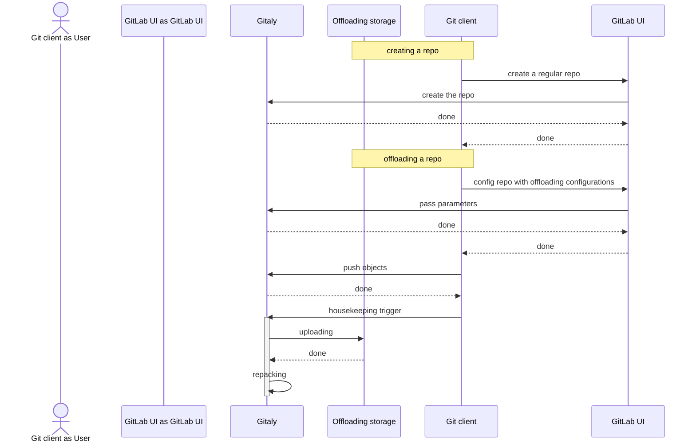
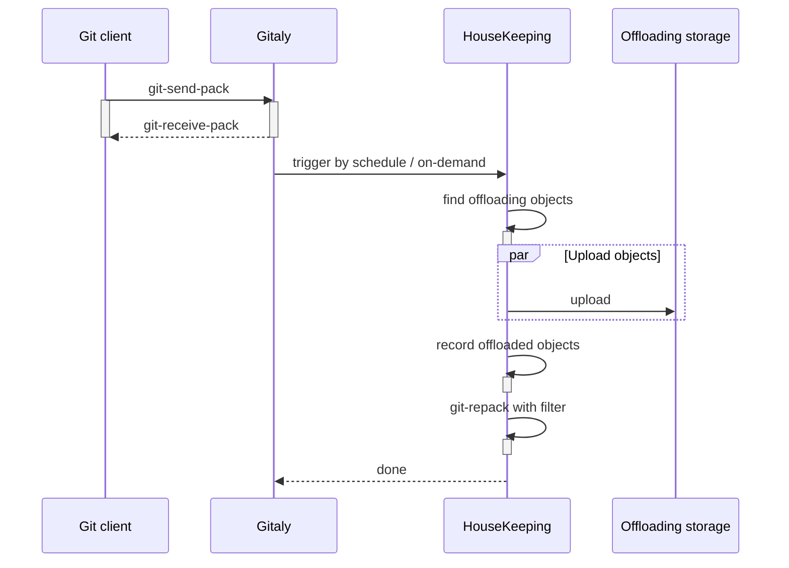
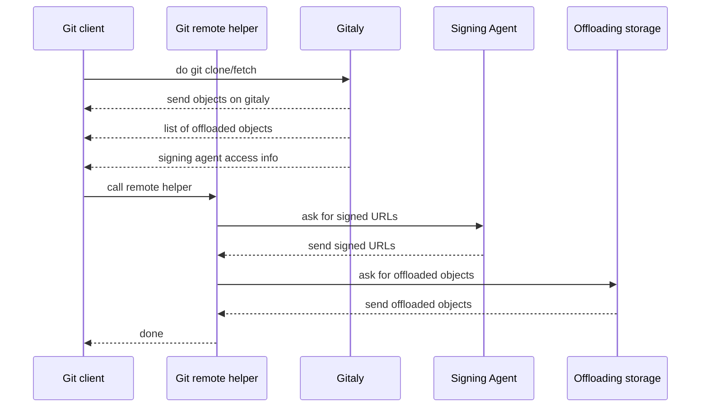
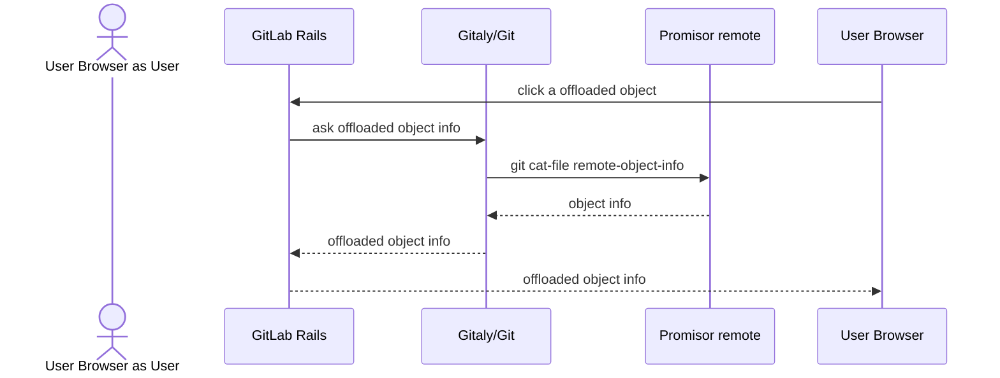
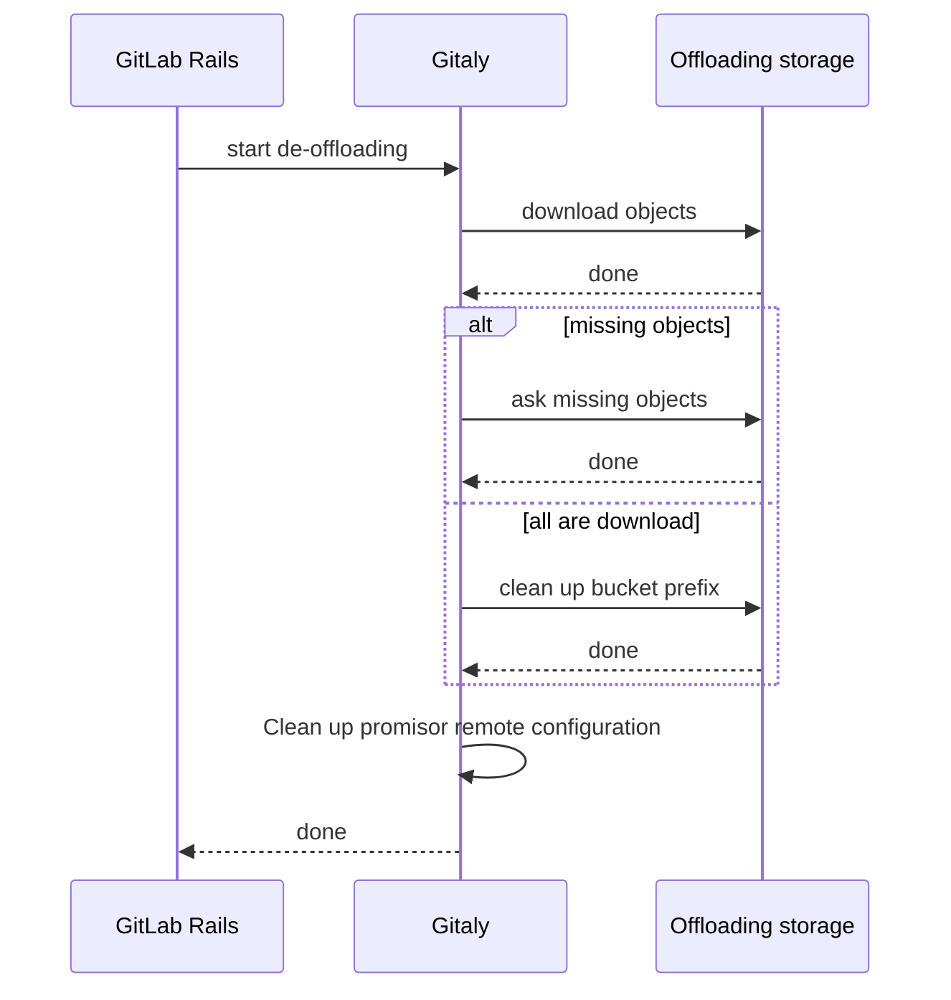



## Summary

Providing performant fetching and pushing with reasonable data storage costs is
critical to our business. To achieve this, it is reasonable to offload less
frequently accessed large data into secondary, cheaper storage.

This blueprint outlines a Gitaly feature that offloads object blobs meeting
specific criteria to cloud object storage. For example, object blobs that are
larger than a certain size or are rarely accessed. Offloading such data to
cloud object storage not only provides an opportunity to reduce storage costs
but also alleviates traffic on the Gitaly server by allowing clients to
download objects directly from the cloud storage.

## Motivation

At GitLab, we keep most Git data stored on SSDs to ensure fast data access.
This is sensible for frequently accessed data. However, since storage costs
scale with data growth, we need to be smarter about what kinds of data we keep
on SSDs and what we can offload to cheaper storage.

For example, large files (or in Git nomenclature, "blobs"), which are usually
non-text files such as images, videos, and binaries, are not frequently
modified and can be offloaded to cheaper storage options, such as cloud object
storage, to save costs. Additionally, if a project is "stale" and hasn't been
accessed in a long time, there is no need to keep paying for fast storage for
that project. Instead, we can choose to put all blobs of that stale project
onto cheaper storage. This way, the application still has access to the commit
history and trees, ensuring the project browsing experience is not affected,
but all files are on slower storage since they are rarely accessed.

On the other hand, while Git is designed and optimized to track changes in many
small text files, it struggles with large files because it stores the entire
history. We are seeing a trend where our customers are storing large files,
such as binary files and images, in Git for various reasons. Storing large
files in Git often leads to:

1. Bloated repository size: Repositories can become excessively large and slow
   to clone or fetch.

1. Inefficiency: Every version of a large binary file is stored, even if only
   a small part of the file changes.

[Git LFS](https://git-lfs.com/) is used for repositories that contain large
blobs in order to avoid having to push a large file onto the Git
server. However, it also comes with certain drawbacks and limitations:

- The Git LFS client requires complex additional setup and configuration
  compared to standard Git repositories. Users need to remember
  a set of Git LFS subcommands and manually configure the local `.gitattributes`
  file. Mistakes setting up LFS leads to the large file ending up in Git’s history,
  which is difficult to undo.

- Using Git LFS often involves additional storage costs since the large
  files are stored separately from the Git repository. This can lead to
  higher costs, especially if the hosting service charges for LFS storage
  or bandwidth.

As a result, we are proposing an object offloading architecture to achieve
both significant storage cost savings and a performant experience with large
objects using native Git features (e.g. filter, partial clone and promisor
remote).

## Goals

- Leverage Git native features: Enable Gitaly to offload blobs onto separate
  storage using native Git capabilities.

- Simple client setup: After configuring settings in the GitLab UI, the native
  Git client can be used without any additional setup. Depending on the type of
  offload storage, we should provide information on where to download the Git remote helper.

- Error Prevention: In Git LFS, if a large file mistakenly ends up in the Git history,
  it's difficult to remove. With blob offloading, we can prevent such user errors from occurring in the first place.

- Save overall cost: Offloading certain blobs on to cheaper storage and avoid
  excessive network traffic.

- Enhance server side performance: As large blobs are offloaded, we would
  expect better performance when doing backup or replica, since data size are much smaller.

- Prevent excessive network traffic between Gitaly server and offloading storage:
  Apart from necessary setup, uploading, downloading, and deleting blobs,
  Gitaly server and offloading storage should not interact frequently.

- Be an alternative of Git LFS: This feature can serve as an alternative or replacement for Git LFS.
  However, they are not mutually exclusive; users can choose to use both simultaneously if desired.

## Non-goals

- Additional traffic costs higher than storage savings: While some network
  traffic between offloaded storage and the Gitaly server is inevitable, we
  must ensure that the new network traffic cost does not outweigh the storage cost savings.

## Proposal

We propose to use
[Git's Partial Clone feature](https://www.git-scm.com/docs/partial-clone)
to facilitate Gitaly's offloading blob capability. In Git Partial Clone, objects
can be missing in a remote. And a promisor remote is a remote
that promises to provide the missing objects. We propose to use
a cloud bucket storage serving as a promisor remote. A customized
[Git remote helper](https://git-scm.com/docs/Gitremote-helpers) will be
provided as the tool to talk to the promisor remote.

A typical process for enabling and using the blob offloading feature involves four levels of configuration:

1. Infrastructure Level

1. Gitaly Server Level

1. Repository Admin Level

1. End User Level

At Infrastructure level, a cloud bucket storage is provisioned as the offloading storage by the
Git host (e.g., GitLab or self-hosted environments). This bucket can be shared
among multiple repositories. If shared, a specific path within the bucket is
designated as the offloading path. The Git host must also ensure that each
Gitaly node has the appropriate permissions to read, write, and delete objects
in the bucket. The actual setup process varies depending on the cloud provider.
Here is an example for the GCP platform:

1. Create a service account (SA).

1. Create an IAM role with the permissions: `storage.buckets.list`,
   `storage.objects.create`, `storage.objects.delete`, and `storage.objects.list`.

1. Create an IAM role binding that associates the SA with the role.

1. Link the SA to the Google Compute Instances where Gitaly is running.

Next, at the Gitaly server level, configurations need to be added to Gitaly's
toml file. These configurations include:

- Enablement flag: A flag that activates the offloading feature.

- Bucket name: The name of the bucket provisioned by the Git host.

- Prefix in the bucket: The system admin selects a prefix that, when combined
  with the repository path, determines the final storage path for offloaded objects.

- Upload worker count: This setting specifies the number of threads that Gitaly
  should use for uploading objects.

At repository admin level, these configurations are needed on a per-repository basis:

1. Enablement flag: Enable blob offloading feature for this repo.

1. Filter Criteria: Provide a filter to this repo.
   The filter is used to choose which objects should be offloaded.
   More details are at section [filtering criteria](#filtering-criteria).

The repository admin has the option to trigger a Gitaly housekeeping job on demand.
This job runs git-repack(1) with the provided filter, uploading objects that
meet the filter criteria to the cloud bucket while retaining others on the
Gitaly server. Gitaly keeps a record of the uploaded objects.
This job can also be scheduled to run periodically.

Finally, at the end-user level, the Git user needs to download a customized
remote helper to enable their local Git client to communicate with the
offloading bucket. The following configurations need to be set to inform the
Git client that this is a partial clone:

- `remote.<remote name>.promisor=true`

- `remote.<remote name>.ur=gs://...`

The user edits the content as usual and pushes it to Gitaly, which may include
several large objects. The housekeeping job handles the offloading process,
which is transparent to the end user.

When another user wants to fetch the repository, the objects stored on Gitaly
are fetched first. Gitaly then provides the client with a list of missing
objects, a temporary token, and the address of a signed URL agent.
The client contacts the agent to obtain a list of signed URLs.
The remote helper is then used to download the missing objects directly
from the cloud bucket using these signed URLs.

The end user can provide their own `--filter` flag in `git clone`, see the documentation
[here](https://git-scm.com/docs/git-clone/en#Documentation/git-clone.txt-code--filtercodeemltfilter-specgtem).
However, this filter will
not affect the [offloading filtering criteria](#filtering-criteria).

## Design and implementation details

### Components and configuration

#### Offloading storage

A storage solution for offloading needs to be provisioned before enabling the
feature. Ideally, this can be any object storage service. For example:

- Public Cloud Storage: Amazon S3, Google Cloud Storage.

- Self-Managed Storage: MinIO.

For each type of object storage, corresponding components need to be provided, such as:

- A Git remote helper. A custom helper tailored for each type of storage.
  For example, a helper for Amazon S3 and another for Google Cloud Storage,
  as their APIs and libraries differ.

- A signing agent. A component responsible for generating signed URLs. The
  mechanism for providing these URLs varies by provider and needs to be supported accordingly.

- A housekeeping job interface. Gitaly will require different APIs to interact
  with various storage systems for uploading and managing offloaded objects.
  This interface needs to accommodate the specific requirements and capabilities
  of each storage solution.

At the time of writing this blueprint, we initially only support Google Cloud Storage.

Each repository will have a dedicated path (prefix) within a shared bucket to
store its objects. Multiple repositories will share one bucket due to
limitations on the number of buckets that can be provisioned. This approach
ensures efficient use of available resources.

From the bucket provider, the following configurations need to be provided to Gitaly:

- The bucket address and the repository's bucket prefix:
  Identifies the specific location within the bucket where the repository's
  objects will be stored.

- The type of the bucket: the type of object storage systems,
  including but not limited to AWS S3, Google Cloud Storage, Minio.
  This is not required, since the type
  can sometimes be inferred from the bucket url, e.g. Google Cloud Storage starts with `gs://`.

- An endpoint to get signed URLs for the bucket: This is used for client
  downloading of objects.

- Infrastructures and permissions for a Gitaly node to access the
  repository's bucket prefix. The actual items may vary depending on the provider,
  but in general it should contain:

  - An IAM role which has the these permission:

    - Upload objects to the prefix (for pushing).

    - Read the list of objects in the prefix (for syncing information between Gitaly and the bucket).

    - Delete objects in the prefix (for cleaning).

    - Capability to get singed URL (for downloading).

  - A service account (SA) that attaches to the Gitaly node.

  - An IAM role binding that links the SA to the role

#### Filtering Criteria

Whether objects are offloaded to another object database can be determined
based on one or more filtering criteria, as listed below:

- By size:  Large blobs are prioritized for offloading to reduce expensive
  storage usage, making them a quick win for cost savings. Size-based filtering
  is natively supported in Git, as detailed in
  [git-repack(1): --filter=<filter-spec>](https://git-scm.com/docs/git-repack#Documentation/git-repack.txt---filterltfilter-specgt).

- Frequency of Access: Frequently accessed projects might remain fully on fast
  storage, while inactive projects might have their blobs offloaded.

- By Age: Blobs added a long time ago and not referred to by any recent commits
  can be offloaded, while newer blobs remain on the main object database (ODB).

- By Tier: Free projects might have many blobs offloaded to cheaper storage,
  while Ultimate projects might keep all their objects on the fastest storage.

As mentioned, only size-based filtering is natively supported in Git and defined
by the filter spec. Other criteria would need to be implemented at the
application level (e.g., by GitLab or Gitaly).

This filter configuration must also be provided to Gitaly.

#### Gitaly server functionality

Gitaly requires a housekeeping job to manage repacking and uploading.
Its main responsibilities are:

- Setup Offloading Storage: Configure the offloading storage as a promisor remote.

- Identify Objects to Upload: Determine which objects to upload based on
  the filter configuration.

- Upload Objects: Transfer the filtered objects to the offloading storage.

- Record Uploaded Objects: Maintain a record of the objects that have been uploaded.

- Repack and Clean Up: Execute `git-repack(1)` according to the filter configuration.
  Delete packs that contain uploaded objects and retain the others.

Gitaly needs to keep a list of uploaded objects. As discussed
in [Discussion: Blob offloading in object storage with transactions](https://gitlab.com/gitlab-org/gitaly/-/issues/6120), this
list is required to:

- Validate Object ID Correctness: Ensure consistency between the server-side
  repository and the object storage.

- Implement Snapshot Isolation: Provide a consistent view of the repository by
  isolating snapshots of the object states.

- Prevent Race Conditions: Help avoid conflicts and issues when pruning objects.

We plan to store this list in the .promisor file under the pack folder.
Currently, the `.promisor` file (see [here](https://git-scm.com/docs/git-repack#Documentation/git-repack.txt--a))
is an empty file that is created after repacking is complete.
We propose writing to this file to save the list of uploaded objects.

Gitaly needs a signing agent component, which can be implemented as a gRPC
endpoint or another form accessible to the Git client.
The process is like this:

- Gitaly provides the client with a list of objects it can download, along with
  the endpoint and access token for the agent.

- The Git client, using the Git remote helpers, requests the agent to provide a list
  of signed URLs for the objects.

- The agent verifies the access token. If invalid, it rejects the request.
  Otherwise, it communicates with the bucket provider's signed-URL endpoint
  to obtain a list of signed URLs—**one for each object**—and returns these URLs to the client.

The reasons for the existence of this agent are twofold:

- Control Access: It prevents direct access from the client to the offloading
  storage. Gitaly controls what the client can access, with the client only
  able to interact with offloading storage through signed URLs.

- Simplify Git Protocol: By implementing this functionality outside of Git,
  it alleviates the complexity of the Git protocol.

From the Gitaly server, the following configurations need to be provided to the Git client:

- The endpoint of signed-URL agent and its access token

- A list of objects the client can download

- Filter criteria for object selection.

- The URL of the promisor remote.

#### Git remote helper

A [Git remote helper](https://git-scm.com/docs/gitremote-helpers) is an executable file that facilitates communication
between Git and a remote service. For instance, Git includes a set of "curl"
family remote helpers that manage various transport protocols,
such as `git-remote-http`, `git-remote-https`, `git-remote-ftp`, and `git-remote-ftps`.

To use a Git remote helper, its executable file must be downloaded and placed in
the client's `$PATH` environment variable, ensuring Git can locate it when
interacting with the promisor remote.

In this blueprint, as we are introducing cloud storage as a new kind of remote,
we need a series of Git remote helpers to manage interactions with different
cloud storage providers. Each cloud storage provider may use different
underlying protocols and APIs. A preliminary remote helper for Google Cloud
Storage can be found [here](https://gitlab.com/eric.p.ju/git-remote-gs).

The Git remote helper is responsible for:

- Requesting a list of signed URLs from the signed-URL agent.

- Downloading objects from the offloading storage using the signed URLs.

Currently, the Gitaly team will ship a binary for Google Cloud Storage (GCS).
Based on customer demand, we may consider shipping binaries for other cloud
storage providers in the future as well.

### What we need from Git

We need to add a feature to git-repack(1) that will enable the segmentation of
different types of blobs into distinct object databases. This is essential for
effectively managing offloaded storage. The progress of this feature is tracked
in [this issue](https://gitlab.com/gitlab-org/git/-/issues/159).

We require a feature in git-cat-file(1) that allows us to fetch object
information without downloading the actual object. This capability is crucial
for efficiently managing and interacting with remote objects, especially for
UI purposes. The development of this feature is tracked in
[cat-file: add --batch-command remote-object-info command](https://gitlab.com/gitlab-org/git/-/issues/335) and
[cat-file: Support for reading object type and content from a remote without downloading them](https://gitlab.com/gitlab-org/git/-/issues/294)

### Create a repo and make it offloading

A user can create a repo and then offload it. For any existing repo, a
user can start offloading it directly by configuring and trigger housekeeping

### Git push

### Git clone and Git fetch

### Browsing an offloaded object through the UI

### De-offloading process

"De-offloading" allows a repository to revert back from offloading setup.

## Open Questions

### Why don't we consider client uploading

A detailed discussion on this topic can be found in [Discussion: Blob offloading in object storage with transactions](https://gitlab.com/gitlab-org/gitaly/-/issues/6120).

Summary:

1. Trust Issues: We cannot fully trust the Git client to upload blobs without
   corruption. This poses a risk to data integrity.

1. Verification Requirements: Gitaly server would still need to download and
   verify blobs to ensure their existence and correctness, which diminishes the
   benefit of client-side uploads.

1. Cleanup Challenges: Handling objects uploaded by the client introduces
   additional complexity. If a push fails or is rejected, the system needs a
   mechanism to clean up the partially uploaded blobs, adding to the overhead.

### What happened if the filter is later updated or deleted

#### Relaxing a filter

Definition: Relaxing a filter refers to changing the criteria for which objects
are offloaded in such a way that the new filter (`f_b`) results
in a smaller set of objects (`B`) compared to the original filter (`f_a`) with
object set `A`, meaning `B` is a subset of `A`.

An simple example is use size as a filter criteria. Say, originally, the
filter is set to `blob:1g`, any object equal or lager than `1g` is
offloaded. Later, the filter is changed to `blob:2g`, the objects that is
equal or lager than `2g` is subset of the old set. In this case, the filter
is relaxed.

Example: Consider a filter based on size:

- Original Filter (f_a): blob:1g — Offloads any object that is equal to or
  larger than 1 GB.

- New Filter (f_b): blob:2g — Offloads any object that is equal to or
  larger than 2 GB.

In this case, the objects that were offloaded by f_a and are also larger than
2 GB will remain offloaded, but objects between 1 GB and 2 GB will
now be downloaded back to the local storage.

When a filter is relaxed, some objects need to be downloaded from the
offloaded storage back to Gitaly local.

#### Restricting the filter

Definition: Restricting a filter involves changing the criteria for offloading
objects in such a way that the new filter (`f_b`) results in a larger set of
objects (`B`) compared to the original filter (`f_a`) with object set `A`,
meaning `B` is a superset of `A`.

When a filter is restricted, some objects need to be uploaded from Gitaly
local to the offloaded storage.

#### Deleting a filter

Definition: When a filter is deleted, it indicates that the user wants to
disable the offloading feature for the repository.
See [De-offloading process](#de-offloading-process). In this scenario,
Gitaly should:

- Download Offloaded Objects: Retrieve all previously offloaded objects from
  the offloading storage back to the local file system.

- Repack If Needed: Perform a repacking operation to ensure that the
  repository's object database is updated and optimized with the newly
  downloaded objects.

Relation to Relaxing: Deleting a filter can be viewed as a special case of
relaxing the filter where the new filter criteria effectively
become non-existent, requiring all objects to be restored to local storage.

#### Solution

Besides relaxing and restricting, it is worth noting that when a filter is
complex, we could end up in a state where we need to download some objects from
offloaded storage and then upload others.

When relaxing, Gitaly needs the ability to download missing objects according
to the new filter. These objects can be downloaded as loose objects and then
repacked. When restricting, Gitaly needs to be able to get objects from the
existing pack and upload them.

Git would need to have the ability to pack on a repository with partial clone
configuration instead of consider the repository as corrupted.

### How does this interact with transaction manager

A detailed discussion is available at [Discussion: Blob offloading in object storage with transactions](https://gitlab.com/gitlab-org/gitaly/-/issues/6120).

The snapshot isolation can be maintained given the following conditions are met:

- The client receives a signed URI for each object it is to read from the object
  storage. See [Gitaly server functionality](#gitaly-server-functionality)
  signing agent part.

- A list of offloaded object IDs would also help with implementing snapshot isolation.

- Because the offloading storage is likely to be shared by all transactions,
  the pruning process needs to avoid deleting objects that are used by any
  transactions. See [Pruning process should consider transaction](https://gitlab.com/gitlab-org/gitaly/-/issues/6191)

### How do we delete objects?

Given that Gitaly has a list of offloaded blobs, when an object on that list is
found unreachable by Git garbage collection, the blob can be marked in the list.

A scheduled pruning process (e.g., a Gitaly housekeeping job) can scan the list
and delete objects marked unreachable. Once deleted successfully from offloaded
storage, the list is updated. If deletion is unsuccessful, the object is left on
the list, and the pruning process will try to delete it in the next run.

The pruning process should take transactions into consideration.
See [Pruning process should consider transaction](https://gitlab.com/gitlab-org/gitaly/-/issues/6191)

### How does this work with object pools?

A discussion issue is created at [Discussion: Blob offloading and object pool](https://gitlab.com/gitlab-org/gitaly/-/issues/6245),
where we considered 4 scenarios when blob offloading can happen under object pool setup.

As an initial implementation of blob offloading, we will
consider [phase 1](https://gitlab.com/gitlab-org/gitaly/-/issues/6245#phase-1) in
[Discussion: Blob offloading and object pool](https://gitlab.com/gitlab-org/gitaly/-/issues/6245).
This phase entails:

- If a project is already offloaded and wants to become the source project of a
  pool, it can "de-offload" first, then proceed to the object pool process.
  This way, all its forks will be normal forks and can be offloaded without
  considering if its object pool is offloaded.

- If a project is the source project of a pool already, it is not allowed to offload.
  We don't restrict whether a fork of such a source project can be offloaded or not.

### How will this work with Raft + WAL?

A discussion issue is created at
[Discussion: Blob offloading and RAFT and WAL](https://gitlab.com/gitlab-org/gitaly/-/issues/6257).

There is a limited overlap between RAFT/WAL and blob offloading. For the pushing
process, only the leader node is responsible for running the offloading
housekeeping job. The offloaded object list and the remaining pack file are
then replicated to the replica nodes.

For the fetching process, an offloaded repository fetches objects from
two sources: the Gitaly server and the offloading storage.
As long as RAFT can direct the client to an effective Gitaly replica, the
client can fetch from it. The signing agent is responsible for providing
signed URLs to download objects directly from the offloading storage.

## Problems with the design

### Added complexity

The fact that we are adding promisor remotes adds complexity to the system.
Additional infrastructure and parameters are needed to set up the promisor remotes.

### Possible change in cost over time

The cost of the different storage types might change over time. To anticipate
this, it should be easy to adapt to such changes.

### More points of failure

Having some blobs on a separate storage device adds one more failure scenario
where the device hosting the large blobs may fail.

### Expiration of signed URL

The expiration of a signed URL typically only affects the initiation of a
download, not the ongoing download process. This means that once a download
has started using a signed URL, the download should not be interrupted even if
the URL expires during the process.

However, this behavior can depend on the cloud storage provider and their
specific implementation of signed URLs. To be certain, it's important to test
this behavior with the specific provider being used (e.g., Google Cloud Storage, Amazon S3).

- If the expiration does not affect ongoing downloads: We can set the timer to
  be relatively short, just long enough for the download to start.
  This minimizes the window of vulnerability where the URL could be exploited
  but still allows for reliable downloading.

- If the expiration does affect ongoing downloads: This scenario is more complex.
  Initially, a fixed timer can be used, but we may need to consider implementing
  an adaptive timer mechanism. This would involve the signing agent setting
  the timer based on factors like the size of the object and the client's
  network conditions. Alternatively, a callback mechanism could be explored to
  refresh or extend the URL's validity as needed during the download process.

Further testing with the specific cloud storage provider is recommended to
confirm the exact behavior and adapt the approach accordingly.

## Possible optimization

### Concurrency

- A Git remote helper can take advantage of concurrency to download offloaded objects.
- Gitaly can take advantage of concurrency to upload objects.

### Multi-part uploading and downloading

If multi-part uploading and downloading are supported by the offloaded storage
provider, we can leverage these features to enhance performance.
The housekeeping job can utilize multi-part uploading to accelerate the
upload process, while the remote helper can employ multi-part downloading
for faster retrieval of objects.

### Multi-tier storage class and lifecycle

Some cloud providers offer different storage classes for managing hot and cold data.
For example AWS S3 provide [Intelligent-Tiering and Glacier](https://aws.amazon.com/s3/storage-classes/)
and GCP Cloud Storage offers [Standard storage and Coldline storage](https://cloud.google.com/storage/docs/storage-classes).
Considering these storage classes can help further reduce costs.

Cloud providers also offer lifecycle policies that automatically move data between warm and cold storage.
However, we need to consider how a blob's storage class is changed:

- In-place storage class changes: The storage class is changed directly within
  the same bucket. For instance, if objects in bucket are rarely accessed,
  we can simply downgrade the storage class from hot to cold.
  Blob offloading can easily take advantage of this scenario with minimal effort.

- Moving objects between buckets: In this case, objects are transferred from one
  bucket to another as part of the lifecycle policy. For example, if some objects in
  bucket are rarely accessed, they might be moved to another bucket. This
  scenario requires careful reconfiguration, as it involves changing the
  offloading storage location. A multi-promisor remote setup may be needed so
  that a repository is aware of both hot and cold offloading storage.
