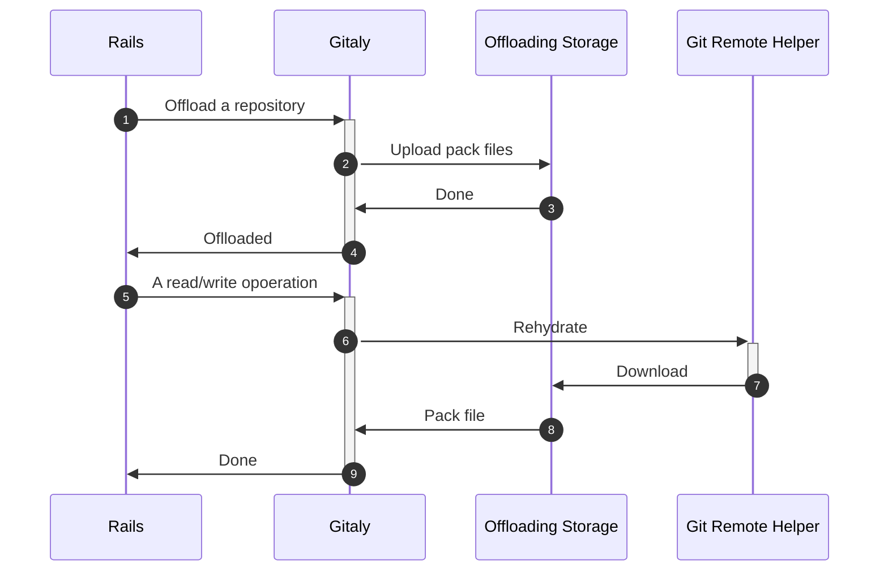
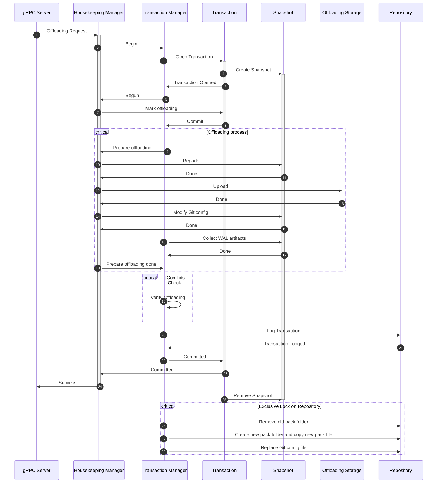



## Summary

This blueprint outlines a Gitaly feature designed to offload the object stores
of inactive repositories to cloud object storage. Offloading these repositories
to cloud storage presents an opportunity to reduce storage costs while maintaining
uninterrupted access for users.

## Motivation

At GitLab, most Git data is stored on SSDs to ensure fast access, which is
appropriate for active repositories. However, as storage costs increase with
data growth, we should explore the possibility of moving inactive repository
data to cheaper storage. An
[internal investigation](https://gitlab.com/gitlab-org/gitaly/-/issues/5699#note_1800318701)
indicates that offloading repositories with no activity for one year or more
could result in potential savings of approximately `$80k` per month.

To address this, we propose a design to offload inactive repository data to more
cost-effective storage solutions using native Git features.

## Goals

- Cost Savings: Object storage is significantly cheaper than SSDs. Offloading
  inactive repositories to object storage should lead to reduced storage costs.
  While additional network traffic may occur during certain operations
  (such as offloading data or users accessing repositories),
  the cost of this network traffic should not outweigh the savings from
  offloading storage.

- Seamless User Experience: End users should not need to perform any additional
  configurations. They should continue to interact with their repositories as
  usual, without interruption. However, since the repository data is no longer
  stored on SSDs, users may experience slower performance.

- Operational Experience with Promisor Remotes: This initiative also serves as
  an opportunity to gain hands-on operational experience with promisor remotes
  for offloading Git data. In the future, we plan to extend this strategy by
  offloading large blobs across all repositories to promisor remotes
  (see [Gitaly: Offload large blobs to secondary storage](https://gitlab.com/groups/gitlab-org/-/epics/9094)).
  This blueprint acts as a simplified run with inactive repositories.
  As we deploy it in staging and production environments,
  we expect to encounter unforeseen challenges, which will provide invaluable
  insights for the broader initiative.

## Non-goal

- Identifying Inactive Repositories: We do not define which repositories are
  considered "inactive". System administrators should determine this based on
  their criteria, such as no reads for over a year or no writes for six months.

- Batch Offloading: This blueprint does not include a method for batch
  offloading multiple repositories. The offloading process described here is
  repository-specific.

## Proposal

We propose to use [Git's Partial Clone feature](https://www.git-scm.com/docs/partial-clone)
to facilitate Gitaly's offloading capability. In Git Partial Clone, objects
can be missing in a remote. And a promisor remote is a remote
that promises to provide the missing objects. We propose to use
a cloud bucket storage serving as a promisor remote (i.e. the offloading storage).
On the server side, a customized [Git remote helper](https://git-scm.com/docs/gitremote-helpers) will be
provided as the tool to talk to the promisor remote.

A very high level control flow is like this:

A typical process for enabling the feature involves three levels of configuration:

1. Infrastructure Level

1. Gitaly Server Level

1. Project Admin Level

At Infrastructure level, a cloud bucket storage is provisioned as the offloading
storage by the administrator (e.g., GitLab or self-hosted environments).
This bucket can be shared among multiple repositories. If shared,
a specific path within the bucket is designated as the offloading path.
The administrator must also ensure that each
Gitaly node has the appropriate permissions to read, write, and delete objects
in the bucket. The actual setup process varies depending on the cloud provider.
Here is an example for the GCP platform:

1. Create a service account (SA).

1. Create an IAM role with the permissions: `storage.buckets.list`,
   `storage.objects.create`, `storage.objects.delete`, and `storage.objects.list`.

1. Create an IAM role binding that associates the SA with the role.

1. Link the SA to the Google Compute Instances where Gitaly is running.

Next, at the Gitaly server level, configurations need to be added to Gitaly's
toml file. These configurations could include:

- Enablement flag: A flag that activates the offloading feature.

- Bucket name: The name of the bucket provisioned by the Git administrator.

- Prefix in the bucket: The system admin selects a prefix that, when combined
  with the repository path, determines the final storage path for offloaded objects.

- Upload worker count: This setting specifies the number of threads that Gitaly
  should use for uploading objects.

At repository admin level, these configurations could be needed on a per-repository basis:

- Enablement flag: Enable offloading feature for this repo.

- Offloading Condition: Defines the criteria under which the repository is
  eligible for offloading. If the condition is met, Rails can automatically
  trigger Gitaly’s offloading endpoint via a Sidekiq job. For example, a
  configuration field such as `inactive_days_threshold: 90` ensures that any
  repository with no activity for more than 90 days since the last scan will
  be offloaded. How to use this condition to trigger offloading job is out of
  scope of this blueprint.

The repository administrators have the option to trigger a Gitaly offloading job
to offload the repository’s object store. Additionally,
they can choose to rehydrate the repository,
i.e. resetting it to its original state.

## Design and implementation details

### The offloading storage

A storage solution for offloading needs to be provisioned before enabling the
feature. Ideally, this can be any object storage service. For example:

- Public Cloud Storage: Amazon S3, Google Cloud Storage.

- Self-Managed Storage: MinIO.

A custom git remote helper needs to be tailored for each type of storage. For
example, a helper for Amazon S3 and another for Google Cloud Storage, as their
APIs and libraries differ. At the time of writing this blueprint, we initially only support Google Cloud Storage.

Each repository will have a dedicated path (prefix) within a shared bucket to
store its objects. Multiple repositories will share one bucket due to
limitations on the number of buckets that can be provisioned. This approach
ensures efficient use of available resources.

From the bucket provider, the following configurations need to be provided to Gitaly:

- The bucket address and the repository's bucket prefix:
  Identifies the specific location within the bucket where the repository's
  objects will be stored.

- The type of the bucket: the type of object storage systems,
  including but not limited to AWS S3, Google Cloud Storage, Minio.
  This is not required, since the type
  can sometimes be inferred from the bucket url, e.g. Google Cloud Storage starts with `gs://`.

- Infrastructures and permissions for a Gitaly node to access the
  repository's bucket prefix. The actual items may vary depending on the provider, but in general it should contain:

  - An IAM role which has the these permission:

    - Upload objects to the prefix (for pushing).

    - Read the list of objects in the prefix (for syncing information between Gitaly and the bucket).

    - Delete objects in the prefix (for cleaning).

    - Download objects to the prefix (for rehydrating).

  - A service account (SA) that attaches to the Gitaly node.

  - An IAM role binding that links the SA to the role

### Offloading object store with a transaction

From a transaction’s perspective, offloading is a specialized
"write" operation, consisting of four key steps:

- Repacking: Repack objects according to the filter received via gRPC.
  This process generates two pack files: one to replace the existing pack file
  and remain in Gitaly, and another to be uploaded to the offloading storage.

- Uploading: Upload the designated pack file to the offloading storage.

- Reconfiguring: Update the Git configuration to register the promisor
  remote and point to the offloaded storage; possible update other git file,
  e.g. objects/info/alternates.

- Replacing Pack Files: Replace the old pack file with the newly repacked
  one in the repository.

By leveraging Gitaly’s transaction management, we ensure atomicity:
either all these operations succeed, or none are applied.
This guarantees consistency in the offloading process.

Below is a sequence chart illustrating the offloading process with transaction
management:

During transaction committing, the transaction manager should perform repacking,
uploading, reconfiguring the snapshot, and record the replacement in the WAL
entry.
If no
[serialization violation](../../design-documents/gitaly_transaction_management#serializability) occurs, the offload operation is committed.
In the event of a serialization violation, the offloading process should be
aborted. When WAL entry is applied , it should replace both the old file pack
file and the old configuration files.

Since the pack file is uploaded during transaction committing,
a critical task is to ensure that no write operations occur while
applying the offloading transaction’s WAL entry. We need to guarantee that
the uploaded pack file does not contain any objects deleted by other
transactions or miss any objects added by other transactions.
During conflict checks, the offloading operation will conflict with
all other write transactions. We intentionally avoid performing repacking,
uploading, and reconfiguring during WAL log application to prevent blocking WAL
operations and slowing down the process.

### Rehydrating a repository with a transaction

A write operation can trigger a rehydrating process. When a write operation
is detected, the transaction manager will first attempt to create a snapshot.
If the transaction manager can check whether the repository has been offloaded.
If so, it should rehydrate the repository back to the local SSD.
Once the download is complete and validation is successful,
the snapshot can proceed, followed by the write operation.

If multiple transactions occur simultaneously, a locking mechanism will be
required to ensure that the object store is downloaded once and only once.

Rehydrating can also be triggered on-demand by the system administrator.
When initiated, the transaction manager can create a dummy write operation
without committing, allowing it to reuse the same logic as when handling a
standard write operation.

During the rehydrating process, all read and write operations are blocked.
Once the rehydrating is complete, read operations should be performed from
the local object store only. Any stale data in the offloading storage should
be removed through a garbage collection process.

### Read and write on an offloaded repository

A write operation should trigger rehydrating, as outlined in
[Rehydrating with a transaction](#rehydrating-a-repository-with-a-transaction).
Once the rehydrating process is complete, all subsequent writes should be
performed as they would on a regular repository.

For read requests, there are a few different scenarios:

- UI-based read requests: When a user clicks an object to view its content via
  the UI, Git’s partial clone feature, using the Git remote helper, will fetch
  the object from the promisor remote to the local SSD temporarily. The object
  will have a time-to-live (TTL), after which it is removed from the SSD.
  In this scenario, the local SSD serves as a cache. Read requests on offloaded
  repositories in this context can safely bypass the transaction manager,
  because there is no write in this scenario.

  A separate process can be implemented to clean up the local SSD.
  If the read is very often, it can adaptively extend the stay of local SSD
  files.

- Client-based read requests (e.g., `git clone` or `git fetch`):
  When a Git client makes a read request, such as `git clone`,
  the request is proxied through Gitaly. If the request is http(s)-based,
  the logic in `PostUploadPackWithSidechannel` gRPC needs to be updated to
  allow streaming of objects from the offloading storage to the client.
  Similarly, if the request is ssh-based, the logic in `SSHUploadPackWithSidechannel` RPC
  must be updated to handle object streaming.

### Replication

When an offloaded repository is replicated, its data on the SSD is replicated
to the new node in the same manner as ordinary data. The object data in the
offloading storage is also replicated. Each replica repository should have its
own copy of the offloaded data. The new replica’s offloaded data will be stored
under a different prefix, and this new prefix configuration should be reflected
in the replica repository.

### Backup

The backup process can download the entire object store from the offloading
storage to create a self-contained repository backup. This introduces additional
download overhead compared to an ordinary repository, where the data is already
on SSD. However, we don’t expect backups of offloaded repositories to occur as
frequently as those for active repositories. Typically, a backup can be performed
after a repository is offloaded, and no further backups are needed as long as
the repository remains offloaded. This approach makes sense because,
while the repository is offloaded, no write operations occur,
eliminating the need for new backups.

#### Project fork and deletion

When an offloaded project is deleted, its corresponding folder on the
offloading storage should also be removed.

A fork of an offloaded project remains offloaded. The data on the offloading
storage is duplicated, and the forked project should be automatically configured
to reference the location of the duplicated data.

#### Git remote helper

A [Git remote helper](https://git-scm.com/docs/gitremote-helpers)  is an executable that facilitates communication
between Git and a remote service. For example, Git provides a set of "curl"
family remote helpers that handle various transport protocols,
such as `git-remote-https` and `git-remote-ftps`.

In this blueprint, since we are introducing cloud storage as a new type of
remote, we require a series of Git remote helpers to manage interactions with
different cloud storage providers. Each provider may use distinct protocols and
APIs. A preliminary remote helper for Google Cloud Storage can be found  [here](https://gitlab.com/eric.p.ju/git-remote-gs).
The Git remote helper is responsible downloading
objects from the offloading storage. Its executable file lives on Gitaly
server ensuring Git can locate it when interacting with the promisor remote.

## Open Questions

### Offloaded repositories V.S. archived repositories

An offloaded repository differs from an archived repository in several ways:

1. An offloaded repository is not read-only. It can still be written to,
   just like a normal repository.

1. An archived repository’s object store remains on local SSD,
   whereas an offloaded repository’s object store resides in offloading storage.
   There is potential to offload archived repositories in the future.

### Can we avoid the customized Git remote helper

Yes, it’s possible, but not without compromises. We would need to build
an http(s)-based proxy in front of the offloading storage. This proxy would
translate HTTP requests into API calls to the offloading storage.
While this introduces added complexity, the benefit is clear:
we wouldn’t need to repeatedly write custom helpers for different storage types.
For now, we are focused on a Google Cloud Storage remote helper,
but if support for additional storage types is needed in the future,
the http(s)-based proxy approach will be considered.

## Possible optimization

### Concurrency

- A Git remote helper can take advantage of concurrency to download offloaded objects.

- Gitaly can take advantage of concurrency to upload objects.

### Concurrency, Multi-part uploading and downloading

A Git remote helper can take advantage of concurrency to download offloaded objects.
Gitaly can take advantage of concurrency to upload objects.

If multi-part uploading and downloading are supported by the offloaded storage
provider, we can leverage these features to enhance performance.
The housekeeping job can utilize multi-part uploading to accelerate the
upload process, while the remote helper can employ multi-part downloading
for faster retrieval of objects.

### Multi-tier storage class and lifecycle

Some cloud providers offer different storage classes for managing hot and cold data.
For example AWS S3 provide [Intelligent-Tiering and Glacier](https://aws.amazon.com/s3/storage-classes/)
and GCP Cloud Storage offers [Standard storage and Coldline storage](https://cloud.google.com/storage/docs/storage-classes).
Considering these storage classes can help further reduce costs.

Cloud providers also offer lifecycle policies that automatically move data between warm and cold storage.
However, we need to consider how a blob's storage class is changed:

- In-place storage class changes: The storage class is changed directly within
  the same bucket. For instance, if objects in bucket are rarely accessed,
  we can simply downgrade the storage class from hot to cold.
  Offloading can easily take advantage of this scenario with minimal effort.

- Moving objects between buckets: In this case, objects are transferred from one
  bucket to another as part of the lifecycle policy. For example, if some objects in
  bucket are rarely accessed, they might be moved to another bucket. This
  scenario requires careful reconfiguration, as it involves changing the
  offloading storage location. A multi-promisor remote setup may be needed so
  that a repository is aware of both hot and cold offloading storage.
