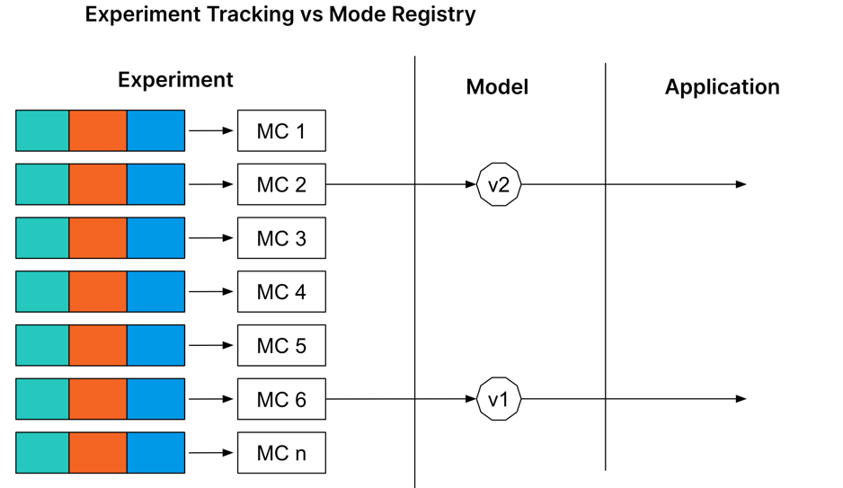
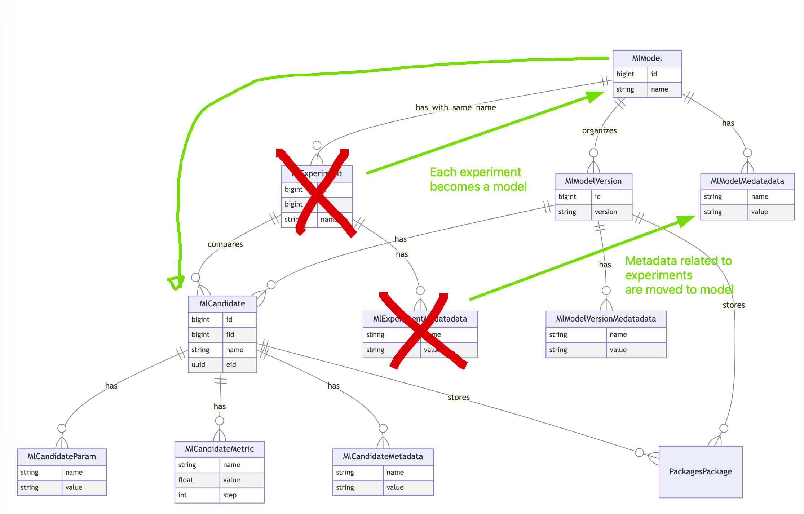



## Summary

Keeping Model experiments and model registry as two different features will add
unnecessary overhead to UX and code maintenance, and we aim to merge model
experiments into model registry. This will require some changes to the data layer
and might lead to data loss depending on the chosen strategy.

## Motivation

Removing Model experiments while providing all functionality on Model registry
consolidates the user journey into a single feature without sacrificing usability.

### Goals

- Include all functionality from Model Experiments into Model registry
- Deprecate Model experiments (<https://docs.gitlab.com/ee/user/project/ml/experiment_tracking/>)

## Context

[Machine learning model experiments](https://docs.gitlab.com/ee/user/project/ml/experiment_tracking/index.html)
is a feature released in 16.2 that allow users to store model candidates and their
associated metadata into GitLab. The two main entities in Model experiments are
a candidate, a combination of training code, parameters and data, and an experiment,
a collection of comparable candidates. Model experiments are used to track evolution
of candidates within an experiment according to user defined metrics, and to manage
the metadata associated to these candidates. One of the key functionalities in Model
experiments is the compatibility layer with [MLflow client](https://docs.gitlab.com/ee/user/project/ml/experiment_tracking/mlflow_client.html),
allowing existing MLflow users to use GitLab as their new solution without
changes to their codebase.

[More context on is Model experiments](https://www.youtube.com/watch?v=qC8yssVEh8A)

[Model registry](https://docs.gitlab.com/ee/user/project/ml/model_registry/index.html) is a
feature being released in 16.8 to address the follow up need of model experiments:
managing and deploying models and their versions. In its current form it is a
package registry that allows users to manage their model's metadata. In addition
to having a collection of versions, users can also create candidates within that
model. In terms of usage, a model candidate can then be promoted into a model version.

## Design and implementation details

### Data Layer changes

This blueprint propose the following architectural changes:

- Ml::Candidates will belong to Ml::Model instead of Ml::Experiment
- All Ml::Candidates to use `ml_model` package type instead of `generic`
- When creating an experiment using the MLflow client API, an Ml::Model will be created instead of an Ml::Experiment
- Deletion of Ml::Experiments and Ml::ExperimentMetadata

Data topology changes:

|         |                                             |
|---------|---------------------------------------------|
| Before  |   |
| Changes |  |
| After   |      |

### Milestone 1: Migrate Ml::Candidates packages to ml_model type

Goal:

- \[ \] All packages associated to an Ml::Candidate are of `ml_model` type

Existing candidates use the generic package type to store artifacts, while model
registry uses the new ml model type and its endpoints. These endpoints allow more domain control
over the creation of packages, and should simplify the logic behind storing
candidate artifacts. We can keep existing candidates using the generic package,
or find a way to migrate them to the new ml model package type.

As of Feb 2024, gitab.com database has ~38k candidates out of which ~4k have packages that need to be migrated. We
don't have much data on self managed instances, but hte migration should work
for them as well.

#### Iteration 1: New candidates use the ml_model package type

This is already being done for candidates that are part of a model_version.
For others, when we identify the model registry feature flag is enabled we could
already support candidate by adding a new endpoint to [`ml_model_packages.rb`](https://gitlab.com/gitlab-org/gitlab/-/blob/master/lib/api/ml_model_packages.rb#L38)

#### Iteration 2: Packages for existing candidates to be migrated to ml_model

Add migration to updates all generic packages associated to a candidate to
package_type `ml_model`. These packages follow a different naming convention
(`ml_experiment_{experiment_iid}/{candidate_iid}`)
than that supported by ml_model packages (`{ml_model_name}/{semver_version}`),
but since for now they will still belong to an experiment we should allow
ml_models to accept the existing name and version.

### Milestone 2: Use Ml::Model as the parent of Ml::Candidates

Goal:

- \[ \] `experiment_id` column on Ml::Candidate is removed, and a column `model_id` is added
- \[ \] Add candidate comparison table to the model detail page

Ml::Model is now composed by a default_experiment Ml::Experiment, with the same
name as the model, which holds the Ml::Candidates assigned to the model. Removing
this indirection.

The only feature that Model experiments has and Model registry doesn't support
as of now is a table view to compare and sort candidates by metrics, model
registry only shows a list without much information

### Milestone 3: Replace Ml::Experiment with Ml::Model

Goals:

- \[ \] MLflow client compat endpoints (`experiments/create`) create a model instead of an experiment
- \[ \] A new model is created for each experiment
- \[ \] All candidates are created within models
- \[ \] Ml::Candidates parent changes from an experiment to a model

Experiments is an abstraction that serves only to group candidates. But if
candidates are assigned to models, a model already plays the role of experiment
and this becomes unnecessary. Worst case possible, a user can still create a
scratch model to collect candidates without the intention of promoting them,
which is the exact same as an experiment. Removing the experiment table will
simplify the codebase

#### Step 1: Add display name to Ml::Models

Model names follow a strict regex which experiments don't. We will need to implement
a Display name for models so that the original name of the experiment is kept,
but add an additional slugified version of the display name.

#### Step 2: Block creation of new experiments, only create models

Change experiment mlflow endpoints to create models instead of experiments.

#### Step 3: Block creation of new experiments, only create models

Create a model for every experiment, and associate existing candidates to those.
New candidates will always be associated with models. An Experiment of name `My Experiment`
will have a model of Display Name `My Experiment` and name `my_experiment`.

In this step, all candidates will be associated to a model, either the newly
created model or the model which the experiment is the default_experiment for.
A new column `model_id` needs to be added to Ml::Candidate

### Milestone 4: Cleanup

Goals:

- \[ \] Delete tables Ml::Experiments and Ml::ExperimentsMetadata
- \[ \] Delete ExperimentsController (and related helpers)
- \[ \] Delete frontend code under [`ml/experiment_tracking`](https://gitlab.com/gitlab-org/gitlab/-/blob/master/app/assets/javascripts/ml/experiment_tracking/)

## Keeping existing separation

Pros:

- No work required on the sort term

Cons:

- Overhead in maintaining two different features that partially do the same thing
- Increase in code complexity to handle two different features
- More complex user journey

## Deprecate Model experiments without migrating data

Since model experiments

Pros:

- Considerably less work to be done, we can simply delete the tables.

Cons:

- Loss of early adopters confidence on testing experimental features

Existing topology as diagram

```mermaid
erDiagram
    MlExperiment ||--o{ MlCandidate : compares
    MlExperiment ||--o{ MlExperimentMedatadata : has
    MlCandidate ||--o{ MlCandidateParam : has
    MlCandidate ||--o{ MlCandidateMetric : has
    MlCandidate ||--o{ MlCandidateMetadata : has
    MlCandidate ||--o{ PackagesPackage : stores
    MlModel ||--o{ MlExperiment : has_with_same_name
    MlModel ||--o{ MlModelVersion : organizes
    MlModel ||--o{ MlModelMedatadata : has
    MlModelVersion ||--o{ MlCandidate : has
    MlModelVersion ||--o{ MlModelVersionMedatadata : has
    MlModelVersion ||--o{ PackagesPackage : stores
    MlCandidateParam {
        string name
        string value
    }
    MlCandidateMetric {
        string name
        float value
        int step
    }
    MlCandidateMetadata {
        string name
        string value
    }
    MlExperimentMedatadata {
        string name
        string value
    }
    MlCandidate {
        bigint id
        bigint iid
        string name
        uuid eid
    }
    MlExperiment {
        bigint id
        bigint iid
        string name
    }
    MlModel {
        bigint id
        string name
    }
    MlModelVersion {
        bigint id
        string version
    }
    MlModelVersionMedatadata {
        string name
        string value
    }
    MlModelMedatadata {
        string name
        string value
    }
```
