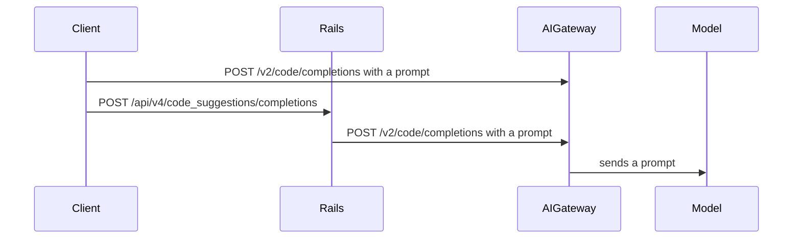
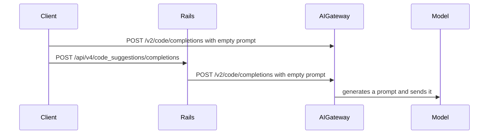
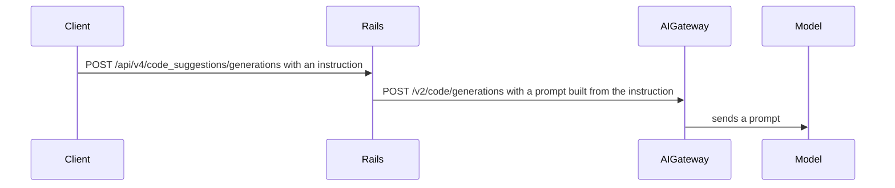
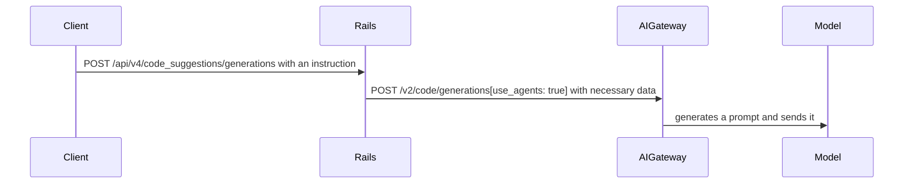

<!-- Design Doucments often contain forward-looking statements -->
<!-- vale gitlab.FutureTense = NO -->

<!-- This renders the design document header on the detail page, so don't remove it-->


## Summary

The LLM prompts were developed in the Rails codebase to leverage existing Ruby expertise and as the AI Gateway was evolving. Now that the AI Gateway is a stable and key part of the GitLab infrastructure the prompts can be migrated from Rails into the AIGW. The Rails monolith will remain the persistence and control layer, with AI features becoming a thin entrypoint which refer to the prompt and wrapper code in the AI Gateway. Prompt code will moved to yaml files on the AI Gateway with Python wrappers. GitLab AI functionality is expected to be unchanged during evaluations.

## Motivation

Moving prompt to the AI Gateway offers the following advantages:

- Native access to data science libraries written in Python
- Ability to iterate on AI features and prompts without changing Ruby code and upgrading GitLab Rails
- The clients with direct access to AI Gateway don't need to rely on Rails to retrieve prompts or duplicate the prompt logic
- Ability to maintain or analyze the prompts data that is now stored in a single place

### Goals

- Migrate most of the prompts from GitLab Rails Ruby code to YAML files in AI Gateway
- Preserve the existing AI functionality: product coverage, performance, observability
- Cleanup the prompts that are no longer used ([example](https://gitlab.com/gitlab-org/gitlab/-/issues/469377))

## Proposal

Use [Agents](https://docs.gitlab.com/ee/development/ai_features/#2-create-an-agent-definition-in-the-ai-gateway) to implement the functionality that executes a model request based on the given information and agent definition. The agent definition is stored in YAML file: prompt template, model and client information, and LLM params.

The agents functionality can be exposed by:

- Using generic `v1/agents/{agent_id}` [endpoint](https://gitlab.com/gitlab-org/modelops/applied-ml/code-suggestions/ai-assist/-/blob/61f45843f759345f884f4b902cf20390a4682cae/ai_gateway/api/v1/agents/invoke.py#L25) that accepts agent-id (to locate the correct agent definition) and the [parameters](https://gitlab.com/gitlab-org/modelops/applied-ml/code-suggestions/ai-assist/-/blob/61f45843f759345f884f4b902cf20390a4682cae/ai_gateway/api/v1/agents/invoke.py#L14) to build the prompt using the prompt template from agent definition.
  - Example: [Generate issue description](https://gitlab.com/gitlab-org/gitlab/-/merge_requests/152429)
- Defining a separate endpoint like [`v2/chat/agent`](https://gitlab.com/gitlab-org/modelops/applied-ml/code-suggestions/ai-assist/-/blob/61f45843f759345f884f4b902cf20390a4682cae/ai_gateway/api/v2/chat/agent.py) for complex features that require pre and post processing.
  - Example: [Duo Chat React](https://gitlab.com/gitlab-org/gitlab/-/issues/456258)
- Extending the existing endpoints like [`v2/code/completions`](https://gitlab.com/gitlab-org/modelops/applied-ml/code-suggestions/ai-assist/-/blob/61f45843f759345f884f4b902cf20390a4682cae/ai_gateway/api/v2/code/completions.py#L150) to use agents when a request to a model is performed. It enables gradual migration of complex features with a lower risk of breaking the existing functionality.
  - Example: [Code Completions](https://gitlab.com/gitlab-org/gitlab/-/issues/473156)

## Iteration plan

[Prompt Migration to AI Gateway](https://gitlab.com/groups/gitlab-org/-/epics/14259) is used to track the progress.

- Migrate [Code Completions/Generations prompts for Custom Models](https://gitlab.com/groups/gitlab-org/-/epics/14430). The features backed by Custom Models are experimental/beta, i.e lower risk of degrading the experience of existing customers.
  - Migrate Code Completions/Generations prompts for GA Models.
- Migrate Duo Chat ReAct prompt (currently in [progress](https://gitlab.com/gitlab-org/gitlab/-/issues/456258)).
  - Migrate Duo Chat ReAct prompt for Custom Models
- Migrate [Duo Chat Tools prompts for Custom Models](https://gitlab.com/groups/gitlab-org/-/epics/14431). The features backed by Custom Models are experimental/beta, i.e lower risk of degrading the experience of existing customers.
  - Migrate Code Completions/Generations prompts for GA Models.
- Migrate other Duo Features.

## Design and implementation details

### Prompt Definition

Agents are defined in  [AI Gateway](https://gitlab.com/gitlab-org/modelops/applied-ml/code-suggestions/ai-assist) at [ai_gateway/agents/definitions](https://gitlab.com/gitlab-org/modelops/applied-ml/code-suggestions/ai-assist/-/tree/main/ai_gateway/agents/definitions). The definitions are `.yml` files stored in a folder per feature: `generate_issue_description` or `chat/react` or `code_suggestions/generations/v2`. The folder is the agent-id.

The name of YAML files is either the name of the model for which the prompt is defined or `base.yml`: `code_suggestions/completions/codegemma.yml` or `chat/react/base.yml`. If an agent definition for a specific model is requested by passing model metadata, then a definition for the model is used; otherwise, the base definition is used.

This folder structure also supports versioning. For example, `v2`
subfolder can be created in a feature folder and contain new prompts for all
models: `code_suggestions/generations/v2/base.yml` and  `code_suggestions/generations/v2/mistral.yml`.
The feature then uses `code_suggestions/generations/v2` instead of `code_suggestions/generations` as agent-id to point to the new prompt based on a condition, for example, a feature flag.

As a result, the definitions are stored in the following structure:

```yaml
ai_gateway/agents/definitions

chat
  react
    base.yml
    mistral.yml
  explain_code
    base.yml
    mistral.yml
code_suggestions
  completions
    base.yml
    codegemma.yml
    codestral.yml
  generations
    v2
      base.yml
      mistral.yml
    base.yml
    mistral.yml
...
```

The definitions can be potentially improved by introducing inheritance. When a feature has mostly the same definition for all models, it can inherit from or include base definition and extend it.

### Code Completion

#### Current behavior

Code Completions request either:

- Goes through Rails to generate a prompt and send it to AI Gateway
- Goes to AI Gateway directly if direct access is enabled and contains the prompt



#### Proposal

Code Completions sends an empty or nil prompt and additional data to indicate that the prompt must be generated by AI Gateway. AI Gateway uses the request data to generate a prompt itself and sends it to a model:



#### PoC

- This [MR](https://gitlab.com/gitlab-org/modelops/applied-ml/code-suggestions/ai-assist/-/merge_requests/1063) demonstrates extending the existing `/v2/code/completions` that uses agents to build and execute the prompt.
- This [collaboration issue](https://gitlab.com/gitlab-org/gitlab/-/issues/473156) contains more details for using the endpoint.

### Code Suggestion

#### Current behavior

Code Generations request goes through Rails to generate a prompt and send it to AI Gateway:



#### Proposal

Code Generations request sends a prompt that contains user instructions only and additional data and AI Gateway generates a prompt to send it to a model. To indicate that the agent functionality must be used, `use_agent` flag is additionally sent.



For Code Generations, we can use `prompt` field to pass the additional information for code generation, so we cannot nullify it to indicate agent usage:

- Use a flag (like `use_agent` boolean field) to indicate agent usage
- Eventually, `prompt` field contains the user instruction only
- For the first iterations, we can pass the whole prompt and then iteratively migrate different parts from the Rails prompt to AI Gateway

#### PoC

- This [PoC](https://gitlab.com/gitlab-org/modelops/applied-ml/code-suggestions/ai-assist/-/merge_requests/1096) demonstrates extending the existing `/v2/code/generations` that uses agents to build and execute the prompt.
- This [collaboration issue](https://gitlab.com/gitlab-org/gitlab/-/issues/473394) contains more details for using the endpoint.

## Testing and Validation Strategy

Ideally, the migration shouldn't change the prompt or any LLM parameters. That's
why testing and validation strategy comes down to verifying that the requests to
the model are identical before and after the migration.

For Anthropic models, run AI Gateway with the following env variable and verify
that the parameters sent to Anthropic server are the same:

```bash
ANTHROPIC_LOG=debug poetry run ai_gateway
```

For LiteLLM models, run the
[proxy](https://docs.gitlab.com/ee/administration/self_hosted_models/litellm_proxy_setup.html#example-setup-with-litellm-and-ollama)
with [detailed debug](https://docs.litellm.ai/docs/proxy/debugging#detailed-debug) enabled and
verify that the parameters sent to the model are the same:

```bash
litellm --detailed_debug
```

If the prompt or the LLM parameters are changed, then an additional evaluation
is recommended before rolling out
([example](https://gitlab.com/gitlab-org/gitlab/-/issues/470819)).

## Rollout Plan

The rollout plan depends on the individual feature, but the following
collaboration issues can be used as examples:

- [Code Generations](https://gitlab.com/gitlab-org/gitlab/-/issues/473394)
- [Code Completions](https://gitlab.com/gitlab-org/gitlab/-/issues/473156)

The changes should be introduced behind a feature flag:

- If the features are experimental/beta and can be grouped into a single logical
  section (like Custom Models), a single feature flag can be used.
- If a feature is GA, a separate feature flag per feature is recommended.
