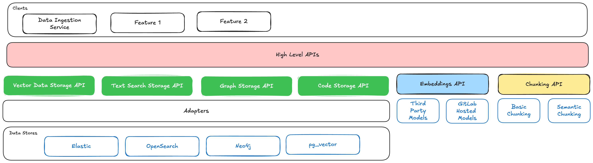
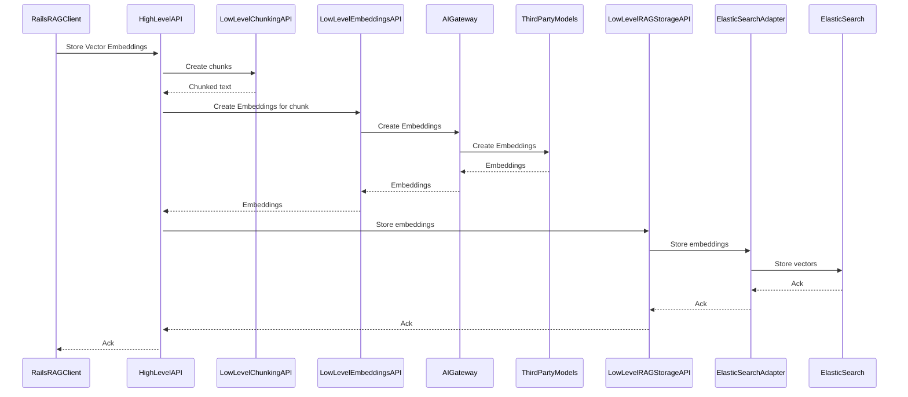
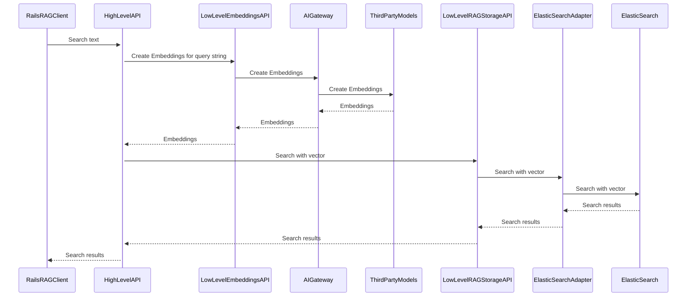
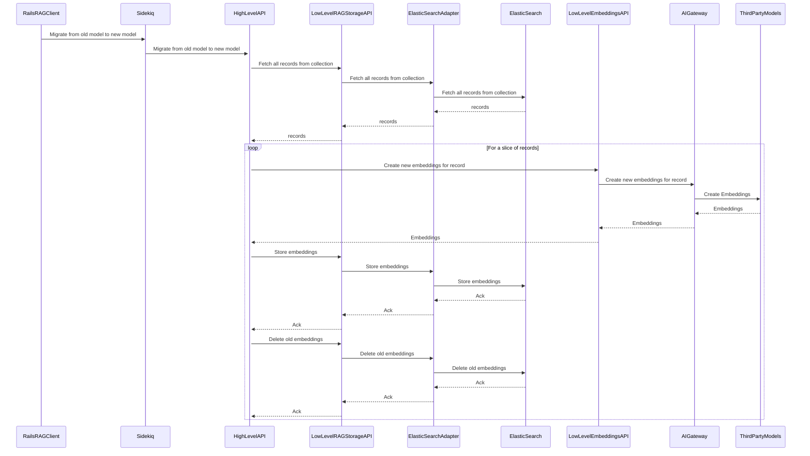

<!-- Design Documents often contain forward-looking statements -->

<!-- This renders the design document header on the detail page, so don't remove it-->


## Summary

To enhance the grounding of our AI features, there is a need for Retrieval Augmented Generation (RAG). As RAG evolves, no single method or storage solution currently addresses all potential use cases. Additionally, with advances in LLMs and larger context windows, our solution must remain adaptable. We also observe that customers leverage a variety of vector stores for RAG, making a one-size-fits-all approach impractical. Hence, creating an abstraction layer that unifies various RAG and embedding solutions will enable us to support diverse use cases efficiently.

## Motivation

The RAG abstraction layer will provide several key benefits:

- **Customer Flexibility**: Customers can integrate their preferred data stores and models.
- **Avoid Vendor Lock-in**: The architecture is designed to prevent dependency on a single vendor.
- **Modular Feature Development**: Features can be built independently of underlying data store constraints.
- **Adaptability**: Our solution can evolve as new techniques, models, and vendors emerge.

### Goals

- Enable teams to easily integrate vector databases and embedding models.
- Build an abstraction layer for diverse features like chat routing, memory, issue search, and code context.

## Proposal

We propose a layered abstraction model that provides both low-level APIs for specific data stores and high-level composite APIs. Teams can choose the appropriate API level based on their familiarity with the underlying technology. The abstraction layer will include the following components:



1. **Data Stores** - The underlying storage solutions such as vector or graph databases.
2. **Models** - These are the various embedding models that can be used, both third party and GitLab hosted, to embed the data prior to query / storing
3. **Chunking utilities** - These will be utilities that can be used by teams to quickly develop their chunk strategy whether fixed or semantic. Teams should be able to define the chunk size, overlap, etc. This is a part of the abstraction layer since we don't want teams to have to develop their own mechanisms.
4. **Encryption utilities** - Functions to encrypt data before it is stored in the data stores, ensuring data security.
5. **Low Level APIs** - Fine-grained APIs to interact directly with the underlying storage and models. These APIs offer clients detailed control over their data operations. These include:

a. *Store APIs* - Store and search data in the underlying data stores.

```ruby
add_vector(collection, vector, metadata)
search_vector(collection, vector, filter)
```

b. *Embedding APIs* - Generate embeddings from text. Data must be pre-chunked.

```ruby
create_embeddings(collection, model, list_of_text)
```

c. *Utility APIs* - Common functionalities such as chunking and encryption.

```ruby
chunk(text, method, size, overlap)
encrypt(text, key)
decrypt(text, key)
```

> Note: To begin with we will only build chunking, embeddings creation and vector search APIs

6. **High Level APIs** - Composite APIs that combine multiple lower-level APIs to streamline feature development. These abstract complex operations into simple interfaces.

```ruby
insert_record(collection, text, metadata, model, chunking_options)
update_model(collection, old_model, new_model)
```

> Note: To begin with we will only build the insert, search and update_model APIs


7. **Clients**: These are various teams that will consume these APIs. One specific user of the API will be a data ingestion service that can be configured by customers to ingest data from their data sources such as Confluence docs into the RAG store.

## Architecture

Here are some examples to illustrate the architecture

### Storing Data

We will provide a high-level API to store vector embeddings. The high level api will then internally call multiple low level APIs such as `chunk`, `create_embeddings` and `insert_record`



> Note: The adapters will read the connection configuration from GitLab config.

### Data Retrieval

High-level APIs will facilitate data retrieval, using composite approaches that query multiple data stores if necessary.



### Refreshing Data

The system will support model migration by regenerating embeddings when models are updated.



## TODO

- [] We need to figure out how we can apply GitLab RBAC to the data being retrieved
