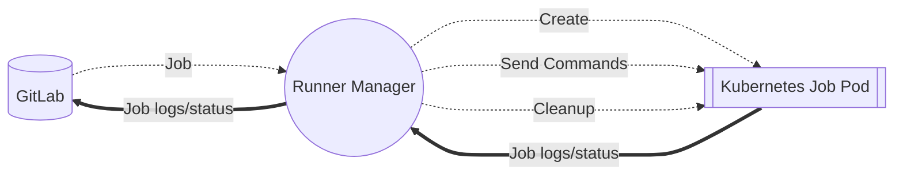
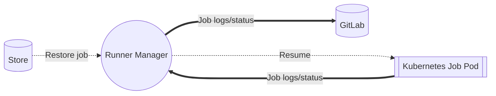
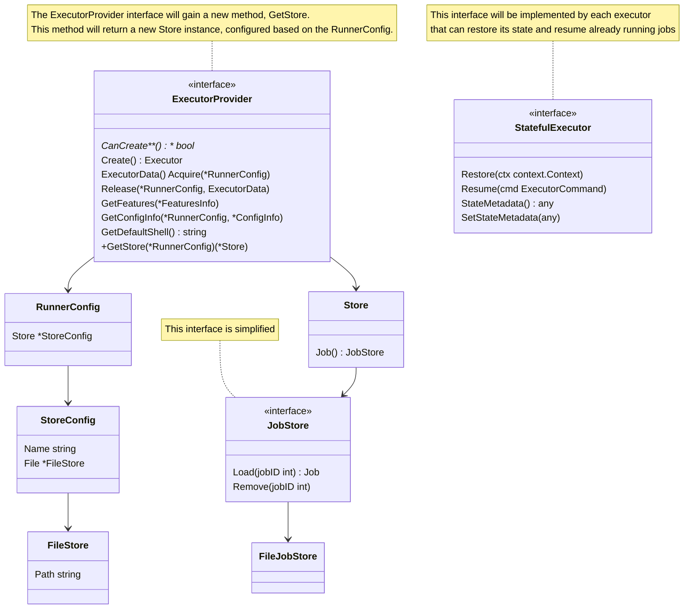

# GitLab Runner Fault Tolerance

```markdown
---
title: GitLab Runner Fault Tolerance
status: proposed
creation-date: "2024-08-20"
authors: [ "@ggeorgiev_gitlab" ]
coach: [ ]
approvers: [ "@DarrenEastman", "@NicoleWilliams" ]
owning-stage: "~devops::verify"
participating-stages: []
toc_hide: true
---
```

``

The GitLab Runner fault tolerance feature is a proposed technical solution for avoiding orphaned resources (like Kubernetes pods) and jobs stuck in a `Running` state when a Runner Manager restarts.

## Glossary

- GitLab Runner - [gitlab-org/gitlab-runner](https://gitlab.com/gitlab-org/gitlab-runner)
- Runner Manager - A long-running GitLab Runner process that accepts jobs from GitLab and runs them based on the configured executor.
- Executor - Executors run GitLab jobs in various environments. For example, the **Kubernetes** executor runs jobs in a **Pod**.
- Stateful Executor - An executor that can resume execution of a job after the Manager has been restarted.

## Motivation

As the cloud-native movement gained momentum and Kubernetes became increasingly popular, users began hosting their Runner Managers in dynamic cloud environments more frequently. In these environments, the machine or container running the Manager can disappear at any moment.

### Current job execution mechanism

From now on, let's focus on the context of Kubernetes and the Kubernetes executor. Here's how job execution works under normal conditions: The Manager receives a job from GitLab, creates the job pod in Kubernetes, and sends commands to be executed inside it. It also reads the job logs and status, sending this information back to GitLab, which then refreshes the UI.



### When things go wrong

When a manager disappears, the pods it was managing become orphaned and continue running until removed by another mechanism. New Manager instances have no memory of the running job pod or the running job. As a result, the running job will not be updated in the GitLab UI until it fails due to the timeout configured in GitLab.

## Goals

- GitLab Runner can seamlessly resume running jobs from the moment they were previously stopped.
- Only executors supporting fault tolerance (**Stateful Executors**) can resume jobs.
  - In the first iteration of the feature, this will only be the Kubernetes executor [with the attach strategy](https://docs.gitlab.com/runner/executors/kubernetes/#job-execution).
- GitLab Runner will support different storage mediums for saving job execution metadata.

### Non-Goals

- GitLab Runner will not attempt to resume jobs that have already timed out.
- It will not resume jobs when the fault tolerance feature is activated after a job is already running or has become orphaned.
- Guarantee 100% seamless transition of **job logs** to the new manager when resuming. The manager might crash before saving the latest execution state to the store. However, this shouldn't disrupt the overall job execution flow.

## Proposal

GitLab Runner will be saving in the **configured store** the **Job** and the **Execution State** of each job. If a store is configured and if the executor supports fault tolerance, before requesting a new job the store will be checked for jobs that are already running.

### Implementation details

### Code path

The fault-tolerant Runner Manager will:

1. Create the configured store if the executor is a `Stateful Executor`.

   - If no store is configured but the executor is `Stateful`, a `noop` store will be used. This allows data saving calls without additional logic branching.

   ```go
   store := NewNoopStore()
   if isStatefulExecutor := executor.(StatefulExecutor); isStatefulExecutor {
    store, _ = provider.GetStore(runnerConfig)
   }
   ```

2. Execute jobs as normal, but periodically or on certain events, write them to the store.
3. Upon restart, check for `Running` jobs in the store. If a job hasn't been updated recently, it will be resumed.

   - Disable all trace logging initially to prevent log duplication, as the Runner generates numerous job logs during job execution startup.
   - Restore the `State Metadata` on the executor first. For the `Kubernetes Executor`:

   ```go
   type executorStateMetadata struct {
     // The secrets created by the executor
    Credentials *api.Secret   `json:"credentials"`
    // The build pod
    Pod         *api.Pod      `json:"pod"`
    // The services
    Services    []api.Service `json:"services"`
    // Offset is the offset off of which to read the job logs from the build pod
    Offset      int64         `json:"offset"`
   }

   // Only the name and namespace of these resources is serialized to the store
   /*
   {
    credentials: { name: "", namespace: "" }
    pod: { name: "", namespace: "" }
    services: [{ name: "", namespace: "" }]
    offset: 0
   }
   */
   ```

   - Call the `Prepare` method on the `Executor` to set it up for job processing.
   - Re-enable and resume trace logging as normal.
   - Call the `Restore` method, part of the `StatefulExecutor` interface. This method queries the Kubernetes cluster for the full API objects:

   ```go
   func (s *executor) Restore(ctx context.Context) error {
    s.state.Pod, _ = s.kubeClient.CoreV1().Pods(s.state.Pod.Namespace).Get(s.state.Pod.Name)
    s.state.Credentials, _ = s.kubeClient.CoreV1().Secrets(s.state.Credentials.Namespace).Get(s.state.Credentials.Name)
    // do the same for services

    return nil
   }
   ```

   - Call the `Resume` method on the `StatefulExecutor` instead of the usual `Run` method. The `Resume` method reattaches to the `Pod` and continues sending the job trace and status to GitLab as usual.

After a restart, the new job execution mechanism will function as follows:



### Internal interfaces

Some of the most common interfaces will receive new methods.



### Iteration `#1` (Alpha)

- Only one Runner Manager instance will be supported due to the lack of leader election.
- The only supported storage medium will be the **File System**.
- The entire Job struct, including secrets and environment variables, will be saved to the store.
  - **Note:** I will verify if environment variables are necessary for resuming the Kubernetes executor.
  - This approach is necessary because we can't retrieve a `JobResponse` from GitLab once it has been initially received - [Discussion](https://gitlab.com/gitlab-org/gitlab-runner/-/issues/36951#note_2036646868)

### Iteration `#2` (Beta)

- Implement leader election to enable multiple Runner Managers to operate on the same store
- Introduce support for additional storage mediums

### Iteration `#3`

- TBD

## References

- Master issue
  - [**Add fault tolerance to the Runner K8s executor (attach strategy only)**](https://gitlab.com/gitlab-org/gitlab-runner/-/issues/36951)
