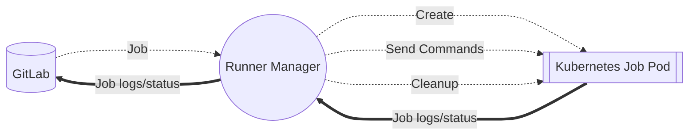
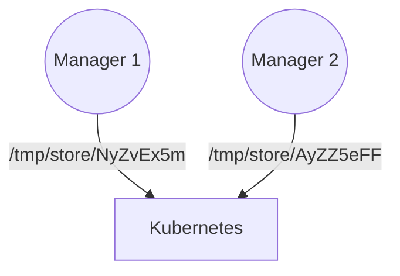
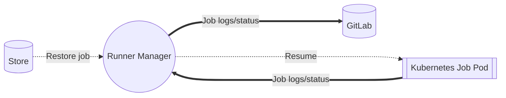
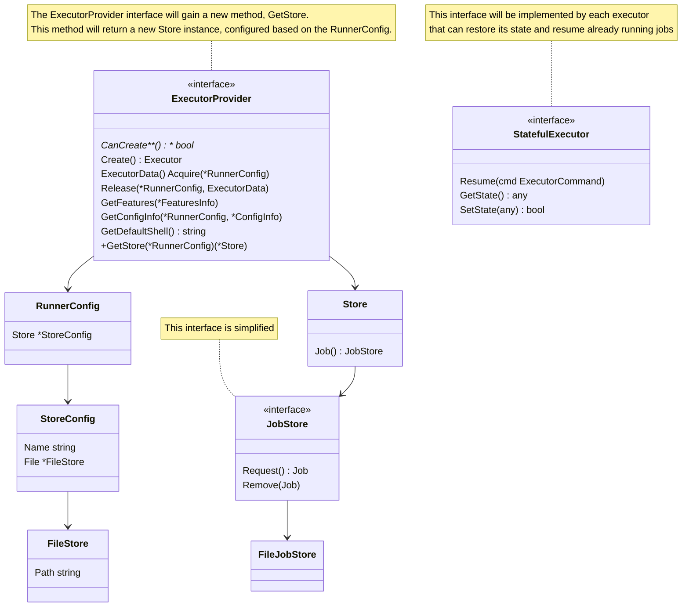

# GitLab Runner Fault Tolerance

```markdown
---
title: GitLab Runner Fault Tolerance
status: proposed
creation-date: "2024-08-20"
authors: [ "@ggeorgiev_gitlab" ]
coach: [ ]
approvers: [ "@DarrenEastman", "@NicoleWilliams" ]
owning-stage: "~devops::verify"
participating-stages: []
toc_hide: true
---
```

``

The GitLab Runner fault tolerance feature is a proposed technical solution for avoiding orphaned resources (like Kubernetes pods) and jobs stuck in a `Running` state when a Runner Manager restarts.

## Glossary

- GitLab Runner - [https://gitlab.com/gitlab-org/gitlab-runner](https://gitlab.com/gitlab-org/gitlab-runner)
- Runner Manager - A long-running GitLab Runner process that accepts jobs from GitLab and runs them based on the configured executor.
- Executor - Executors run GitLab jobs in various environments. For example, the **Kubernetes** executor runs jobs in a **Pod**.
- Stateful Executor - An executor that can resume execution of a job after the Manager has been restarted.

## Motivation

As the cloud-native movement gained momentum and Kubernetes became increasingly popular, users began hosting their Runner Managers in dynamic cloud environments more frequently. In these environments, the machine or container running the Manager can disappear at any moment.

### Current job execution mechanism

From now on, let's focus on the context of Kubernetes and the Kubernetes executor. Here's how job execution works under normal conditions: The Manager receives a job from GitLab, creates the job pod in Kubernetes, and sends commands to be executed inside it. It also reads the job logs and status, sending this information back to GitLab, which then refreshes the UI.



### When things go wrong

When a manager disappears, the pods it was managing become orphaned and continue running until removed by another mechanism. New Manager instances have no memory of the running job pod or the running job. As a result, the running job will not be updated in the GitLab UI until it fails due to the timeout configured in GitLab.

## Goals

- GitLab Runner can seamlessly resume running jobs from the moment they were previously stopped.
- Only executors supporting fault tolerance (**Stateful Executors**) can resume jobs.
  - In the first iteration of the feature, this will only be the Kubernetes executor [with the attach strategy](https://docs.gitlab.com/runner/executors/kubernetes/#job-execution).
- GitLab Runner will support different storage mediums for saving job execution metadata.

### Non-Goals

- GitLab Runner will not attempt to resume jobs that have already timed out.
- It will not resume jobs when the fault tolerance feature is activated after a job is already running or has become orphaned.
- Guarantee 100% seamless transition of **job logs** to the new manager when resuming. The manager might crash before saving the latest execution state to the store. However, this shouldn't disrupt the overall job execution flow.

## Proposal

GitLab Runner will be saving in the **configured store** the **Job** and the **Execution State** of each job. If a store is configured and if the executor supports fault tolerance, before requesting a new job the store will be checked for jobs that are already running.

## Implementation details

### Stores

The first supported store will be the **File store**. Future implementations may include other stores such as **Redis**. However, the **Step Runner** could potentially eliminate the need for additional stores, as discussed in [this issue](https://gitlab.com/groups/gitlab-org/-/work_items/12935#note_2075889632).

### Stores with multiple manager instances

The **File store** will support only **one** manager reading from or writing to a specific directory path. While **Step Runner** might allow multiple managers to access the same services simultaneously, this is still uncertain.

If we decide to implement additional stores or enhance existing ones, we could explore implementing some form of leader election. This would enable one Manager to read from a single store and distribute jobs to worker Managers without store specific synchronization.

### Configuration

The store configuration has a few options that will control its lifecycle:

```toml
[[runners]]
executor = "kubernetes"

[runners.store]
name = "file" # The name of the store configured below

# Default values are depicted below
health_interval = 5 # Interval in seconds to update the health of the job in the store.
cleanup_interval = 300 # Interval in seconds to cleanup the store.
health_timeout = 30 # Timeout in seconds to consider a job unhealthy. Unhealthy jobs will be resumed from the store.
stale_timeout = 10800 # Timeout in seconds to consider a job stale. Stale jobs are removed from the store.
max_retries = 10 # Maximum number of times a job will be retried.
```

Additionally each store has its own properties:

```toml
[runners.store.file]
path = "/tmp/store"
```

### File store

The **file store** is a simple store that saves jobs to disk in a directory. As such it has the limitation that it does not support more than one Runner Manager instance using the same store path this means that deployments that use multiple runners on the same machine should use a different path for each runner. The store allows for variable expansion in the path to allow for that scenario. Since the expansion happens very early on in the lifecycle of the Runner only a handful of variables are available.

- CI_RUNNER_ID
- CI_RUNNER_REVISION
- CI_RUNNER_SHORT_TOKEN
- CI_RUNNER_TAGS
- CI_RUNNER_VERSION
- Any environment variable that is set in the **environment** section of the **config.toml**

### Deploying fixed Managers with a File store



When the Runner Managers are fixed, they are registered only once. This allows the use of the **CI_RUNNER_SHORT_TOKEN** environment variable to assign each manager a unique store location. Consequently, when a manager restarts, it can resume jobs from its designated store.

```toml
[runners.store.file]
path = "/tmp/store/$CI_RUNNER_SHORT_TOKEN"
```

### Deploying Managers with a File store through Helm Chart

When using the Helm chart, we can't rely on the **CI_RUNNER_SHORT_TOKEN** variable because managers are registered when brought up and unregistered when brought down. This means each new Manager instance will have a different **CI_RUNNER_SHORT_TOKEN**. We need a method to link a specific Runner Manager to a specific store location. For this purpose, we can employ a **StatefulSet**. StatefulSets attach volume mounts to a specific pod index within the set.

For instance, if we scale a StatefulSet to three instances, we'll get the following pods:

```
gitlab-runner-manager-0
gitlab-runner-manager-1
gitlab-runner-manager-2
```

If we scale it down to 2 we'll get

```
gitlab-runner-manager-0
gitlab-runner-manager-1
```

If we scale back to 3 again, we'll get a new instance with the same volume mount as the previous one.

The volume mount can be configured in the values.yaml file:

```yaml
workloadManager: StatefulSet

volumeMounts:
  - name: store-path
    mountPath: /tmp/store
```

The store then can be configured in the config.toml:

```toml
[runners.store.file]
path = "/tmp/store"
```

Caution is necessary when scaling down the Managers. If Managers are scaled down abruptly, interrupting running jobs or leaving interrupted jobs waiting to be resumed, these jobs might not be picked up again.

This proposal is explored in [https://gitlab.com/gitlab-org/charts/gitlab-runner/-/merge_requests/493](https://gitlab.com/gitlab-org/charts/gitlab-runner/-/merge_requests/493)

### Deploying Managers with a File store through Runner Operator

This is yet to be explored, but the approach will likely be similar to Helm Chart.

### Code path

The fault-tolerant Runner Manager will:

1. Create the configured store if the executor is a `Stateful Executor`.
    - If no store is configured but the executor is `Stateful`, a `noop` store will be used. This allows data saving calls without additional logic branching.

    ```go
    store := NewNoopStore()
    if isStatefulExecutor := executor.(StatefulExecutor); isStatefulExecutor {
    	store, _ = provider.GetStore(runnerConfig)
    }
    ```

2. Execute jobs as normal, but periodically or on certain events, write them to the store.
3. Upon restart, check for `Running` jobs in the store. If a job hasn't been updated recently, it will be resumed.
    - Disable all trace logging initially to prevent log duplication, as the Runner generates numerous job logs during job execution startup.
    - Restore the `State Metadata` on the executor first. For the `Kubernetes Executor`:

    ```go
    type executorStateMetadata struct {
      // The secrets created by the executor
    	Credentials *api.Secret   `json:"credentials"`
    	// The build pod
    	Pod         *api.Pod      `json:"pod"`
    	// The services
    	Services    []api.Service `json:"services"`
    	// Offset is the offset off of which to read the job logs from the build pod
    	Offset      int64         `json:"offset"`
    }

    // Only the name and namespace of these resources is serialized to the store
    /*
    {
    	credentials: { name: "", namespace: "" }
    	pod: { name: "", namespace: "" }
    	services: [{ name: "", namespace: "" }]
    	offset: 0
    }
    */
    ```

    - Call the `Prepare` method on the `Executor` to set it up for job processing.
    - Re-enable and resume trace logging as normal.
    - Call the `Resume` method on the `StatefulExecutor` instead of the usual `Run` method. The `Resume` method restores resources from the Kubernetes cluster, such as the `Pod`, reattaches to the `Pod`, and continues sending the job trace and status to GitLab as usual.

After a restart, the new job execution mechanism will function as follows:



### Internal interfaces

Some of the most common interfaces will receive new methods.



### Iteration #1 (Alpha)

- Only one Runner Manager instance per store path will be supported.
- Enable deployment in a Kubernetes cluster with multiple managers using **File Store** while still using one Manager per path.
- The only supported storage medium will be the **File System**.
- The entire Job struct, including secrets and environment variables, will be saved to the store.
    - This approach is necessary because we can't retrieve a `JobResponse` from GitLab once it has been initially received - [https://gitlab.com/gitlab-org/gitlab-runner/-/issues/36951#note_2036646868](https://gitlab.com/gitlab-org/gitlab-runner/-/issues/36951#note_2036646868)
    - This might end up not being an issue if **Step Runner** manages to solve it - [https://gitlab.com/groups/gitlab-org/-/epics/12935](https://gitlab.com/groups/gitlab-org/-/epics/12935)

### Iteration #2 (Beta)

- TBD

### Future development

The next iteration will heavily depend on feedback from the first. We'll have several milestones before planning the next Fault Tolerance iteration. We'll also likely start [dogfooding the Kubernetes executor around that time](https://gitlab.com/groups/gitlab-org/-/epics/14813), which will provide real-world data to inform our planning. Here are some potential future developments:

- Integrate **Step Runner**
    - This integration's timeline depends on the relative progress of **Step Runner** development compared to **Fault Tolerance**
- Make another executor fault-tolerant—the Docker Executor is a strong candidate, and we already have a proof of concept: [https://gitlab.com/gitlab-org/gitlab-runner/-/merge_requests/4976](https://gitlab.com/gitlab-org/gitlab-runner/-/merge_requests/4976)
- Implement **File Store file locks**
    - Currently, file store access isn't synchronized, allowing only a single manager to access it for simplicity.
    - We could investigate file locks' performance and behavior.
    - We might add a file store property to toggle file locks, avoiding locking overhead in simple single-manager scenarios.
    - File locking is OS and filesystem-dependent, potentially limiting portability.
    - Implementing file locking may be more complex than creating a **Redis store**.
- Implement another store
    - Distributed systems like **Redis** could enable store implementation without leader election. **Redis** provides synchronization primitives to ensure multiple managers can access the same store, addressing the **File Store** limitation.
- Implement leader election
    - This would allow any manager to resume any job, rather than limiting it to one manager per store.
    - A leader would benefit large clusters that overwhelm the GitLab API with job requests. Instead, only one or a few managers would send API requests.
    - While this option seems least appealing due to its complexity, future feedback might change this perspective.

## References

- Master issue
    - [**Add fault tolerance to the Runner K8s executor (attach strategy only)**](https://gitlab.com/gitlab-org/gitlab-runner/-/issues/36951)
