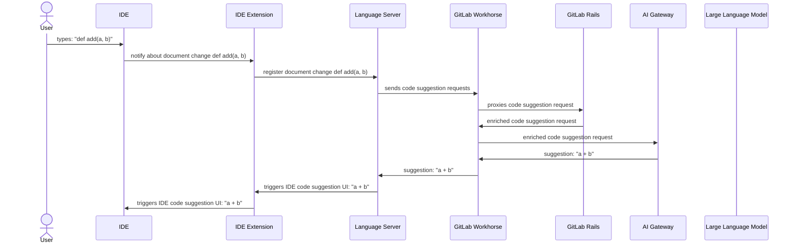
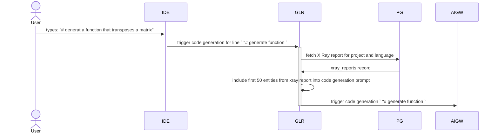
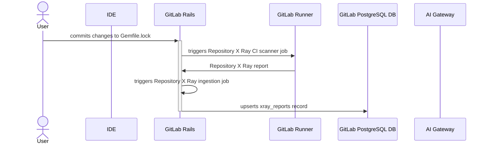

## Code Creation features technical overview

This page provides high level overview into how the Code Creation group features are implemented and which compontents are involved with them.

In most general sense code suggestions feature follow sequence as described on a diagaram below

Components pictured on diagrama are as follow:

1. IDE extensions: GitLab offers number of IDE extensions (aka plugins) that among other features also provide integration with Language Server
   1. Language Server: https://gitlab.com/gitlab-org/editor-extensions/gitlab-lsp       
   1. VSCode Extension: https://gitlab.com/gitlab-org/gitlab-vscode-extension/      
   1. JetBrains Extension: https://gitlab.com/gitlab-org/editor-extensions/gitlab-jetbrains-plugin
   1. NeoVim Extension: https://gitlab.com/gitlab-org/editor-extensions/gitlab.vim
1. [Langugage Server](https://gitlab.com/gitlab-org/editor-extensions/gitlab-lsp): it a unified way of delivering features that can be shared across different IDEs reducing duplication. Language Server is a component that uses the [LSP protocol](https://microsoft.github.io/language-server-protocol/#:~:text=The%20Language%20Server%20Protocol%20(LSP,definition%2C%20find%20all%20references%20etc.) for communication with IDE extensions. 
1. [GitLab Workhorse](https://docs.gitlab.com/ee/development/workhorse/) - GitLab Workhorse is a smart reverse proxy for GitLab intended to handle resource-intensive and long-running requests.
1. [GitLab Rails](https://gitlab.com/gitlab-org/gitlab) - main GitLab component providing majority of features.
1. [AI Gateway](https://gitlab.com/gitlab-org/modelops/applied-ml/code-suggestions/ai-assist) - a standalone-service that will give access to AI features to all users of GitLab, no matter which instance they are using: self-managed, dedicated or GitLab.com. For more conceptual information refer to [architecture blueprint](https://docs.gitlab.com/ee/architecture/blueprints/ai_gateway/index.html)
1. Large Language Model - a AI model that provides code generation capabilities

## Code Completion

Code completion interaction is one of two code cration requests that can be triggered by IDE. It's goal is to provide very fast responses (< 1 second) 
at the cost of smaller suggestion size, and less context awareness of surrounding source code or repository files 

## Code Generation

Code completion interaction is another type code cration requests that can be triggered by IDE. It's goal is to provide long and extensive responses generating
complete blocks of code like function or classe. It responses times are much longer then code completions (up to 30 seconds). This type of code creation requests
takes extended context into account when resolving user task. This context comes from current files in IDE as well as [Repository X Ray](https://docs.gitlab.com/ee/user/project/repository/code_suggestions/repository_xray.html) report. 

In above diagram some components (inc: GitLab Workhorse or Language Server) are ommitted for brevity reasons. However high level flow of requests shown in [technical overview](#code-creation-features-technical-overview) section
remains unchanged.  

## Repository X ray

[Repository X Ray](https://docs.gitlab.com/ee/user/project/repository/code_suggestions/repository_xray.html) is a feature that generates additional context data that is being included into code generation requests 
in order to ground AI model into context of existing source code and aling it with its private API as well as coding patterns. 

Repository X Ray report is generated as shown on following diagram:

Components pictured on diagrama are as follow:

1. GitLab Runner
1. GitLab PostgrSQL DB
1. Repository X Ray CI scanner 

Existing Repository X Ray reports are being included into code generation requests as shown in diagram at [code generation](#code-generation) paragraph. 