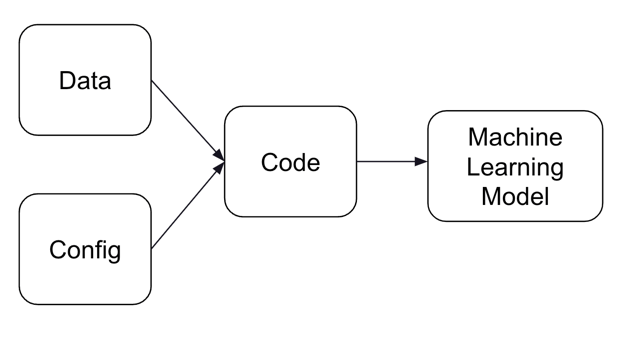
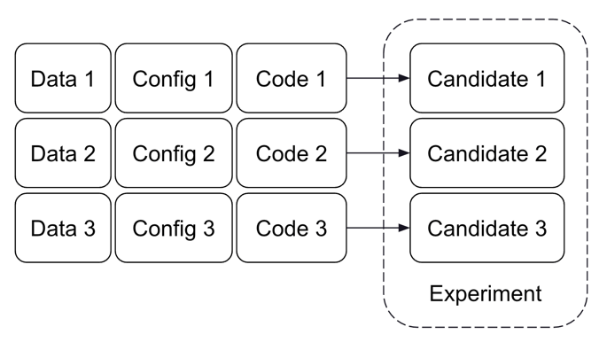

NOTE: The MLOps Incubation Engineering project has become the MLOps team. These pages are left fir historical purposes, but are not actively maintained. Please refer to the [MLOps team page](/handbook/engineering/development/data-science/modelops/mlops) for updated information.

This is a project led by the Incubation Engineer - MLOps

DRI: [@eduardobonet](https://gitlab.com/eduardobonet)

- [Epic](https://gitlab.com/groups/gitlab-org/-/epics/8560)
- [All Merge Requests](https://gitlab.com/gitlab-org/gitlab/-/merge_requests?scope=all&state=opened&label_name[]=Model%20Experiments)
- [All Issues](https://gitlab.com/gitlab-org/gitlab/-/issues/?label_name%5B%5D=Model%20Experiments)
- [Usage](https://gitlab.com/gitlab-data/tableau/-/issues/323)

## Mission

Make it dead simple for Data Scientists to track their model experiments within GitLab, while making it easy to access
the experiments results across the product (on Model Registry, on MRs, on Issues, etc)

## Guiding Principles

- GitLab enables Data Scientists to use Experiment Tracking without requiring any support from Platform Engineers
- Data Scientists can start using GitLab Experiment Tracking without any changes to their codebase
- Experiment Tracking is not just a vertical feature, it integrates across the platform to enhance experience in different steps of model development

## Approach: GitLab as a backend for MLFlow

[MlFlow](https://mlflow.org/docs/latest/tracking.html) is the most popular open source option for Experiment Tracking, providing
a powerful client that allows Data Scientists to log a wide range of models. It also provides a UI to organize and
explore these experiments. However, while its Machine Learning related features are great, it lacks features required by
organizations, such as user management. It also requires users to manually deploy and maintain the deployment.

Our approach is to reimplement the MLFlow backend on GitLab, and offer a UI consistent to platform. This way, users can
still rely on MLFlow client, having user management handled by GitLab, without needing any additional support for
deployment.

We should also go beyond, and leverage the DevOps Platform to integrate this feature across the platform:

- How can it enhance User Experience on CI/CD, on Merge Requests, on packaging
- How can the patterns and components that our users are already used to (cross-reference, comments, descriptions) enhance Experiment Tracking
- How can we use this to manage the entire lifecycle of models within GitLab

## Current Status

### Available Futures

Demo as of January 16th:

<figure class="video_container">
  <iframe width="600" height="340" src="https://www.youtube.com/embed/uxweU4zT40?controls=0"  frameborder="0" allowfullscreen></iframe>
</figure>

- **GitLab MLFlow API** MLFLow API is partially implemented
- **Logging through MLFlow Client** Data Scientist can use the MLFlow Client to save their experiment data on GitLab:
  - Create experiments
  - Create candidates
  - Log parameters, metrics, artifacts and metadata.
- **Search and organization of Candidates**
  - Search candidates by name
  - Sort by name, creation date and metrics
  - Compare candidates in a table
  - Visualize details of a candidate and its metadata
  - Download the artifacts

### Release Plans

We are dogfooding the MVP. We intend to release the MVP to users on 16.0

## FAQ?

### What is Machine Learning Experiment Tracking?

A Machine Learning Model is the result of three components: the code to extract the patterns, the data where the patterns are
extract from and the configuration used for both. Any change on either of these components can lead to changes in the model
performance.

Each **Model Candidate** represents a combination of the three components, and the associated artifact and results. A group
of comparable candidates is called an experiment.

Experiment Tracking gives Data Scientists a central place to organize, discover and compare candidates, experiments
and artifacts, making it easier to keep track of the evolution across time.

Some of the common features seen in Experiment Tracking offerings are:

- Log the parameters used to created a Candidate
- Log the model metrics of each candidate
- Log additional metadata for each candidate
- Log the artifact generated for each candidate
- Being able to search and filter candidates by metric, parameters or metadata

More info:

- [ML Experiment Tracking: What It Is, Why It Matters, and How to Implement It](https://neptune.ai/blog/ml-experiment-tracking)
- [Experiment Tracking](https://madewithml.com/courses/mlops/experiment-tracking/)

### What is the difference between Experiment Tracking and Model Registry?

Experiment Tracking is focused on comparing different candidates that can be promoted to a model version. Model Registry
on the other hand focuses on the lifecycle of a candidate that was promoted to a model version.

Candidates can be created either locally, manually or automated through CI (in an MR for example),
and the code might not even be present in the repository yet. Meanwhile, a model version can be deployed along the application for consumption.
This way, Experiment Tracking is associated to the Create stage of MLOps, when the Data Scientist is still prototyping,
while the Model Registry belongs to the Packaging stage.

### What is the difference between Experiment Tracking and Experimentation/AB Testing?

Although with similar names, they do not interact. ML Experiments compare model candidates, based on model metrics computed at
creation time, while AB testing and experimentation aims com measure the impact of a two or more different variants based on usage
metrics.
