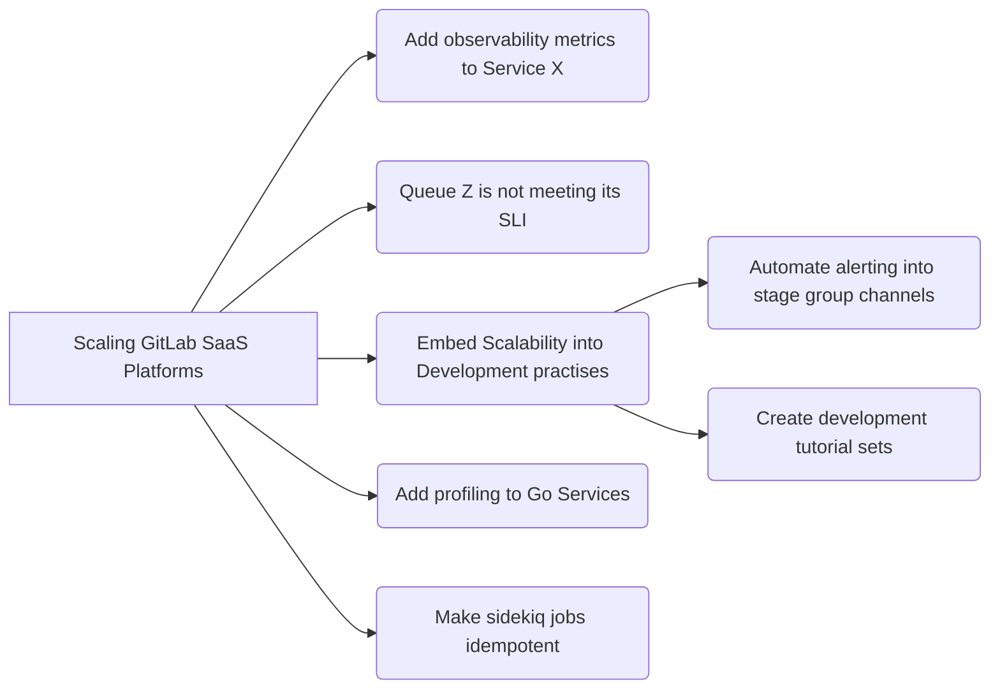

---

title: "Scalability Group Project Management"
---

## Project Management

We use Epics, Issues, and Issue Boards to organize our work, as they complement each other.

The single source of truth for all work is [Scaling GitLab SaaS Platforms epic](https://gitlab.com/groups/gitlab-com/gl-infra/-/epics/148).
This is considered as the top-level epic from which all other epics are derived.

Epics that are added as children to the top-level epic are used to describe projects that the team undertakes.

Having all projects at this level allows us to use a single list for prioritization and enables us to prioritize
work for different services alongside each other. Projects are prioritized in line with the OKRs for the current quarter.

Project status is maintained in the description of the top-level epic so that it is visible at a glance. This is auto-generated using [the epic issues summary project](https://gitlab.com/gitlab-com/gl-infra/epic-issue-summaries).
You can watch a [short demo of this process](https://youtu.be/6Wb1f-c1_og) to see how to use status labels
on the epics to make use of this automation.

Example organization is shown on the diagram below:

*Note* If you are not seeing the diagram, make sure that you accepted all cookies.

### Project Ownership

Each project has an owner who is responsible for delivering the project.

The owner needs to:
1. Update the status block in the epic description each week.
1. Work with others to move project issues through the boards.

### Project Structure

The epic for the project must have the following items:

1. **Background**, including a problem statement, to provide context for people looking to understand the project.
1. **Exit criteria** for the specific goals of the project.
    1. These are created as issues with the `exit criterion` label in the epic and are linked in the description.
    1. We create these at the start of the project to allow us to keep focused on our goal, and use [blocking issues](https://docs.gitlab.com/ee/user/project/issues/related_issues.html) to indicate the state of each exit criterion.
1. **Status yyyy-mm-dd** should be the final heading in the description.
    1. This enables others who are interested in the epic to see the latest status without having to read through all comments or issues attached to the epic.
    1. This heading is used to auto-generate the status information on the top-level epic.
    1. If the epic has no child-epics and a mermaid block is added, [this script](https://gitlab.com/gitlab-com/gl-infra/epic-issue-summaries/-/blob/master/epic_issue_relationships.rb) that runs on a pipeline will automatically generate and include an issue relationship diagram in this section. An example can be seem [in this epic](https://gitlab.com/groups/gitlab-com/gl-infra/-/epics/447).
1. **Start date** is set to the expected start date, and updated to be the actual start date when the project begins.
1. **Due date** is set to be the expected end date.
    1. This should be seen as a target, and this target is re-evaluated every few weeks while the project is in progress. The date that a project actually ended is taken from the date that the epic was closed.

## Issue boards

The Scalability group [issue boards](https://gitlab.com/gitlab-com/gl-infra/scalability/-/boards/) track
the progress of ongoing work.

On the **planning board**, the goal is to get issues into a state where we have enough information to build the issue.
However, not all issues that are `workflow-infra::Ready` to be built should be scheduled for development right away. Some
issues may be too big, or might not be as important as others. This means not all issues that are `workflow-infra::Ready` on the
planning board will move to the build board immediately.

Please see the [triage rotation section](#triage-rotation) for when to move issues between the boards.

| **Planning** | **Building**|
|--------------|-------------|
| [Planning Board](https://gitlab.com/gitlab-com/gl-infra/scalability/-/boards/1697168) | [Build Board](https://gitlab.com/gitlab-com/gl-infra/scalability/-/boards/1697160) |
| Issues where we are investigating the work to be done. | Issues that will be built next, or are actively in development. |
| 	    |         |

## Labels

The Scalability teams routinely uses the following set of labels:

1. The group label, `group::Scalability`.
2. The team labels, `team::Scalability-Observability` and `team::Scalability-Practices`
3. Scoped `workflow-infra` labels.
5. Scoped `Service` labels.

The `group::Scalability` label is used in order to allow for easier filtering of
issues applicable to the team that have group level labels applied.

### Workflow labels

The Scalability teams leverage scoped workflow labels to track different stages of work.
They show the progression of work for each issue and allow us to remove blockers or change
focus more easily.

The standard progression of workflow is from top to bottom in the table below:

| State Label | Description |
| ----------- | ----------- |
|  | Problem is identified and effort is needed to determine the correct action or work required. |
|  | Proposal is created and put forward for review.  SRE looks for clarification and writes up a rough high-level execution plan if required. SRE highlights what they will check and along with soak/review time and developers can confirm.  If there are no further questions or blockers, the issue can be moved into "Ready". |
|  | Proposal is complete and the issue is waiting to be picked up for work. |
|  | Issue is assigned and work has started.  While in progress, the issue should be updated to include steps for verification that will be followed at a later stage.|
|  | Issue has an MR in review. |
|  | MR was merged and we are waiting to see the impact of the change to confirm that the initial problem is resolved. |
|  | Issue is updated with the latest graphs and measurements, this label is applied and issue can be closed. |

There are three other workflow labels of importance:

| State Label | Description |
| ----------- | ----------- |
|  | Work in the issue is being abandoned due to external factors or decision to not resolve the issue. After applying this label, issue will be closed. |
|  | Work is not abandoned but other work has higher priority. After applying this label, team Engineering Manager is mentioned in the issue to either change the priority or find more help. |
|  | Work is blocked due external dependencies or other external factors. Where possible, a [blocking issue](https://docs.gitlab.com/ee/user/project/issues/related_issues.html) should also be set. After applying this label, issue will be regularly triaged by the team until the label can be removed. |

### Priority labels

The Scalability group has only one priority label: `Scalability::P1`.

Only issues of the utmost importance are given this label.

When an issue is given this label, a message should be pasted in the team's Slack channel so that an owner can be found as quickly as possible.

These issues should be picked up soon as possible after completing ongoing task unless directly communicated otherwise.

It is a scoped label as we previously had 4 levels of priority. We found that
[in practise we primarily used P4](https://gitlab.com/gitlab-com/gl-infra/scalability/-/issues/863), and used P1 to indicate the issues of greatest importance.

### Labels in gitlab-org group

Stage groups use [type labels](/handbook/engineering/metrics/#data-classification) to label merge requests in projects in the `gitlab-org` group. The Scalability group is not a part of the stage groups, and labels of importance for the team are explained above. When submitting work in gitlab-org group, we apply ~"team::Scalability" and ~"type::maintenance" to merge requests by default. The latter label is describing work towards refinement of existing functionality which describes majority of the work the team is contributing.

### Choosing something to work on

We work from our main epic: [Scaling GitLab's SaaS Platforms](https://gitlab.com/groups/gitlab-com/gl-infra/-/epics/148).

Most of our work happens on the current in-progress sub epic. This is always prominently visible from the main
epic's description.

When choosing something new to work on you can either:
- Go to the [Build Board](https://gitlab.com/gitlab-com/gl-infra/scalability/-/boards/1697160) and pick from the `Ready` column.

or

- Go to the [Planning Board](https://gitlab.com/gitlab-com/gl-infra/scalability/-/boards/1697168) and try to advance issues
to the next appropriate column.