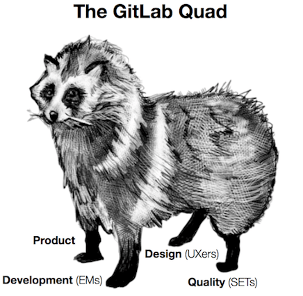

---

title: "Quad Planning"
description: "The Quality Engineering Sub-Department helps facilitate the quad-planning process. This is the participation of Product Management, Development, UX, and Quality which aims to bring test planning as a topic before the development of any feature."
---

The Quality Engineering Sub-Department helps facilitate the quad-planning process.
This is the participation of Product Management, Development, UX, and Quality which aims to bring test planning as a topic before the development of any feature.

These [4 areas are the main pillars](https://about.gitlab.com/handbook/product/product-processes/#pm-em-ux-and-set-quad-dris) to ensure we can continue to ship features while ensuring optimal test coverage. Velocity is only productive when we don't incur test debt. We want to be nimble while shipping fewer bugs thus improving our own velocity. One can look at the metaphor of the 4 legs of the Tanuki, without either one of its legs the Tanuki isn't able to run as fast.

## Two dimensions of Quad Planning

The quad planning has two aspects attached to it, which is as follows:
  1. Test Planning: For now this is the main focus of the quad-planning process. This is discussed elaborately in the below section.
  1. Being involved in the design discussions: When there is a need to participate in design discussions, the PMs directly ping the corresponding [Software Engineer in Test](https://handbook.gitlab.com/job-families/engineering/software-engineer-in-test/) (SET) to participate.

## Process

The [Directly Responsible Individuals](https://about.gitlab.com/handbook/people-group/directly-responsible-individuals/) (DRIs) collaboratively work on new features to ensure we ship quality software.
The SET owns the completion of the `Availability and Testing` section in the Feature Proposal to complete the definition of done. As we grow to reach our [desired ratio](/handbook/engineering/quality/#staffing-planning), we will only have the quad approach in groups where we have an assigned SET in place.
   1. An automated [Quad Planning triage report](https://gitlab.com/gitlab-org/quality/triage-ops/-/blob/master/policies/stages/report/quad-planning-issues.yml) is created on a weekly basis for groups with dedicated SETs. The report is generated with issues that satisfy the below conditions:
      1. Issue has the label `workflow:ready for development` and `group::*` (this corresponding to the product group to which the SET is aligned to.)
      1. Issue should not have `bug`, `quad-planning::complete-action`, OR `quad-planning::complete-no-action` labels.
      1. Issue should have an upcoming release milestone added and it should not have any of `Backlog` or `Next x releases` milestones.
   1. The `quad-planning::ready` label is automatically applied to all issues in the report.
   1. The SET will review the report every week. If necessary, the SET will coordinate with the PM/EM to discuss specific issues as needed.
   1. After reviewing each issue, the SET adds the testing requirements for each issue:
      1. The SET adds the [Availability and Testing section](https://gitlab.com/gitlab-org/gitlab/-/blob/master/.gitlab/issue_templates/Feature%20proposal%20-%20detailed.md#L74) to the issue description, ensuring that the strategy accounts for all test levels and facilitating discussions and feedback with the group.
      1. The SET add a checklist of the testing requirements in the above section, as appropriate. The checklist could contain one or more of the below mentioned details:
         1. Run the `package and qa` job.
         1. Update an existing end to end test, with the feature flag enabled and disabled if the feature is behind a feature flag - Provide the link of the testcase to be updated.
         1. Add new end to end test, with the feature flag enabled and disabled if the feature is behind a feature flag - Create a testcase issue and provide the link.
         1. If the feature is behind a feature flag, the feature flag rollout issue should include an item to verify that any end to end tests were executed and passed.
         1. Ensure test coverage in unit/integration tests, no end-to-end test is required.
         1. Ensure that the change is following our process on [maintaining backward compatibility across updates](https://docs.gitlab.com/ee/development/multi_version_compatibility.html).
            1. This is key for difficult to test changes, such as [modifying](https://docs.gitlab.com/ee/development/multi_version_compatibility.html#when-modifying-a-sidekiq-worker) or [adding](https://docs.gitlab.com/ee/development/multi_version_compatibility.html#when-adding-a-new-sidekiq-worker) Sidekiq workers.
   1. Finally the SET adds the `quad-planning::complete-action` label to the issue which marks the completion of quad-planning.
   1. If the change is trivial enough and does not actually need a `Availability and Testing` section, then the SET add the `quad-planning::complete-no-action` label.

### Sample Quad Planning flow

This diagram gives a visual representation of the Quad Planning workflow. It is ment to be a tool to facilitate efficient planning. It is not a complete diagram covering every technique we use to make the decisions (i.e. risk analysis is not covered).

```mermaid
flowchart TB
   %% nodes
   quad_planning_issue(Find your section in the Weekly Quad Planning Issue Report)
   issues_to_triage{Issues\nremaining to\nQuad Plan?}
   Done

   no_action_label(Add label 'quad-planning::complete-no-action')
   action_label(Add label 'quad-planning::complete-action')
   questions_issue{questions on issue?}

   discuss_issue(Discuss with counterparts)
   document_issue{docs-only issue?}
   tests_needed{Testing scenarios should be \ncovered or considered?}
   e2e_tests{needs E2E testing?}

   documentation_recommendation(Add comment why no testing needed &\n to review documentation)
   add_avail_section(Add `Availability & Testing` section)
   simple_recommendation(Add advice on\nUnit/Integration testing)
   complex_recommendation(Add advice on testing approach &\nidentify E2E tests to update/add)

   issue_done(Finished with this issue)
   track_new_test(Add note to tracking issue\nto implement new E2E test)

   next_issue(Find next Issue in the most recent Release)

   %% external links
   click add_avail_section_simple "https://gitlab.com/gitlab-org/gitlab/-/blob/master/.gitlab/issue_templates/Feature%20proposal%20-%20detailed.md#L74"
   click add_avail_section_complex "https://gitlab.com/gitlab-org/gitlab/-/blob/master/.gitlab/issue_templates/Feature%20proposal%20-%20detailed.md#L74"
   
   %% diagram

   quad_planning_issue --> issues_to_triage
 
   issues_to_triage -->|No| Done
   issues_to_triage -->|Yes| next_issue
   next_issue --> questions_issue
   questions_issue -->|Yes| discuss_issue
   questions_issue -->|No| document_issue
   discuss_issue --> document_issue
   
   document_issue -->|Yes| documentation_recommendation
   document_issue -->|No| tests_needed
   tests_needed -->|Yes| add_avail_section
   tests_needed -->|No| documentation_recommendation
   e2e_tests -->|Yes| complex_recommendation
   e2e_tests -->|No| action_label
   
   complex_recommendation --> track_new_test
   add_avail_section --> simple_recommendation
   simple_recommendation --> e2e_tests
   
   documentation_recommendation --> no_action_label
   track_new_test --> action_label
   
   no_action_label --> issue_done
   action_label --> issue_done
   issue_done --> issues_to_triage
```

