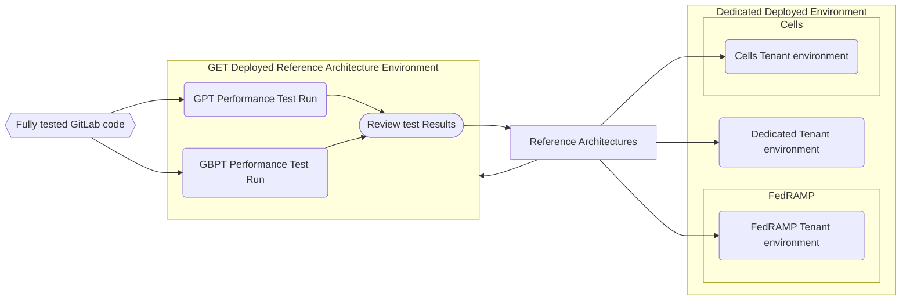
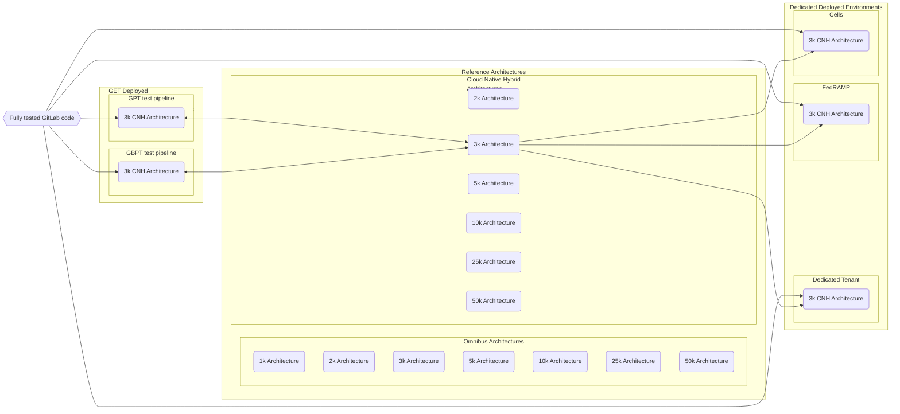
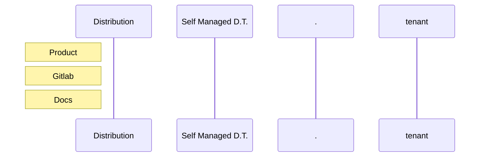

---

title: Performance Testing of Reference Architectures
---

## Overview

Doing performance testing is a complicated process to do well. This page is targeted at clarifying our process for doing performance testing as it relates to Dedicated and subsequently Cells and FedRAMP.

## Approach

Our base performance test approach is proactively test against [Reference Architectures](https://docs.gitlab.com/ee/administration/reference_architectures). We do this by running [GPT against the latest Nightly release of GitLab](https://handbook.gitlab.com/handbook/engineering/infrastructure/test-platform/performance-and-scalability/#test-process) ([customer facing description](https://docs.gitlab.com/ee/administration/reference_architectures/#validation-and-test-results)). We also run [browser based testing using GBPT against Reference Architectures](https://handbook.gitlab.com/handbook/engineering/infrastructure/test-platform/performance-and-scalability/#browser-performance-tool). This provides us confidence that the feature changes have not affected performance on environments deployed to match Reference Architectures.

Dedicated deploys Cloud Native environments based on Reference Architectures so the testing we do is directly mappable to the Dedicated Tenant environments.

### Diagrams

Note: For readability this diagram only shows the lines for the 3k `Reference Architecture`, there are equivalant lines for all the Reference Architectures to the `GET Deployed Reference Architecture Performance Test Environments` and from the Cloud Native Hybrid Reference Architectures to the `Dedicated Deployed Environments` (based on the size of the tenant environment)

### Brittany diagram

## Gitaly focus

TBD

## Assurance we can provide the customer

* We have recommendations on how to determine what sized Reference Architecture they should need
* We have performance tested the CNH Reference Architectures and are confident in our published metrics
* We will listen to their concerns and work with them to provide better confidence in GitLab
    * We added a [50k Reference Architecture](https://gitlab.com/gitlab-com/gl-infra/gitlab-dedicated/team/-/issues/2445) due to a customer request
    * We added [monorepo testing based on Chromium](https://gitlab.com/gitlab-org/quality/quality-engineering/team-tasks/-/issues/2377) 

## Cells

## FedRAMP

## Sample issues supporting customer requests

* [Enhance performance testing on large monorepos](https://gitlab.com/groups/gitlab-org/quality/quality-engineering/-/epics/37)
* [Extended performance testing to a large monorepo based on Chromium](https://gitlab.com/gitlab-org/quality/quality-engineering/team-tasks/-/issues/2377)
* [Extended Reference Architectures to a 50k size](https://gitlab.com/gitlab-com/gl-infra/gitlab-dedicated/team/-/issues/2445)
* [Pairing with a customer to define what performance testing needed to be done](https://gitlab.com/gitlab-com/gl-infra/gitlab-dedicated/team/-/issues/3724)

