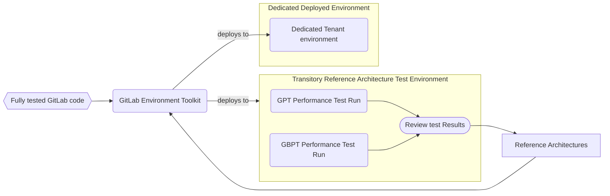
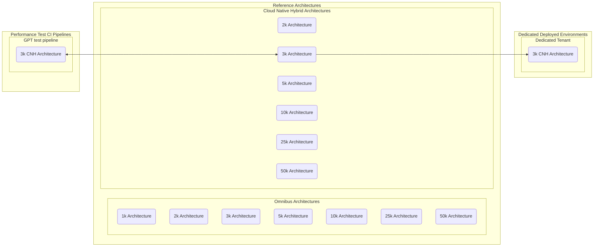

---

title: Performance Testing of Reference Architectures
---

This page is targeted at clarifying our process for doing performance testing as it relates to our Reference Architectures. This is not ment to replace the existing documentation, but rather to supplement the `how` and `what` in our existing documentation and provide a `why` our customers can trust that the results we present are relevant to their environments.

## Approach

The base of the performance test approach is to proactively test against [Reference Architectures](https://docs.gitlab.com/ee/administration/reference_architectures). This is done by running [GPT against the latest Nightly release of GitLab](https://handbook.gitlab.com/handbook/engineering/infrastructure/test-platform/performance-and-scalability/#test-process) ([customer facing description](https://docs.gitlab.com/ee/administration/reference_architectures/#validation-and-test-results)). There is also [browser based testing using GBPT against Reference Architectures](https://handbook.gitlab.com/handbook/engineering/infrastructure/test-platform/performance-and-scalability/#browser-performance-tool).  This provides confidence that the feature changes have not affected performance on environments deployed to match Reference Architectures.

Dedicated deploys Cloud Native environments based on Reference Architectures so the testing done for Reference Architectures is directly mappable to the Dedicated Tenant environments.

### Current Test Tools

| Tool | Test Details | Latest Results |
| ---- | ------------ | -------------- |
| [GPT](https://gitlab.com/gitlab-org/quality/performance) | https://gitlab.com/gitlab-org/quality/performance/-/wikis/current-test-details | https://gitlab.com/gitlab-org/quality/performance/-/wikis/home |
| [GBPT](https://gitlab.com/gitlab-org/quality/performance-sitespeed) | https://gitlab.com/gitlab-org/quality/performance-sitespeed/-/wikis/Current-Test-Details | https://gitlab.com/gitlab-org/quality/performance/-/wikis/Benchmarks/SiteSpeed |

## How do Reference Architecture based performance tests work?

Reference Architectures are the center of our performance testing approach. They describe the infrastructure that we are deploying to stand up GitLab on. GET deploys the infrastructure based on the Reference Architecture and then deploys the feature tested version of GitLab on that infrastructure. As we run performance tests, we review the results and they feedback to iteratively improve the Reference Architectures. When we deploy a Tenant under Dedicated environment, we use the same Reference Architecture to define the infrastructure we are deploying.

This diagram shows a different view into the same information. It shows all the Reference Architectures we have defined and how the 3k Cloud Native Reference Architecture links to the performance test pipelines and the Dedicated environments. For readability, only the lines for the [3k Cloud Native Hybrid Reference Architecture](https://docs.gitlab.com/ee/administration/reference_architectures/3k_users.html#cloud-native-hybrid-reference-architecture-with-helm-charts-alternative) are shown. Lines for the other [Reference Architectures](https://docs.gitlab.com/ee/administration/reference_architectures/) could be drawn instead. The Reference Architecture fields in the diagram link to their corresponding definitions.

## Types of performance tests covered

We have tests that cover a variety of different areas of GitLab in order to provide confidence in our application:

| Tool | Area |
| ---- | ---- |
| GPT | [API](https://gitlab.com/gitlab-org/quality/performance/-/wikis/current-test-details#api) |
| GPT | [git](https://gitlab.com/gitlab-org/quality/performance/-/wikis/current-test-details#git) |
| GPT | [scenarios](https://gitlab.com/gitlab-org/quality/performance/-/wikis/current-test-details#scenarios) |
| GPT | [web](https://gitlab.com/gitlab-org/quality/performance/-/wikis/current-test-details#web) |
| GBPT | [web](https://gitlab.com/gitlab-org/quality/performance-sitespeed/-/wikis/Current-Test-Details) |

We performance test web with both GPT and GBPT because they each provide different approaches to testing that give us different insights that we use to improve performance.

## Environment specifics

This section identifies some of the key criteria of Dedicated

### Dedicated

- Deploys a Reference Architecture based environment with [GitLab Environment Toolkit](https://gitlab.com/gitlab-org/gitlab-environment-toolkit)
- Deploys the previous major release of GitLab
- Deploys to AWS/GCP
- Uses cloud-provider managed services
- Cloud-Native Hybrid

### Findings

Dedicated deployments use standard Reference Architecture infrastructure, so our existing performance tests are directly attributable