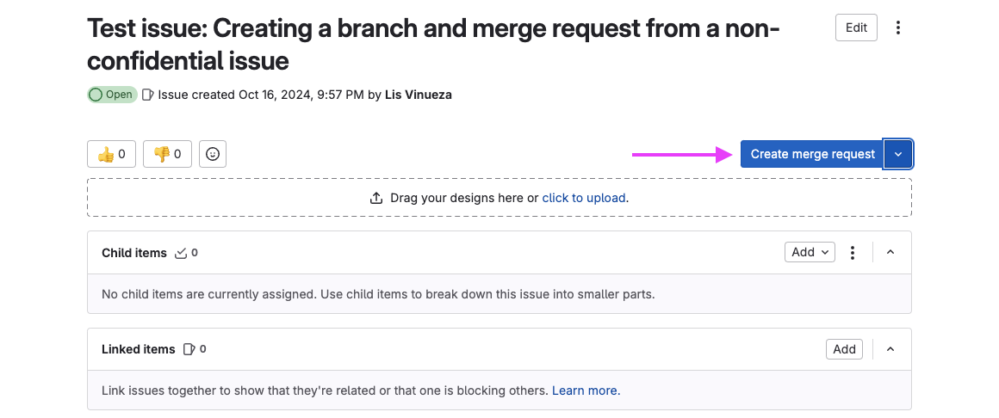
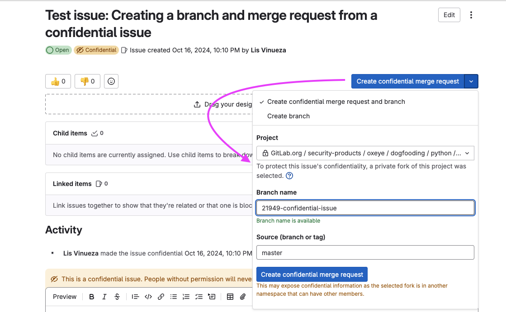
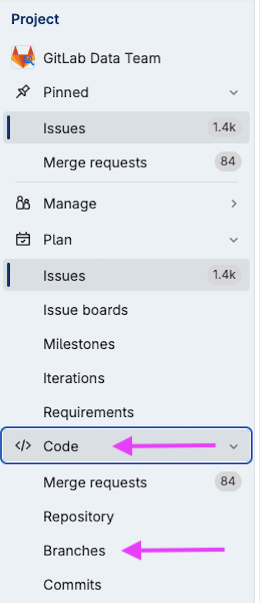
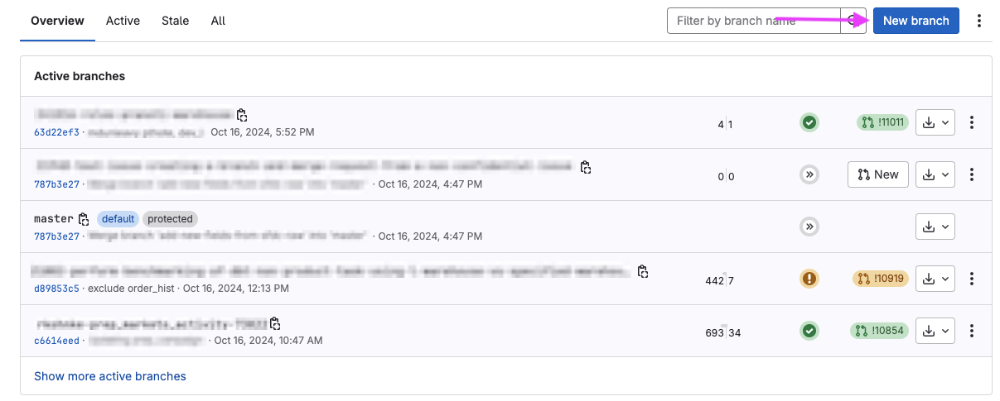
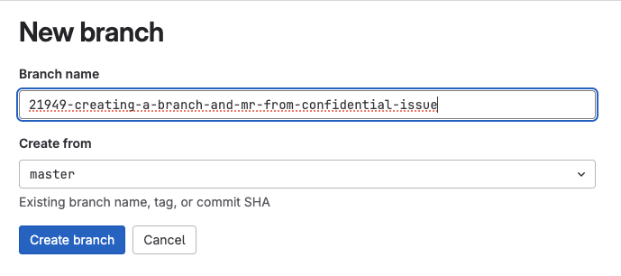
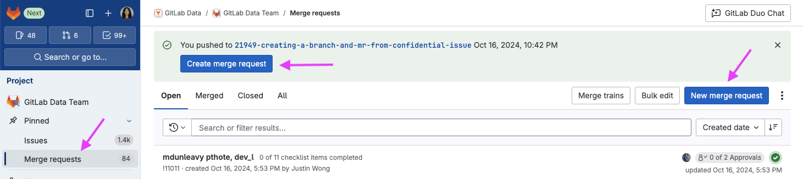

# Practical Guide

Our goal is to empower every team member to contribute to and benefit from our data ecosystem. This guide is designed to break down barriers and enable everyone, regardless of their role or technical background, to actively participate in our data projects.

By providing practical, step-by-step instructions, we aim to demystify the process of contributing to the Data Team's projects. Whether you're a seasoned data professional or someone from another department looking to leverage data for your work, this guide will help you navigate the technical aspects of making changes, resolving issues, and collaborating effectively.

We're committed to enabling teams to self-serve their data needs. This guide complements our [dbt change workflow](/handbook/enterprise-data/how-we-work/dbt-change-workflow/), [dbt guide](/handbook/enterprise-data/platform/dbt-guide/), [sql guide](/handbook/enterprise-data/platform/sql-style-guide/) and [ci jobs](/handbook/enterprise-data/platform/ci-jobs/) by focusing on the hands-on aspects of contribution. 

Remember, every contribution, no matter how small, helps to enrich our collective knowledge and improve our data capabilities. We encourage you to dive in, experiment, and don't hesitate to ask questions in #data. Together, we can build a more data-driven GitLab.

# Working in the GitLab Web IDE

Everything starts with an issue! Make sure you have created an issue using the appropriate template, most likely the Standard data team issue template and let's get started.

## Create a new branch 

1. Non-confidential issues

To create a branch and a merge request from a non-confidential issue, you can simply click the "Create merge request" button in your issue

While you have the option to create only the branch and not the merge request, and also to update your branch name and source by using the dropdown next to the 'Create merge request' button, it's best to create the merge request and branch simultaneously, using the default branch name and source (master). 

2. Confidential issues

When working on a confidential issue, you may notice that you can't create an MR directly in the project. Instead, you're only presented with the option to create your branch and MR in a fork

However, you can still create a branch within the project for your work. To do this, click on 'Code' in the left sidebar, then select 'Branches'. 

From there, click on the 'New branch' button to begin the process of creating your branch.

When creating your new branch, you'll need to consider the naming convention. Start the branch name with the issue ID (e.g., `21949-`) to automatically link the future MR to the existing issue. Follow this with a descriptive name that closely aligns with the issue. For consistency, use `snake_case` or `kebab-case` (e.g., `21949-creating-a-branch-and-mr-from-confidential-issue`). You'll also need to choose the source branch from which to create your new branch. In most cases, this will be the default branch 'master'.

Once you've created your branch for this confidential issue, you'll usually be prompted to create a merge request on the next screen. If you don't see this prompt, don't worry. You can go to 'Merge requests' in the left sidebar, where you should see an option to 'Create merge request' for your recently created branch. Alternatively, you can click on 'New merge request' and choose your newly created branch as the source branch. Both methods will allow you to start the merge request process.

## Create a merge request
