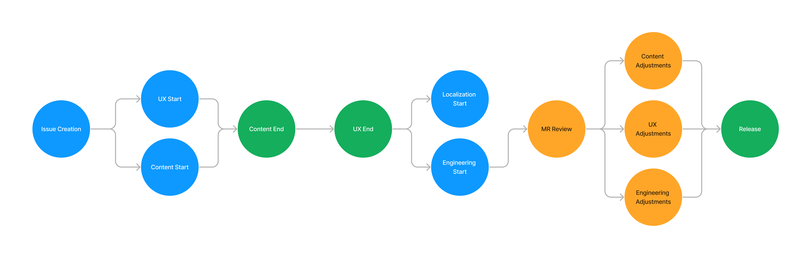

## Purpose

Both the Digital Experience team and the [Localization team](https://handbook.gitlab.com/handbook/marketing/localization/) have collaborated for many quarters, and we would like to outline our learnings to work more efficiently together. 

### Summary

 

Right now, an issue is created leading to UX and content to start working. Ideally, when the content is completed, UX is able to start working. After the UX is completed, this allows engineering and Localization to start working. Engineers will kick off a merge request, which allows content, UX, and engineering to make adjustments to the page. Note that we need the source language to be completed before translations can begin. 

### Challenges

All of this has been synthesized by the [following issue comment](https://gitlab.com/gitlab-com/marketing/digital-experience/buyer-experience/-/issues/3855#note_1980717872) as well as from [Phase 1 of localizing content](https://gitlab.com/gitlab-com/localization/localization-team/-/issues/169#recycle-improvements-what-can-be-improved), which fall into two buckets:

1. Techology: The engineering review process, and integration with other tools
1. People: Project management, including flow and organization

### How Engineering kicks off a translation request

Engineers can kick off the translation process by [creating a new issue using the localization template](https://gitlab.com/gitlab-com/localization/issue-tracker/-/issues/new?issuable_template=localization-request) in the [Localization Issue Tracker project](Localization Issue Tracker). This eventually leads to an item being created in 

Note that the source language's content must be completed for this to go through. Given that it takes them between 5-7 days to translate, communicate that with your stakeholders before commiting to work. As a general rule, content should be completed before the start of an iteration to give ample time for translations and LQA.

#### Best practices when building marketing pages to support internationalizaion

- If pages are build in Contentful, avoid custom JSON. 
- Encourage UX and L10n to talk to each other.
  - When net new pages are created, we should use the `i10n-attention` [label](https://gitlab.com/groups/gitlab-com/-/labels?subscribed=&sort=relevance&search=l10n-attention)
  - [Overflowing text](https://gitlab.com/gitlab-com/localization/localization-team/-/issues/171) due to the length of different character averages among locales

### Requesting access into Argo

Argo is a translation service used by the localization team to manage files and assets that are to be translated. This epic was created to track onboarding into [Argo](https://gitlab.com/gitlab-com/localization/localization-team/-/issues/156). Here are issues that talk about [assets](https://gitlab.com/gitlab-com/localization/localization-team/-/issues/173) and [requests](https://gitlab.com/gitlab-com/localization/localization-team/-/issues/174) in the UI. You can do request content that lives in YAML, or that [exists in Contentful](https://gitlab.com/gitlab-com/localization/localization-team/-/issues/172) 

### How do we localize YML? 

### How do we deal with Marketo Forms? 

Right now, each Marketo form ID is unique per every locale. We are looking into a potential solution so that one form holds each locale's content. 

### Contentful

#### What are source entries in Contentful?

#### What is the difference between field level and entry level localization? 

