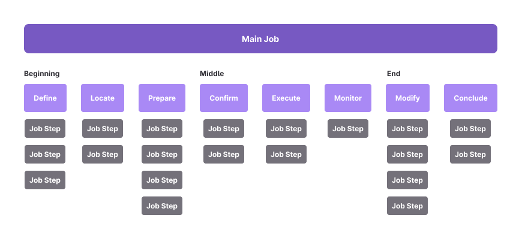
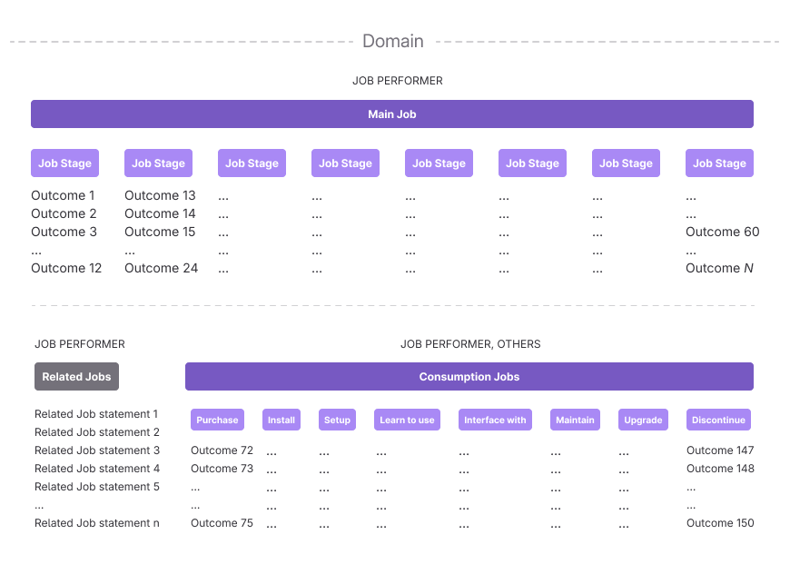

>⚠️ **This framework is undergoing evaluation in a [pilot program](https://gitlab.com/gitlab-org/gitlab/-/iss️ues/477045)** ⚠️

We use Jobs-to-be-Done (JTBD) and Outcome-Driven Innovation (ODI) to achieve a deeper understanding of our users and the underlying Job they're trying to accomplish. Though JTBD can be applied in various ways, we use our own interpretation that fits best with our design process. We leverage the framework for "categorizing, defining, capturing, and organizing users' needs, and tying user-defined performance metrics (in the form of desired outcome statements) to the JTBD" (Ulwick).

At it's core, we focus on asking: **What outcome are you trying to influence?**

## Framework Overview

Here are the key steps to apply the framework:

1. **[Define Job Performers and their Jobs]**: Understand who your [Job Performers] are and the [Jobs] they are responsible for in your [Domain]<!--(/handbook/product/ux/jobs-to-be-done/jtbd_topics__definitions/#domain)-->.
1. **[Investigation Interviews, Job Mapping and Outcome Survey Preparation:]** Interview [Job Performers]<!--(/handbook/product/ux/jobs-to-be-done/jtbd_topics__definitions/#job-performers)--> to understand their process, create [Job Maps]<!--(/handbook/product/ux/jobs-to-be-done/jtbd_topics__definitions/#job-maps)--> to assist with drafting [Outcome statements]<!--(/handbook/product/ux/jobs-to-be-done/jtbd_topics__definitions/#outcome-statements)--> to baseline the experience, evaluate solutions, and prioritize future efforts.
1. **[Construct Outcome Statements]<!--(/handbook/product/ux/jobs-to-be-done/jtbd-playbook/#exercise-2:-construct-outcome-statements)--> and [Survey]<!--(/handbook/product/ux/jobs-to-be-done/jtbd-playbook/#outcomes-survey)-->** Conduct a quantitative analysis to understand how well the current experience meets users needs. Baseline the [Outcomes]<!--(/handbook/product/ux/jobs-to-be-done/jtbd_topics__definitions/#outcomes)--> for their effectiveness.
1. **Evaluate Solutions:** Continually refer to the baselined Outcomes when creating and validating solutions to ensure significant impact on meeting user needs.

For a step-by-step process, follow the [JTBD playbook]<!--(/handbook/product/ux/jobs-to-be-done/jtbd-playbook).-->

## Core Concepts

### Job Performers vs. Personas

Understanding the roles and contributions of [Job Performers]<!--(/handbook/product/ux/jobs-to-be-done/jtbd_topics__definitions/#job-performers)--> (someone executing a Job) and Personas is crucial and highly valuable in the JTBD framework. Each Persona, like a Software Developer, may undertake various [Jobs]<!--(handbook/product/ux/jobs-to-be-done/jtbd_topics__definitions/#job-types) --> as part of their role (writing code, reviewing code, maintaining infrastructure, and so on). Similarly, other job titles or Personas may also undertake the [Main Job]<!--(/handbook/product/ux/jobs-to-be-done/jtbd_topics__definitions/#main-jobs)--> in JTBD; for example, an engineering manager may review code or plan projects. Both Personas and [Job Performers]<!--(/handbook/product/ux/jobs-to-be-done/jtbd_topics__definitions/#job-performers)--> are valuable constructs that help understand and improve your product, but it is essential to keep them separate and recognize how they're related, but different.

### Job Types

Understanding the different [Job types]<!--(handbook/product/ux/jobs-to-be-done/jtbd_topics__definitions/#job-types)--> and how they relate to each other is crucial for mapping out the entire user experience and identifying opportunities to create value. There are several key [Job types]<!--(handbook/product/ux/jobs-to-be-done/jtbd_topics__definitions/#job-types)--> to consider in the JTBD framework:

- **Main Jobs:** The overarching goal or objective that the [Job Performer]<!--(/handbook/product/ux/jobs-to-be-done/jtbd_topics__definitions/#Job-Performers)--> is trying to achieve is the [Main Job]<!--(/handbook/product/ux/jobs-to-be-done/jtbd_topics__definitions/#main-jobs)-->. This is the highest-level job for a given [Domain]<!--(/handbook/product/ux/jobs-to-be-done/jtbd_topics__definitions/#domain)-->. Main Jobs are the primary goal the Job Performer is trying to achieve when using your product. It's why they chose to use your product. [Main Jobs]<!--(/handbook/product/ux/jobs-to-be-done/jtbd_topics__definitions/#main-jobs)--> are mapped using a Job Map and are always solution-agnostic.
- **Consumption Chain Jobs:** The supplemental tasks a [Job Performer]<!--(/handbook/product/ux/jobs-to-be-done/jtbd_topics__definitions/#job-performers)--> undertakes when interacting with a product or service are the [Consumption Chain Jobs]<!--(/handbook/product/ux/jobs-to-be-done/jtbd_topics__definitions/#consumption-jobs)-->. These include every step from identifying a need, finding and selecting a solution, purchasing, configuring, using, maintaining, and eventually discontinuing its use. [Consumption Chain Jobs]<!--(/handbook/product/ux/jobs-to-be-done/jtbd_topics__definitions/#consumption-jobs)--> do not have a Job Map and are often solution-dependent.
- **Related Jobs:** Other jobs that the [Job Performer]<!--(/handbook/product/ux/jobs-to-be-done/jtbd_topics__definitions/#job-performers)--> may be trying to get done, either before, during, or after the [Main Jobs]<!--(/handbook/product/ux/jobs-to-be-done/jtbd_topics__definitions/#main-jobs)--> (this may include Consumption Chain Jobs). Understanding the Related Jobs is **vital to providing the best platform experience** for the user.

### Job Maps

The Job Map is a visual representation of the sequence of [Stages]<!--(/handbook/product/ux/jobs-to-be-done/jtbd_topics__definitions/#job-stages)--> a [Job Performer]<!--(/handbook/product/ux/jobs-to-be-done/jtbd_topics__definitions/#job-performers)--> goes through to complete the [Main Job]<!--(/handbook/product/ux/jobs-to-be-done/jtbd_topics__definitions/#main-jobs)-->. It reveals the underlying patterns of intent and the sub-goals that comprise accomplishing the overall Job.

Common [Stages]<!--(/handbook/product/ux/jobs-to-be-done/jtbd_topics__definitions/#job-stages)--> of a Job Map include, _but are not limited to:_

- Define: Determine objectives and plan how to get the Job done
- Locate: Gather materials and information needed to do the Job
- Prepare: Organize materials and create the right setup
- Confirm: Ensure that everything is ready to perform the Job
- Execute: Perform the Job as planned
- Monitor: Evaluate success as the Job is executed
- Modify: Modify and iterate as necessary
- Conclude: End the Job and follow-up

These [Stages]<!--(/handbook/product/ux/jobs-to-be-done/jtbd_topics__definitions/#Job-Stages)--> are arranged in a logical flow, with related [Job Steps]<!--(/handbook/product/ux/jobs-to-be-done/jtbd_topics__definitions/#job-steps)--> clustered together with their relevant [Job Stage]<!--(/handbook/product/ux/jobs-to-be-done/jtbd_topics__definitions/#job-stages)-->. When complete and validated with users, the Job Map will serve as a foundation for creating [Outcome statements]<!--(/handbook/product/ux/jobs-to-be-done/jtbd_topics__definitions/#outcomes)--> and uncovering [Underserved Needs]<!--(/handbook/product/ux/jobs-to-be-done/jtbd_topics__definitions/#underserved-needs)-->.

### Outcomes

[Outcomes]<!--(/handbook/product/ux/jobs-to-be-done/jtbd_topics__definitions/#outcomes)--> are the specific, measurable, and actionable results that users want to achieve when getting a Job done. They represent the desired end-state or performance metrics that users use to evaluate the success of a solution.

**[Outcomes]<!--(/handbook/product/ux/jobs-to-be-done/jtbd_topics__definitions/#outcomes)--> are the most crucial part of the JTBD framework**, as they help you understand what users truly value and how to design solutions that better meet their needs. By focusing on Outcomes rather than features or functionality, you can uncover unmet or [Underserved Needs]<!--(/handbook/product/ux/jobs-to-be-done/jtbd_topics__definitions/#underserved-needs)--> and identify opportunities to create differentiated value. By understanding the [Outcomes]<!--(/handbook/product/ux/jobs-to-be-done/jtbd_topics__definitions/#outcomes)--> that users care about, you can design more effective solutions, make better prioritization decisions, and measure the true impact of your work.

### Continuous Evaluation

Using [Outcomes]<!--(/handbook/product/ux/jobs-to-be-done/jtbd_topics__definitions/#outcomes)--> to prioritize, design, and measure, allows for predictable, repeatable, and consistent evaluation methods, creating feedback loops that relate directly to the outcomes you are trying to influence.

- **Benchmarking:** Evaluate the Main Job and Consumption Chain Job Outcomes to establish a benchmark and assist with prioritization by identifying underserved needs.
- **Solution Evaluation** Evaluate how your solution improves the targeted Outcome(s), using the established benchmark as reference.

## Jobs GitLab helps get done

### Main jobs

_placeholder for jtbd-yml file_

## Reference Material

- [JTBD topics and definitions]
- [Jobs to be Done Playbook by Jim Kalbach](https://rosenfeldmedia.com/books/jobs-to-be-done-book/)
- [Jobs to be Done by Anthony Ulwick](https://jobs-to-be-done-book.com/)
- [Competing Against Luck by Clay Christenson](https://www.amazon.com/dp/0062435612/ref=cm_sw_em_r_mt_dp_U_v0k9Eb92AEDZX)
- [Intercom on Jobs to be Done by Intercom](https://www.intercom.com/resources/books/intercom-jobs-to-be-done)
