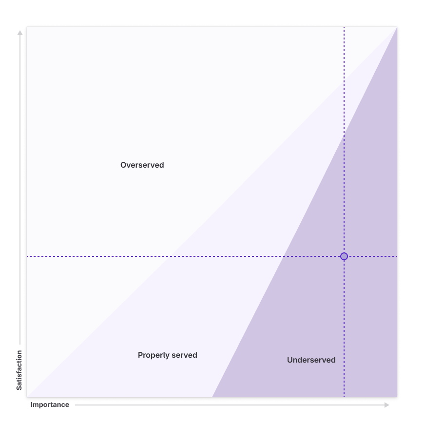

>⚠️ **This framework is undergoing evaluation in a [pilot program](https://gitlab.com/gitlab-org/gitlab/-/iss️ues/477045)** ⚠️

If Jobs-to-be-Done is the theory, then Outcome-Driven Innovation is the practice.

## Continuous Evaluation

Continuous evaluation involves establishing predictable, repeatable, low-effort, and high-efficacy methods complemented by consistent feedback loops. This process includes generating regular benchmark scores and assessing solutions against these benchmarks. Implementing continuous evaluation ensures ongoing improvement and alignment with user needs, leading to higher user satisfaction and better product performance.

## Evaluation Methods

### Benchmarking the Domain With The Outcome Survey

Benchmarking helps identify improvement areas, evaluate whether we're innovating effectively, reach user expectations, measure progress, set performance standards, and understand the competitive landscape. This is all achieved through an _Outcome Survey_.

An Outcome Survey identifies and prioritizes the specific Outcomes that users seek when using a product or service. Unlike traditional surveys that focus on user satisfaction or feature preferences, an Outcome Survey delves into the fundamental Job that users are trying to accomplish and the specific desired Outcomes related to that Job. This structured approach enables product teams to pinpoint and prioritize the Outcomes that drive user behavior and satisfaction, guiding product development efforts toward delivering solutions that effectively address these critical user needs.

#### Process & Survey Design

>⚠️ Before conducting an Outcome survey, your team must _define the Job Performers, theirs Jobs, the process they follow to accomplish those Jobs through a Job Map, and use all of that to draft Outcome statements_ in your Domain.

You will find everything you need to get started in the [Qualtrics template](https://gitlab.eu.qualtrics.com/survey-builder/LS_2l5ektxWK1wFRuC/edit?ContextLibraryID=GR_6ziMa2ooJx4Y6SF). (Library/UX Research & Product/Templates/Opportunity Score Template)

##### Screening

There are two aspects to screening:

- Ensuring a representative sample: Screen out participants who do not perform the Jobs in the survey. Use your defined Job Performer to make this determination.
- Identify segments: Gain deeper insights into user needs and behaviors across different groups

**A note on segmentation**

To establish segments, we screen on these factors;

- Organization size
- Sector
- GitLab License
- GitLab Version

The goal is to receive a minimum of **50** responses per segment. In some cases, this may be unachievable in a reasonable timeframe. If this is the case for your Domain, then try to achieve 100 total responses, with _50 being the absolute minimum_.

💡 Note: Remember to recruit both GitLab and non-GitLab users.

You may refer to our [sample screener](https://docs.google.com/document/d/1sxhg6d3VPg0sxlUULgYPehnHXVvwx_lm2y5Xv9wn4sY/edit?usp=sharing) if you need more guidance.

##### Question Structure

Questions are structured in the survey following a precise method to reduce survey fatigue (see the example below). It is critical that you do not deviate from this or you may risk a low completion rate.

##### Scoring

You will find everything you need to score your results with this [Outcome scoring](https://docs.google.com/spreadsheets/d/109GZqTYPpOLpHLj-gwV_ldMFwIKa9MaaLPyLJ4kdoQs/edit?usp=sharing) template.

The results of the Outcome survey are scored using the top-two box method, which is intended for use in surveys where participants are asked to rate their level of importance and satisfaction across a scale. This is the same method we use for [CSAT](/handbook/sales/field-operations/user-success-operations/cs-ops-programs/nps-csat-scores/#scoring-methodology). Refer to the example below for more details.

Looking at the example data above, we see that (40) or 80% of the total (50) participants find the [Job step] important, and 30% of participants are satisfied with the current [Solution]. We can plot these scores as data points to understand further how this correlates to Needs. To achieve this, we move the decimal (0.8 is now 8, and 0.3 is now 3). Looking at the diagram below, we find that this Outcome is an Underserved need.

### Design evaluation

With an established benchmark, evaluating the design is a much simpler process. The goal is to increase satisfaction, measured using an abridged version of the benchmarking Outcome survey. This is accomplished by taking every Outcome from the Job Step(s) you are designing within and asking the satisfaction questions with a short survey in a moderated or unmoderated session. You will want at least (10) participants to ensure you are moving in the right direction by improving the satisfaction score.

#### Alignment with UX Heuristics

The three dimensions, Speed, Predictability/Reliability, and Efficiency/Better Results, directly correlate with GitLab's UX Heuristics. Due to this alignment, it is not necessary to evaluate designs for each of these elements independently. Instead, using this framework, the ideal scenario for Job Performers involves **instant task completion**, **100% predictability**, and **0% efficiency loss**. Such perfection facilitates progress and fulfills needs.

| UX Heuristic | Speed | Predictability / Reliability | Efficiency/Better Results |
| --------- | ------------- | ---------------------- | ------------------ |
| Visibility of system status | — | ✅ | — |
| Flexibility and efficiency of use | — | — | ✅ |
| User control and freedom | — | ✅ | ✅ |
| Error Recovery | —| ✅ | ✅ |
| Real-time user interface | ✅ | — |✅ |
| A tool the whole team can use | — | — | ✅ |
| Minimal setup required | ✅ | — | ✅ |
| Documentation is easy to use | — | — | ✅ |
| Features communicate the problem being solved and value to a new user | ✅ |✅  | ✅ |
| Features / workflows have clear calls to action | — | ✅ | ✅ |
| Tasks are easy to learn and/or have setup support / guidance | — | ✅ | ✅|
