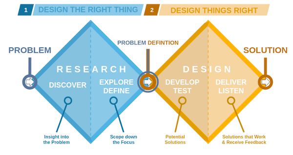
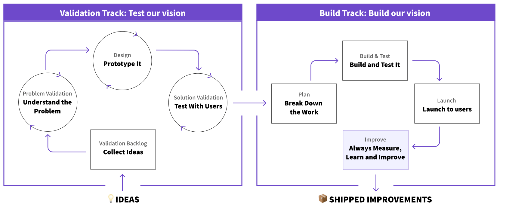

UX Research plays an important role when it comes to developing products that are addressing real user needs and matching their expectations. It is important to know when doing research could be **most** effective and what questions need to be answered at what time during product development.

When is it **ideal** to conduct UX Research? Quick answer: UX Research can and should be applied whenever possible within the product development process.

The content in the following sections is covered in more depth in a 20 minute, self paced [LevelUp course (internal link)](https://levelup.gitlab.com/learn/course/when-to-conduct-ux-research).

## Where UX Research fits into the product life cycle

In general, UX Research can be inserted **at any stage** of the product development life cycle. However, the types of research can vary depending on where teams are in the life cycle. As you continue to read through this page, you will learn more about what kinds of research you can do and **when it is (or isn't)** appropriate.

### Double Diamond model and GitLab’s product development flow

The British Design Council developed the [Double Diamond model](https://www.designcouncil.org.uk/our-resources/the-double-diamond/), a process model for UX design. It consists of two diamonds representing two distinct phases:

- Phase 1: Design the right thing
- Phase 2: Design things right

Source: [Wikipedia](https://en.wikipedia.org/wiki/Double_Diamond_(design_process_model))

These two phases map to [GitLab’s product development flow, specifically the Validation track](/handbook/product-development-flow/#workflow-summary), where “Phase 1: Design the right thing” equals “[Problem Validation](/handbook/product/ux/ux-research/problem-validation-and-methods/)” and “Phase 2: Design things right” equals “[Solution Validation](/handbook/product/ux/ux-research/solution-validation-and-methods/)”.

- In theory, you should do research to fit wherever you are in the product development workflow. However, in practice, if you already have a solution in place, but haven’t done any research, there’s still time to learn from your users.
- Conduct research often because you can improve the product many times over whenever research is utilized. The goals for any research will evolve as the product begins to take shape.

### Design the right thing/Problem Validation

Usually this phase starts when there is an initial problem statement about users that we aim to solve. For example, we may have heard something in a customer call or have seen customer feedback that shapes these initial problem statements. It’s also common that there is an assumption or hypothesis of what users may be experiencing without them having it shared directly.

Either way, what follows next is a phase of discovery research where we aim to understand users' experiences in depth. This is the time to collect as much data as possible to thoroughly understand nuances and details. It’s about going broad, diverging, and embracing the complexity that comes with it. This phase is referred to as “Discover”.

Once enough data is gathered a phase of convergence begins, the second half of the first diamond. This is when we aggregate learnings and revise the initial problem statement or create one if the discovery research started with an hypothesis or assumption. This phase is referred to as “Define”.

For any problem validation research, we have the same goal: *“**A thorough understanding of the problem**: The team understands the problem, who it affects, when and why, and how solving the problem maps to business needs and product strategy.”*

### Design things right/Solution Validation

The solution validation phase starts once the problem statement is clearly defined. At the beginning is again a divergent phase where Product Designers explore a lot of different solutions and iterate on them. It’s helpful to conduct solution validation during this time to inform and influence the different design iterations. At the end of the phase, there is one design solution to move forward with for implementation.

The goals of solution validation align with these goals: *“**High confidence in the proposed solution**: Confidence that the jobs to be done outlined within the problem statement can be fulfilled by the proposed solution.”*

### Don’t stop here - there’s more UX Research to do!

Once the feature is released to users, it’s important to continue to gather qualitative and quantitative feedback from them in order to continuously improve the experience. This is what the “Improve Phase” of GitLab’s Development workflow, specifically the [Build track](/handbook/product-development-flow/#build-track), encapsulates.

Goals of the Improve Phase:

1. **Understand Qualitative Feedback**: To know how to improve something, it's important to understand the qualitative feedback that we're hearing from users and team members. User interviews, survey verbatims, and customer comments left within GitLab issues can all help inform teams of how well a new feature is being received.
1. **Measure Quantitative Impact**: Qualitative data is great in helping us understand in detail the [Why, How or What of users’ behaviors](/handbook/product/ux/ux-research/problem-validation-and-methods/#descriptive-and-informative-research-methods). Going a step further and coupling it with quantitative data can help to paint the full picture of what is going on at scale. During implementation, set up dashboards in Tableau to be able to review the performance and engagement of your change.

Insights from the Improve phase may initiate a new round of Problem Validation or Solution Validation.

### In summary you should do research when…

While research tends to be the most useful towards the beginning of the double diamond, it can be beneficial to conduct research at every stage along the way.

There are two helpful questions to ask yourself to determine where you are in the Double Diamond:

- **How well do we know the problem and/or user needs?** The *less* we know about the problem or user needs, the *greater* chance we are in the problem validation phase.
- **How confident are we that the solution we’ve designed is the right one?** The *more* confidence we have that our solution is addressing user needs or a user experience problem, the *greater* chance we are in the solution validation phase.

## When you shouldn’t do UX Research

There are many times where research is appropriate, but oftentimes we fail to consider reasons to NOT conduct research:

```mermaid
%%{init: {"flowchart": {"htmlLabels": false}} }%%
flowchart TB
   node1["`Consider whether to do UX Research`"] --> node2{"`Do you have enough time and/or resources?`"}
   node2 --> |Yes| node3{"`Are there clear goals and/or action plans?`"}
   node2 --> |No| node2no{{"`Consider a scrappy research approach like getting internal feedback.`"}}
   node3 --> |No| node3no{{"`Rethink the goals of the research and determine what you would do with different answers.`"}}
   node3 --> |Yes| node4{"`Am I open to changing course based on the outcome of this research?`"}
   node4 --> |Yes| node5{"`Do I know who my target user is?`"}
   node4 --> |No| node4no{{"`Skip this research, so time can be spent on other efforts.`"}}
   node5 --> |No| node5no{{"`Leverage internal data or past research to determine what user personas to target. If no internal data exists, collaborate with other team members to make a 'best guess'.`"}}
   node5 --> |Yes| node6{"`Have I looked for past research on this topic?`"}
   node6 --> |Yes| node7{"`Are my research questions specific and focused?`"}
   node6 --> |No| node6no{{"`Look for existing research in Dovetail and the GitLab UX Research project.`"}}
   node7 --> |No| node7no{{"`Work with UX Research to distill questions down to a specific user, user pain point or user benefit.`"}}
   node7 --> |Yes| nodex(("`Proceed with UX Research planning`"))
```

- **Time or resource constraints**: Situations where studies have very tight due dates, adequate funds are not available to answer research questions, or team members are at capacity. That being said, scrappy research (for example: fewer participants/data than desired, getting feedback from team members instead of recruiting users) when these kinds of limitations happen is always better than no research at all.
- **Research questions are too broad**: In some cases, research questions can be too complex to undertake (example: what do our customers want in a DevOps platform). UX Researchers should determine whether the questions can be distilled into ones they can feasibly answer.
- **Unclear goals or action plans**: When there are no plans to respond to user feedback to make meaningful changes to the product or decisions about the direction to take the product. Research findings should have a pathway into some kind of identified impact prior to the project kicking off. You should be able to clearly answer the question ‘What are the expected outcomes of this research?’.
- **Using research to check a box**: These are cases where UX Researchers are brought in after a decision has already been made and are asked to conduct research to back up the decision. In these situations, there is little opportunity to make any changes based on research.
- **When past research or internal data on the topic already exists**: Either teams aren’t aware that internal data is available or haven’t tried to look before requesting to do research on a given topic.
- **Confusion around who the target user is or how to find them**: These are situations where the problem is not well understood enough to know which kinds of users could be impacted or the type of users sought is too narrow to recruit.
