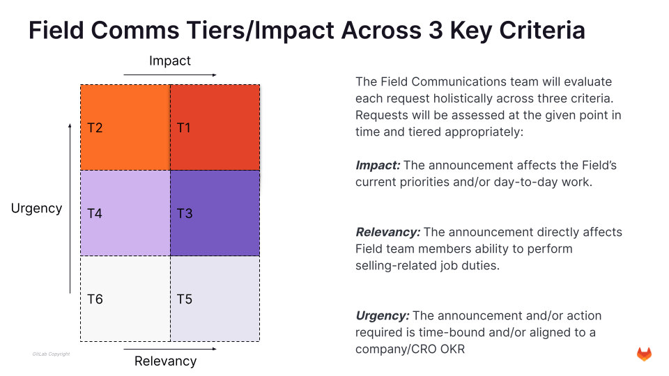
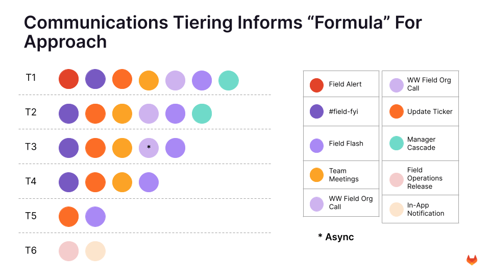

---

title: "Field Communications"
description: "The Field Communications team is responsible for creating effective, timely, and easily consumable communications with Sales and Customer Success audiences"
---

## Welcome to the Field Communications Page

This team is responsible for creating effective, timely, and easily consumable communications with the Field team (Sales, Customer Success, Channel, Alliances, Revenue Strategy, Operations & Enablement). Our goal is to help the field sell better, faster, and smarter with communication programs that keep them better informed of organizational/business updates that impact their roles, as well as useful resources that will enable day-to-day work.

For more information about the Field Enablement team, visit the [team handbook page.](/handbook/sales/field-operations/field-enablement/)

## How to work with us

1. Review this page for information about our Field Communications programs, channels and processes.
2. Engage the Field Communications team by submitting a [Field Announcement Request](/handbook/sales/field-communications/#requesting-field-announcements)

## Primary Field Communications Programs

Field Communications uses the channels outlined in this [communication channel map](https://docs.google.com/presentation/d/1gedEhDc9X77TmHbED2AR1JhSTm2FjKeISdMvqlIdnzk/edit?usp=sharing) to communicate with the Field. Key programs include:

- [Field-FYI Slack Channel](/handbook/sales/sales-google-groups/field-fyi-channel/)
- [Field Flash Newsletter](/handbook/sales/field-communications/field-flash-newsletter/)
- [Field Update Tickers](/handbook/sales/field-communications/field-update-tickers/)
- [Field Alerts](/handbook/sales/field-communications/field-alerts/)
- [WW Field Org & WW Field Manager Calls](/handbook/sales/sales-meetings/#ww-field-org-call)
- [Field Google Group and Slack Channel landscape](/handbook/sales/sales-google-groups/)
   - See this link for how best to communicate with the Field team on Slack or via email.

## Field Communications Playbook

In order to streamline important announcements and reduce noise for the Field team, we operate by a set Field Communications Playbook process. This playbook defines tier 1-5 organizational announcements/changes and applies a communication roll-out plan to each.

The Field Communications team will evaluate each request at the given point in time and tier it appropriately across three criteria:

1. **Impact:** The announcement affects the Field’s current priorities and/or day-to-day work.
1. **Relevancy:** The announcement directly affects Field team members ability to perform selling-related job duties.
1. **Urgency:** The announcement and/or action required is time-bound and/or aligned to a company/CRO OKR.

**For T1 and T2 announcements, Field Communications enacts a Manager Cascade motion to ensure Field people leaders are properly informed and enabled on major initiatives ahead of their team members.**

**T1**:
1. 1-2 months prior: Heads up in WW Field Manager Call
2. 2-4 weeks prior: Initiative covered in segment VP’s leadership meeting by leader or Enablement PM
3. 2-4 days prior: CRO Leaders provided with announcement copy they share with their managers
4. 1 day prior: #field-manager message sent

**T2**:
1. 2-4 weeks prior: Initiative covered in segment VP’s leadership meeting by Enablement PM
2. 1 day prior: #field-manager message sent

To support the GitLab value of transparency, an overview of each Tier along with practical use cases and communication channels is provided below.

## Tier 1 Update

This update highly impacts the Field’s current priorities and/or day-to-day work, is highly relevant to all segments of the Field organization and is highly urgent (requiring immediate action and/or focus by a particular date). **These updates are deemed the most important for the Field and will be addressed in all available Field Communication channels/motions**. Field Enablement is likely required, and the [Field Enablement team](/handbook/sales/field-operations/field-enablement/) should be engaged.

**Use Cases**: Major process changes impacting the Field’s day-to-day work and/or selling activities, CRO/CEO/e-group calls-to-action, major pricing and packaging changes, significant new product offerings, company initiatives and/or priorities that affect how GitLab is sold or how the Field interacts with customers.

**Considerations**:
   1. **Due to the complexity, all Tier 1 announcements require at least 1-2 months notice to the Field Communicatiosn team.** As a general best practice, there should only be 2-3 Tier 1 updates per quarter to keep the Field focused on driving revenue.
   1. Field Communications will enforce a quiet period in the final two weeks of each quarter to limit distractions and allow the Field to focus on closing business.

## Tier 2 Update

This update moderately impacts the Field’s current priorities and/or day-to-day work, is relevant to at least two segments of the Field and is highly urgent (requiring immediate action and/or focus by a particular date). Enablement may or may not be required.

**Use Cases**: Important process changes, CRO/CEO/e-group announcements, important product marketing updates and/or initiatives, important company initiatives and/or priorities, required Field trainings or enablement often attached to a major Field or company initiative.

**Considerations**:
   1. **Due to the complexity, all Tier 2 announcements require at least 1 month notice to the Field Communicatiosn team.**
   1. Field Communications will enforce a quiet period in the final two weeks of each quarter to limit distractions and allow the Field to focus on closing business.

## Tier 3 Update

This update highly impacts the Field’s current priorities and/or day-to-day work, is highly relevant to all segments of the Field organization and is moderately urgent and requires action in the future. Enablement is typically not required.

**Use Cases**: Process changes that require reps to change a behavior, major competitive intelligence that impacts GitLab’s position in the market, major Channel & Alliance partner updates, major Field organization changes, training or enablement.

**Considerations**:
   1. Field Communications will enforce a quiet period in the final two weeks of each quarter to limit distractions and allow the Field to focus on closing business.

## Tier 4 Update

This update moderately impacts the Field’s current priorities and/or day-to-day work, is relevant to at least two segments of the Field and is moderately urgent and requires action in the future. Enablement is not required.

**Use cases**: General updates not related to selling, general requests/survey for feedback*, company/organization announcements

**Considerations**:
   1. Field Communications will limit the number of Field survey requests to one per month. Survey requests will be assessed and scheduled based on this cadence, and exceptions will be made on a case-by-case basis.
   1. Field Communications will enforce a quiet period in the final two weeks of each quarter to limit distractions and allow the Field to focus on closing business.

## Tier 5 Update

This update highly impacts the Field’s current priorities and/or day-to-day work, is highly relevant to all segments of the Field organization but does not require immediate attention or focus. This update is considered to be “nice know information” vs. “need to know”.

**Use cases**: Minor process changes, new resources and/or Highspot pages to enhance selling activities, customer case studies, GitLab release information

## Tier 6 Update

This update minimally impacts the Field’s current priorities and/or day-to-day work, is minimally relevant to all segments of the Field organization or at least two segments of the Field but is not time-bound and does not require immediate attention or focus. This update is typically operational in nature and does not require additional enablement.

**Use cases**: Operational updates that do not impact day to day workflows (i.e. system field changes, future downtime, etc.).

### Requesting Field Announcements

Once you've reviewed the playbook above and would like to request Field Communications support for a field-related announcement, please follow this process:

1. Submit an issue using this [issue template](https://gitlab.com/gitlab-com/sales-team/field-operations/enablement/-/issues/new?issuable_template=field-announcement-request).
   1. **In an effort to reduce overwhelm and to effectively prioritize information sent to the Field, we require that you complete a Field Announcement request at least three business days prior to your requested send date**.
   1. If your request is urgent and requires immediate action from the Field (i.e system outage, something with an immediate customer impact, etc.), please complete a Field Announcement request as soon as possible and notify a member of the Field Communications team via Slack.
1. Provide as much context about your announcement as possible, specifically around the urgency, relevancy and what actions are needed from the Field. **Requesters must complete their required sections in full before Field Communications will triage.**
   1. You are not required to include complete copy in your request, but you must provide draft messaging (bullet points are fine). The Field Communications team will work with you to refine your message as appropriate.
   1. Field Communications will triage the request and apply a placeholder tag Field Announcement::Triage to the issue as quickly as possible. Upon examining the request, they will assign it to a communication tier using one of three tags:
      - Field Announcement::Tier 1
      - Field Announcement::Tier 2
      - Field Announcement::Tier 3
      - Field Announcement::Tier 4
      - Field Announcement::Tier 5
      - Field Announcement::Tier 6
   1. Note: If the announcement request includes a request to survey some or all Field team members, the `Field Survey` tag will be applied to the issue and Field Communications will work with the requestor to determine if request fits within the survey limits set each month or if plans should be adjusted.
3. Field Communications will collaborate with the requester on the announcement details and copy directly in the issue to finalize the roll-out plan and timeline.

### Field Comms Quiet Periods

Field Communications will enforce a quiet period in the final two weeks of each quarter to limit distractions and allow the Field to focus on closing business. Exceptions will be made on a case-by-case basis for urgent announcements that require the Field’s immediate attention (system outage, critical update affecting customers and/or closing business).  The quiet periods for FY25 are as follows:

      - Q1-FY25: 2024-04-16 - 2024-04-30
      - Q2-FY25: 2024-07-17 - 2024-07-31
      - Q3-FY25: 2024-10-17 - 2024-10-31
      - Q4-FY25: 2024-01-16 - 2025-01-30

#### Announcements to External Channel/Alliances Partners

If you have an internal announcement that is also relevant to GitLab's external Channel/Alliances Partner audience, please use the Field Announcement Request process outlined above and add the appropriate details in the `Enablement Scope` section of the issue. Also select the `GitLab Partners (external)` audience in addition to the relevant internal audiences. By selecting this audience, the Field Communications team will engage the appropriate team members in Partner Communications to disseminate the announcement to partners.

If you have an announcement that is relevant *only* for the external partner audience, please open a [Channel Partner Communication Request issue](https://gitlab.com/gitlab-com/channel/channels/-/issues/new?issue%5Bmilestone_id%5D=) so the [Partner Communication team](/handbook/sales/channel/channel-programs-ops/#partner-communications) can assist you.

## Sharing Feedback

Ongoing feedback and participation from the Field is imperative to the success of the Field Communications team and its programs. Field Communications incorporates surveys and other opportunities for feedback directly into [primary communication programs](/handbook/sales/field-communications/#primary-field-communications-programs). Team members are encouraged to provide ongoing feedback via these avenues.

In addition, Field Communications provides team members an opportunity to provide feedback about their Field Communications experience in annual Field and/or company surveys.
