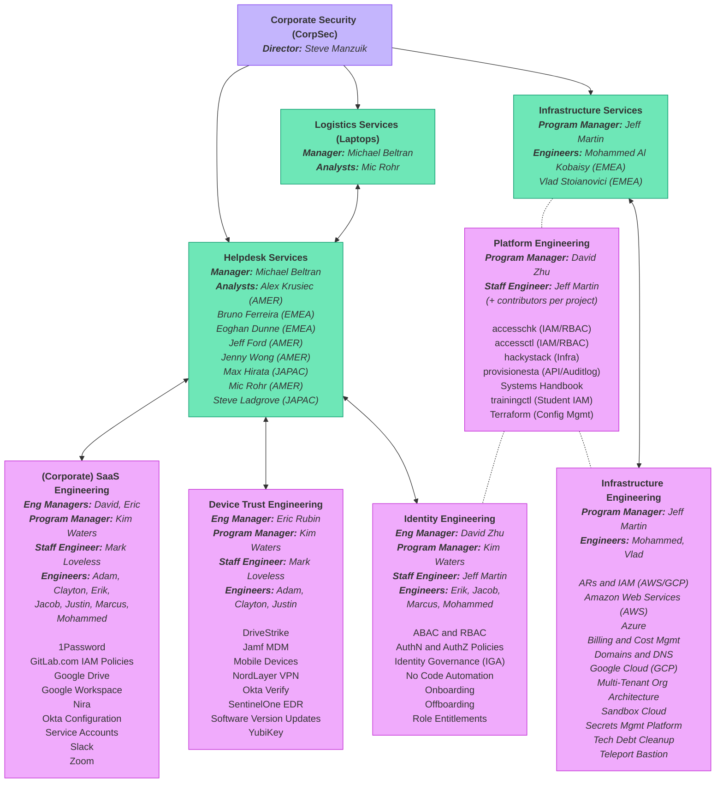

👋 Welcome to Corporate Security, we're glad you're here!

## Need Help?

Please try exploring the following pages to see if your question has been answered in the handbook pages. If not, please ask in the `#it_help` channel and one of our Support Analysts will reply as soon as possible.

- [Onboarding Security Self Service Guides](/handbook/security/guides)
- [CorpSec Support Guide](/handbook/security/corporate/support)
- [CorpSec Applications and Systems](/handbook/security/corporate/systems)
- Ask in the `#it_help` Slack channel

## Direction

### Mission

[Security Division Mission](https://handbook.gitlab.com/handbook/security/#i-classfas-fa-rocket-idbiz-tech-iconsi-security-vision-and-mission)

Our mission is to empower our employees, enable the business, protect our customers, and secure GitLab.

- Safeguard our organization's digital assets, ensuring the integrity, confidentiality, and availability of all data.
- Implement robust security measures, fostering a culture of awareness and compliance among employees, and continuously monitoring and enhancing our information technology systems to protect against evolving threats.
- Leverage the GitLab platform to assist us in the securing of GitLab.
- Through strategic planning, innovative solutions, and collaboration across departments, we aim to support the organization's goals by providing reliable, secure, and efficient IT Security services that adhere to Zero Trust principals.

### Scope

- Architecting next-generation automation and integration between security-related systems that provides data consistency, reliability, strong security, and audibility
- Building relationships with cross-department system owners and proposing solutions to ensure our tech stack applications conform to our latest security best practices
- Consolidating and refactoring legacy tech debt
- Designing processes and choosing software tools that improves back office automation or mitigates security risks
- Escalation engineering and crisis response for leadership teams
- Factor in cost, security, compatibility, maintainability and user experience when making decisions
- Growing other team members’ skill sets through mentorship to improve operational efficiency and encourage professional development
- Handbook documentation for processes and systems architecture
- Identity and access management (IAM)
- Joint collaboration with process and system owners across the company for improving automation efficiency, security posture, and vulnerability management
- Keeping leaders and stakeholders informed of next-gen initiatives and contributing to creating automated analytics for day-to-day IT and Security operations
- Leading innovation opportunities between several teams with a willingness to experiment and to boldly confront problems of large complexity and scope
- Making technical decisions on behalf of the department and organization while providing presentation support to leaders during technical discussions
- New tech stack (vendor) application onboarding and provisioning
- Onboarding provisioning, offboarding deprovisioning
- Policy and configuration management for organization-wide applications and systems that we manage
- Role-based access control (RBAC)
- Shipping laptops to new team members and refreshing older models
- Tech support for team members and temporary service providers
- User experience and productivity optimization for internal software and tools
- Vulnerability and malware risk mitigation
- Workflow automation for employee lifecycle
- X-Men, we are. Always be saving the day with a smile on your face!
- Yesterday's problems are tomorrow's opportunties for iteration
- Zero trust implementation

### Direction and Strategy

- (Internal) [CISO Multi-Year Information Security Goals and Priorities](https://internal.gitlab.com/handbook/security/information_security_goals_and_priorities/)
- (Internal) [CorpSec Strategy](https://docs.google.com/document/d/1-5QG5JCyQA4JYqb3XMYUbt__oyVqmP0IwBWkeyHdK40/edit)
- [CorpSec Direction](/handbook/security/corporate/direction)

### Project Planning

- [Security Division OKRs](https://handbook.gitlab.com/handbook/security/okr/)
- [Corporate Security Epics List](https://gitlab.com/groups/gitlab-com/gl-security/corp/-/epics?state=opened&page=1&sort=start_date_desc)
- [Corporate Security Epics Gannt Chart](https://gitlab.com/groups/gitlab-com/gl-security/corp/-/roadmap?state=opened&sort=START_DATE_ASC&layout=QUARTERS&timeframe_range_type=THREE_YEARS&progress=WEIGHT&show_progress=true&show_milestones=false&milestones_type=ALL&show_labels=true)
- [How We Work](/handbook/security/corporate/how-we-work)

## Services

- 👀 **Please see [CorpSec Support](/handbook/security/corporate/support) if you are looking for help.**
- 📚 [Applications and Systems](/handbook/security/corporate/systems)
- 🛟 [Helpdesk Services](/handbook/security/corporate/services/helpdesk)
    - 🔐 [Access Requests](/handbook/security/corporate/services/access-requests)
    - 💻 [Laptop and Logistics Services](/handbook/security/corporate/services/laptops)
    - 🛬 [Onboarding](/handbook/security/corporate/services/onboarding)
    - 🛫 [Offboarding](/handbook/security/corporate/services/offboarding)
    - 🧑‍💻 [Tech Support (for Team Members)](/handbook/services/corporate/services/)
- ☁ [Infrastructure Services](/handbook/security/corporate/services/infrastructure)

## Engineering

- 💻 [Device Trust Engineering](/handbook/security/corporate/engineering/device-trust)
- 🔐 [Identity Engineering](/handbook/security/corporate/engineering/identity)
- ☁ [Infrastructure Engineering](/handbook/security/corporate/engineering/infrastructure)
- 🏗 [Platform Engineering](/handbook/security/corporate/engineering/platform)
- 👷 [SaaS Engineering](/handbook/security/corporate/engineering/saas)

## Team Functions

## Team Directory

<table style="display: table;">
<thead>
<!-- Team Member -->
<tr>
<th>Team Member</th>
<th>Identity Roles</th>
<th>Group Tags</th>
</tr>
</thead>
<tbody>
<!-- Team Member -->
<tr>
<td>
<a href="/handbook/company/team/#adamhuss">

Adam Huss</a> 
<small>
<i class="fas fa-earth-americas" style="padding-right: 5px;"></i>AMER 
<i class="fas fa-address-card" style="padding-right: 5px;"></i><code>ahuss</code> 
<i class="fa-brands fa-gitlab" style="padding-right: 5px;"></i><a target="_blank" href="https://gitlab.com/adamhuss">@adamhuss</a>
</small>
</td>
<td><small>
<i class="fas fa-address-card" style="padding-right: 5px;"></i><code>corpsec_eng_device_trust</code> 
<i class="fas fa-address-card" style="padding-right: 5px;"></i><code>corpsec_eng_saas</code>
</small></td>
<td><small>
<i class="fa-brands fa-gitlab" style="padding-right: 5px;"></i><a target="_blank" href="https://gitlab.com/groups/gitlab-com/gl-security/corp/team/device-trust">@gitlab-com/gl-security/corp/team/device-trust</a> 
<i class="fa-brands fa-gitlab" style="padding-right: 5px;"></i><a target="_blank" href="https://gitlab.com/groups/gitlab-com/gl-security/corp/team/saas">@gitlab-com/gl-security/corp/team/saas</a> 
</small></td>
</tr>
<!-- Team Member -->
<tr>
<td>
<a href="/handbook/company/team/#akrusiec">

Alex Krusiec</a> 
<small>
<i class="fas fa-earth-americas" style="padding-right: 5px;"></i>AMER 
<i class="fas fa-address-card" style="padding-right: 5px;"></i><code>akrusiec</code> 
<i class="fa-brands fa-gitlab" style="padding-right: 5px;"></i><a target="_blank" href="https://gitlab.com/akrusiec">@akrusiec</a>
</small>
</td>
<td><small>
<i class="fas fa-address-card" style="padding-right: 5px;"></i><code>corpsec_svc_helpdesk</code>
</small></td>
<td><small>
<i class="fa-brands fa-gitlab" style="padding-right: 5px;"></i><a target="_blank" href="https://gitlab.com/groups/gitlab-com/gl-security/corp/team/helpdesk">@gitlab-com/gl-security/corp/team/helpdesk</a> 
</small></td>
</tr>
<!-- Team Member -->
<tr>
<td>
<a href="/handbook/company/team/#bferreira-ext">

Bruno Ferreira</a> 
<small>
<i class="fas fa-earth-europe" style="padding-right: 5px;"></i>EMEA 
<i class="fas fa-address-card" style="padding-right: 5px;"></i><code>bferreira</code> 
<i class="fa-brands fa-gitlab" style="padding-right: 5px;"></i><a target="_blank" href="https://gitlab.com/bruno.n.ferreira">@bruno.n.ferreira</a>
</small>
</td>
</td>
<td><small>
<i class="fas fa-address-card" style="padding-right: 5px;"></i><code>corpsec_svc_helpdesk</code>
</small></td>
<td><small>
<i class="fa-brands fa-gitlab" style="padding-right: 5px;"></i><a target="_blank" href="https://gitlab.com/groups/gitlab-com/gl-security/corp/team/helpdesk">@gitlab-com/gl-security/corp/team/helpdesk</a> 
</small></td>
</tr>
<!-- Team Member -->
<tr>
<td>
<a href="/handbook/company/team/#cshankgitlab">

Clayton Shank</a> 
<small>
<i class="fas fa-earth-americas" style="padding-right: 5px;"></i>AMER 
<i class="fas fa-address-card" style="padding-right: 5px;"></i><code>cshank</code> 
<i class="fa-brands fa-gitlab" style="padding-right: 5px;"></i><a target="_blank" href="https://gitlab.com/cshankgitlab">@cshankgitlab</a>
</small>
</td>
<td><small>
<i class="fas fa-address-card" style="padding-right: 5px;"></i><code>corpsec_eng_device_trust</code> 
<i class="fas fa-address-card" style="padding-right: 5px;"></i><code>corpsec_eng_saas</code>
</small></td>
<td><small>
<i class="fa-brands fa-gitlab" style="padding-right: 5px;"></i><a target="_blank" href="https://gitlab.com/groups/gitlab-com/gl-security/corp/team/device-trust">@gitlab-com/gl-security/corp/team/device-trust</a> 
<i class="fa-brands fa-gitlab" style="padding-right: 5px;"></i><a target="_blank" href="https://gitlab.com/groups/gitlab-com/gl-security/corp/team/saas">@gitlab-com/gl-security/corp/team/saas</a> 
</small></td>
</tr>
<!-- Team Member -->
<tr>
<td>
<a href="/handbook/company/team/#dzhu-gl">

David Zhu</a> 
<small>
<i class="fas fa-earth-americas" style="padding-right: 5px;"></i>AMER 
<i class="fas fa-address-card" style="padding-right: 5px;"></i><code>dzhu</code> 
<i class="fa-brands fa-gitlab" style="padding-right: 5px;"></i><a target="_blank" href="https://gitlab.com/dzhu-gl">@dzhu-gl</a>
</small>
</td>
<td><small>
<i class="fas fa-address-card" style="padding-right: 5px;"></i><code>corpsec_eng_identity</code> 
<i class="fas fa-address-card" style="padding-right: 5px;"></i><code>corpsec_eng_platform</code> 
<i class="fas fa-address-card" style="padding-right: 5px;"></i><code>corpsec_eng_saas</code> 
<i class="fas fa-address-card" style="padding-right: 5px;"></i><code>corpsec_mgr_eng</code>
</small></td>
<td><small>
<i class="fa-brands fa-gitlab" style="padding-right: 5px;"></i><a target="_blank" href="https://gitlab.com/groups/gitlab-com/gl-security/corp/team/identity">@gitlab-com/gl-security/corp/team/identity</a> 
<i class="fa-brands fa-gitlab" style="padding-right: 5px;"></i><a target="_blank" href="https://gitlab.com/groups/gitlab-com/gl-security/corp/team/managers">@gitlab-com/gl-security/corp/team/managers</a> 
<i class="fa-brands fa-gitlab" style="padding-right: 5px;"></i><a target="_blank" href="https://gitlab.com/groups/gitlab-com/gl-security/corp/team/platform">@gitlab-com/gl-security/corp/team/platform</a> 
<i class="fa-brands fa-gitlab" style="padding-right: 5px;"></i><a target="_blank" href="https://gitlab.com/groups/gitlab-com/gl-security/corp/team/saas">@gitlab-com/gl-security/corp/team/saas</a> 
</small></td>
</tr>
<!-- Team Member -->
<tr>
<td>
<a href="/handbook/company/team/#ericrubin">

Eric Rubin</a> 
<small>
<i class="fas fa-earth-americas" style="padding-right: 5px;"></i>AMER 
<i class="fas fa-address-card" style="padding-right: 5px;"></i><code>erubin</code> 
<i class="fa-brands fa-gitlab" style="padding-right: 5px;"></i><a target="_blank" href="https://gitlab.com/ericrubin">@ericrubin</a>
</small>
</td>
<td><small>
<i class="fas fa-address-card" style="padding-right: 5px;"></i><code>corpsec_eng_device_trust</code> 
<i class="fas fa-address-card" style="padding-right: 5px;"></i><code>corpsec_eng_saas</code> 
<i class="fas fa-address-card" style="padding-right: 5px;"></i><code>corpsec_mgr_eng</code>
</small></td>
<td><small>
<i class="fa-brands fa-gitlab" style="padding-right: 5px;"></i><a target="_blank" href="https://gitlab.com/groups/gitlab-com/gl-security/corp/team/device-trust">@gitlab-com/gl-security/corp/team/device-trust</a> 
<i class="fa-brands fa-gitlab" style="padding-right: 5px;"></i><a target="_blank" href="https://gitlab.com/groups/gitlab-com/gl-security/corp/team/managers">@gitlab-com/gl-security/corp/team/managers</a> 
<i class="fa-brands fa-gitlab" style="padding-right: 5px;"></i><a target="_blank" href="https://gitlab.com/groups/gitlab-com/gl-security/corp/team/saas">@gitlab-com/gl-security/corp/team/saas</a> 
</small></td>
</tr>
<!-- Team Member -->
<tr>
<td>
<a href="/handbook/company/team/#eriklentz">

Erik Lentz</a> 
<small>
<i class="fas fa-earth-americas" style="padding-right: 5px;"></i>AMER 
<i class="fas fa-address-card" style="padding-right: 5px;"></i><code>elentz</code> 
<i class="fa-brands fa-gitlab" style="padding-right: 5px;"></i><a target="_blank" href="https://gitlab.com/eriklentz">@eriklentz</a>
</small>
</td>
<td><small>
<i class="fas fa-address-card" style="padding-right: 5px;"></i><code>corpsec_eng_identity</code> 
<i class="fas fa-address-card" style="padding-right: 5px;"></i><code>corpsec_eng_saas</code>
</small></td>
<td><small>
<i class="fa-brands fa-gitlab" style="padding-right: 5px;"></i><a target="_blank" href="https://gitlab.com/groups/gitlab-com/gl-security/corp/team/identity">@gitlab-com/gl-security/corp/team/identity</a> 
<i class="fa-brands fa-gitlab" style="padding-right: 5px;"></i><a target="_blank" href="https://gitlab.com/groups/gitlab-com/gl-security/corp/team/saas">@gitlab-com/gl-security/corp/team/saas</a> 
</small></td>
</tr>
<!-- Team Member -->
<tr>
<td>
<a href="/handbook/company/team/#edunne-ext">

Eoghan Dunne</a> 
<small>
<i class="fas fa-earth-europe" style="padding-right: 5px;"></i>EMEA 
<i class="fas fa-address-card" style="padding-right: 5px;"></i><code>edunne</code> 
<i class="fa-brands fa-gitlab" style="padding-right: 5px;"></i><a target="_blank" href="https://gitlab.com/edunne-gl">@edunne-gl</a>
</small>
</td>
<td><small>
<i class="fas fa-address-card" style="padding-right: 5px;"></i><code>corpsec_svc_helpdesk</code>
</small></td>
<td><small>
<i class="fa-brands fa-gitlab" style="padding-right: 5px;"></i><a target="_blank" href="https://gitlab.com/groups/gitlab-com/gl-security/corp/team/helpdesk">@gitlab-com/gl-security/corp/team/helpdesk</a> 
</small></td>
</tr>
<!-- Team Member -->
<tr>
<td>
<a href="/handbook/company/team/#jacobdwaters">

Jacob Waters</a> 
<small>
<i class="fas fa-earth-americas" style="padding-right: 5px;"></i>AMER 
<i class="fas fa-address-card" style="padding-right: 5px;"></i><code>jwaters</code> 
<i class="fa-brands fa-gitlab" style="padding-right: 5px;"></i><a target="_blank" href="https://gitlab.com/jacobdwaters">@jacobdwaters</a>
</small>
</td>
<td><small>
<i class="fas fa-address-card" style="padding-right: 5px;"></i><code>corpsec_eng_identity</code> 
<i class="fas fa-address-card" style="padding-right: 5px;"></i><code>corpsec_eng_platform</code> 
<i class="fas fa-address-card" style="padding-right: 5px;"></i><code>corpsec_eng_saas</code>
</small></td>
<td><small>
<i class="fa-brands fa-gitlab" style="padding-right: 5px;"></i><a target="_blank" href="https://gitlab.com/groups/gitlab-com/gl-security/corp/team/identity">@gitlab-com/gl-security/corp/team/identity</a> 
<i class="fa-brands fa-gitlab" style="padding-right: 5px;"></i><a target="_blank" href="https://gitlab.com/groups/gitlab-com/gl-security/corp/team/platform">@gitlab-com/gl-security/corp/team/platform</a> 
<i class="fa-brands fa-gitlab" style="padding-right: 5px;"></i><a target="_blank" href="https://gitlab.com/groups/gitlab-com/gl-security/corp/team/saas">@gitlab-com/gl-security/corp/team/saas</a> 
</small></td>
</tr>
<!-- Team Member -->
<tr>
<td>
<a href="/handbook/company/team/#jeffford_">

Jeff Ford</a> 
<small>
<i class="fas fa-earth-americas" style="padding-right: 5px;"></i>AMER 
<i class="fas fa-address-card" style="padding-right: 5px;"></i><code>jford</code> 
<i class="fa-brands fa-gitlab" style="padding-right: 5px;"></i><a target="_blank" href="https://gitlab.com/jeffford_">@jeffford_</a>
</small>
</td>
<td><small>
<i class="fas fa-address-card" style="padding-right: 5px;"></i><code>corpsec_svc_helpdesk</code>
</small></td>
<td><small>
<i class="fa-brands fa-gitlab" style="padding-right: 5px;"></i><a target="_blank" href="https://gitlab.com/groups/gitlab-com/gl-security/corp/team/helpdesk">@gitlab-com/gl-security/corp/team/helpdesk</a> 
</small></td>
</tr>
<!-- Team Member -->
<tr>
<td>
<a href="/handbook/company/team/#jeffersonmartin">

Jeff Martin</a> 
<small>
<i class="fas fa-earth-americas" style="padding-right: 5px;"></i>AMER 
<i class="fas fa-address-card" style="padding-right: 5px;"></i><code>jmartin</code> 
<i class="fa-brands fa-gitlab" style="padding-right: 5px;"></i><a target="_blank" href="https://gitlab.com/jeffersonmartin">@jeffersonmartin</a>
</small>
</td>
<td><small>
<i class="fas fa-address-card" style="padding-right: 5px;"></i><code>corpsec_eng_identity</code> 
<i class="fas fa-address-card" style="padding-right: 5px;"></i><code>corpsec_eng_infra</code> 
<i class="fas fa-address-card" style="padding-right: 5px;"></i><code>corpsec_eng_platform</code> 
<i class="fas fa-address-card" style="padding-right: 5px;"></i><code>corpsec_mgr_program</code> 
<i class="fas fa-address-card" style="padding-right: 5px;"></i><code>corpsec_svc_infra</code>
</small></td>
<td><small>
<i class="fa-brands fa-gitlab" style="padding-right: 5px;"></i><a target="_blank" href="https://gitlab.com/groups/gitlab-com/gl-security/corp/team/identity">@gitlab-com/gl-security/corp/team/identity</a> 
<i class="fa-brands fa-gitlab" style="padding-right: 5px;"></i><a target="_blank" href="https://gitlab.com/groups/gitlab-com/gl-security/corp/team/infra">@gitlab-com/gl-security/corp/team/infra</a> 
<i class="fa-brands fa-gitlab" style="padding-right: 5px;"></i><a target="_blank" href="https://gitlab.com/groups/gitlab-com/gl-security/corp/team/platform">@gitlab-com/gl-security/corp/team/platform</a> 
</small></td>
</tr>
<!-- Team Member -->
<tr>
<td>
<a href="/handbook/company/team/#jwong6">

Jenny Wong</a> 
<small>
<i class="fas fa-earth-americas" style="padding-right: 5px;"></i>AMER 
<i class="fas fa-address-card" style="padding-right: 5px;"></i><code>jwong</code> 
<i class="fa-brands fa-gitlab" style="padding-right: 5px;"></i><a target="_blank" href="https://gitlab.com/jwong6">@jwong6</a>
</small>
</td>
<td><small>
<i class="fas fa-address-card" style="padding-right: 5px;"></i><code>corpsec_svc_helpdesk</code>
</small></td>
<td><small>
<i class="fa-brands fa-gitlab" style="padding-right: 5px;"></i><a target="_blank" href="https://gitlab.com/groups/gitlab-com/gl-security/corp/team/helpdesk">@gitlab-com/gl-security/corp/team/helpdesk</a> 
</small></td>
</tr>
<!-- Team Member -->
<tr>
<td>
<a href="/handbook/company/team/#kimwaters">

Kim Waters</a> 
<small>
<i class="fas fa-earth-americas" style="padding-right: 5px;"></i>AMER 
<i class="fas fa-address-card" style="padding-right: 5px;"></i><code>kwaters</code> 
<i class="fa-brands fa-gitlab" style="padding-right: 5px;"></i><a target="_blank" href="https://gitlab.com/kimwaters">@kimwaters</a>
</small>
</td>
<td><small>
<i class="fas fa-address-card" style="padding-right: 5px;"></i><code>corpsec_mgr_program</code>
</small></td>
<td>
N/A
</td>
</tr>
<!-- Team Member -->
<tr>
<td>
<a href="/handbook/company/team/#mwhitaker">

Marcus Whitaker</a> 
<small>
<i class="fas fa-earth-americas" style="padding-right: 5px;"></i>AMER 
<i class="fas fa-address-card" style="padding-right: 5px;"></i><code>mwhitaker</code> 
<i class="fa-brands fa-gitlab" style="padding-right: 5px;"></i><a target="_blank" href="https://gitlab.com/mwhitaker">@mwhitaker</a>
</small>
</td>
<td><small>
<i class="fas fa-address-card" style="padding-right: 5px;"></i><code>corpsec_eng_identity</code> 
<i class="fas fa-address-card" style="padding-right: 5px;"></i><code>corpsec_eng_saas</code>
</small></td>
<td><small>
<i class="fa-brands fa-gitlab" style="padding-right: 5px;"></i><a target="_blank" href="https://gitlab.com/groups/gitlab-com/gl-security/corp/team/identity">@gitlab-com/gl-security/corp/team/identity</a> 
<i class="fa-brands fa-gitlab" style="padding-right: 5px;"></i><a target="_blank" href="https://gitlab.com/groups/gitlab-com/gl-security/corp/team/saas">@gitlab-com/gl-security/corp/team/saas</a> 
</small></td>
</tr>
<!-- Team Member -->
<tr>
<td>
<a href="/handbook/company/team/#mloveless">

Mark Loveless</a> 
<small>
<i class="fas fa-earth-americas" style="padding-right: 5px;"></i>AMER 
<i class="fas fa-address-card" style="padding-right: 5px;"></i><code>mloveless</code> 
<i class="fa-brands fa-gitlab" style="padding-right: 5px;"></i><a target="_blank" href="https://gitlab.com/mloveless">@mloveless</a>
</small>
</td>
<td><small>
<i class="fas fa-address-card" style="padding-right: 5px;"></i><code>corpsec_eng_device</code> 
<i class="fas fa-address-card" style="padding-right: 5px;"></i><code>corpsec_eng_saas</code> 
<i class="fas fa-address-card" style="padding-right: 5px;"></i><code>corpsec_mgr_program</code>
</small></td>
<td><small>
<i class="fa-brands fa-gitlab" style="padding-right: 5px;"></i><a target="_blank" href="https://gitlab.com/groups/gitlab-com/gl-security/corp/team/device-trust">@gitlab-com/gl-security/corp/team/device-trust</a> 
<i class="fa-brands fa-gitlab" style="padding-right: 5px;"></i><a target="_blank" href="https://gitlab.com/groups/gitlab-com/gl-security/corp/team/saas">@gitlab-com/gl-security/corp/team/saas</a> 
</small></td>
</tr>
<!-- Team Member -->
<tr>
<td>
<a href="/handbook/company/team/#mhirata-gl">

Maximillian Hirata</a> 
<small>
<i class="fas fa-earth-asia" style="padding-right: 5px;"></i>JAPAC 
<i class="fas fa-address-card" style="padding-right: 5px;"></i><code>mhirata</code> 
<i class="fa-brands fa-gitlab" style="padding-right: 5px;"></i><a target="_blank" href="https://gitlab.com/mhirata-gl">@mhirata-gl</a>
</small>
</td>
<td><small>
<i class="fas fa-address-card" style="padding-right: 5px;"></i><code>corpsec_svc_helpdesk</code>
</small></td>
<td><small>
<i class="fa-brands fa-gitlab" style="padding-right: 5px;"></i><a target="_blank" href="https://gitlab.com/groups/gitlab-com/gl-security/corp/team/helpdesk">@gitlab-com/gl-security/corp/team/helpdesk</a> 
</small></td>
</tr>
<!-- Team Member -->
<tr>
<td>
<a href="/handbook/company/team/#mrohr-ext">

Mic Rohr</a> 
<small>
<i class="fas fa-earth-americas" style="padding-right: 5px;"></i>AMER 
<i class="fas fa-address-card" style="padding-right: 5px;"></i><code>mrohr</code> 
<i class="fa-brands fa-gitlab" style="padding-right: 5px;"></i><a target="_blank" href="https://gitlab.com/mic_rohr">@mic_rohr</a>
</small>
</td>
<td><small>
<i class="fas fa-address-card" style="padding-right: 5px;"></i><code>corpsec_svc_helpdesk</code> 
<i class="fas fa-address-card" style="padding-right: 5px;"></i><code>corpsec_svc_logistics</code>
</small></td>
<td><small>
<i class="fa-brands fa-gitlab" style="padding-right: 5px;"></i><a target="_blank" href="https://gitlab.com/groups/gitlab-com/gl-security/corp/team/helpdesk">@gitlab-com/gl-security/corp/team/helpdesk</a> 
<i class="fa-brands fa-gitlab" style="padding-right: 5px;"></i><a target="_blank" href="https://gitlab.com/groups/gitlab-com/gl-security/corp/team/logistics">@gitlab-com/gl-security/corp/team/logistics</a> 
</small></td>
</tr>
<!-- Team Member -->
<tr>
<td>
<a href="/handbook/company/team/#mbeee">

Michael Beltran</a> 
<small>
<i class="fas fa-earth-americas" style="padding-right: 5px;"></i>AMER 
<i class="fas fa-address-card" style="padding-right: 5px;"></i><code>mbeltran</code> 
<i class="fa-brands fa-gitlab" style="padding-right: 5px;"></i><a target="_blank" href="https://gitlab.com/mbeee">@mbeee</a>
</small>
</td>
<td><small>
<i class="fas fa-address-card" style="padding-right: 5px;"></i><code>corpsec_mgr_svc</code> 
<i class="fas fa-address-card" style="padding-right: 5px;"></i><code>corpsec_svc_helpdesk</code> 
<i class="fas fa-address-card" style="padding-right: 5px;"></i><code>corpsec_svc_logistics</code>
</small></td>
<td><small>
<i class="fa-brands fa-gitlab" style="padding-right: 5px;"></i><a target="_blank" href="https://gitlab.com/groups/gitlab-com/gl-security/corp/team/helpdesk">@gitlab-com/gl-security/corp/team/helpdesk</a> 
<i class="fa-brands fa-gitlab" style="padding-right: 5px;"></i><a target="_blank" href="https://gitlab.com/groups/gitlab-com/gl-security/corp/team/logistics">@gitlab-com/gl-security/corp/team/logistics</a> 
<i class="fa-brands fa-gitlab" style="padding-right: 5px;"></i><a target="_blank" href="https://gitlab.com/groups/gitlab-com/gl-security/corp/team/managers">@gitlab-com/gl-security/corp/team/managers</a> 
</small></td>
</tr>
<!-- Team Member -->
<tr>
<td>
<a href="/handbook/company/team/#malkobaisy">

Mohammed Al Kobaisy</a> 
<small>
<i class="fas fa-earth-europe" style="padding-right: 5px;"></i>EMEA 
<i class="fas fa-address-card" style="padding-right: 5px;"></i><code>malkobaisy</code> 
<i class="fa-brands fa-gitlab" style="padding-right: 5px;"></i><a target="_blank" href="https://gitlab.com/malkobaisy">@malkobaisy</a>
</small>
</td>
<td><small>
<i class="fas fa-address-card" style="padding-right: 5px;"></i><code>corpsec_eng_identity</code> 
<i class="fas fa-address-card" style="padding-right: 5px;"></i><code>corpsec_eng_infra</code> 
<i class="fas fa-address-card" style="padding-right: 5px;"></i><code>corpsec_eng_platform</code> 
<i class="fas fa-address-card" style="padding-right: 5px;"></i><code>corpsec_eng_saas</code> 
<i class="fas fa-address-card" style="padding-right: 5px;"></i><code>corpsec_svc_infra</code>
</small></td>
<td><small>
<i class="fa-brands fa-gitlab" style="padding-right: 5px;"></i><a target="_blank" href="https://gitlab.com/groups/gitlab-com/gl-security/corp/team/identity">@gitlab-com/gl-security/corp/team/identity</a> 
<i class="fa-brands fa-gitlab" style="padding-right: 5px;"></i><a target="_blank" href="https://gitlab.com/groups/gitlab-com/gl-security/corp/team/infra">@gitlab-com/gl-security/corp/team/infra</a> 
<i class="fa-brands fa-gitlab" style="padding-right: 5px;"></i><a target="_blank" href="https://gitlab.com/groups/gitlab-com/gl-security/corp/team/platform">@gitlab-com/gl-security/corp/team/platform</a> 
<i class="fa-brands fa-gitlab" style="padding-right: 5px;"></i><a target="_blank" href="https://gitlab.com/groups/gitlab-com/gl-security/corp/team/saas">@gitlab-com/gl-security/corp/team/saas</a> 
</small></td>
</tr>
<!-- Team Member -->
<tr>
<td>
<a href="/handbook/company/team/#sladgrove">

Steve Ladgrove</a> 
<small>
<i class="fas fa-earth-asia" style="padding-right: 5px;"></i>JAPAC 
<i class="fas fa-address-card" style="padding-right: 5px;"></i><code>sladgrove</code> 
<i class="fa-brands fa-gitlab" style="padding-right: 5px;"></i><a target="_blank" href="https://gitlab.com/sladgrove">@sladgrove</a>
</small>
</td>
<td><small>
<i class="fas fa-address-card" style="padding-right: 5px;"></i><code>corpsec_svc_helpdesk</code>
</small></td>
<td><small>
<i class="fa-brands fa-gitlab" style="padding-right: 5px;"></i><a target="_blank" href="https://gitlab.com/groups/gitlab-com/gl-security/corp/team/helpdesk">@gitlab-com/gl-security/corp/team/helpdesk</a> 
</small></td>
</tr>
<!-- Team Member -->
<tr>
<td>
<a href="/handbook/company/team/#smanzuik">

Steve Manzuik</a> 
<small>
<i class="fas fa-earth-americas" style="padding-right: 5px;"></i>AMER 
<i class="fas fa-address-card" style="padding-right: 5px;"></i><code>smanzuik</code> 
<i class="fa-brands fa-gitlab" style="padding-right: 5px;"></i><a target="_blank" href="https://gitlab.com/smanzuik">@smanzuik</a>
</small>
</td>
<td><small>
<i class="fas fa-address-card" style="padding-right: 5px;"></i><code>corpsec_dir</code> 
<i class="fas fa-address-card" style="padding-right: 5px;"></i><code>corpsec_mgr_program</code> 
</small></td>
<td><small>
<i class="fa-brands fa-gitlab" style="padding-right: 5px;"></i><a target="_blank" href="https://gitlab.com/groups/gitlab-com/gl-security/corp/team/managers">@gitlab-com/gl-security/corp/team/managers</a> 
</small></td>
</tr>
<!-- Team Member -->
<tr>
<td>
<a href="/handbook/company/team/#vlad">

Vlad Stoianovici</a> 
<small>
<i class="fas fa-earth-europe" style="padding-right: 5px;"></i>EMEA 
<i class="fas fa-address-card" style="padding-right: 5px;"></i><code>vstoianovici</code> 
<i class="fa-brands fa-gitlab" style="padding-right: 5px;"></i><a target="_blank" href="https://gitlab.com/vlad">@vlad</a>
</small>
</td>
<td><small>
<i class="fas fa-address-card" style="padding-right: 5px;"></i><code>corpsec_eng_infra</code> 
<i class="fas fa-address-card" style="padding-right: 5px;"></i><code>corpsec_eng_platform</code> 
<i class="fas fa-address-card" style="padding-right: 5px;"></i><code>corpsec_svc_infra</code>
</small></td>
<td><small>
<i class="fa-brands fa-gitlab" style="padding-right: 5px;"></i><a target="_blank" href="https://gitlab.com/groups/gitlab-com/gl-security/corp/team/infra">@gitlab-com/gl-security/corp/team/infra</a> 
<i class="fa-brands fa-gitlab" style="padding-right: 5px;"></i><a target="_blank" href="https://gitlab.com/groups/gitlab-com/gl-security/corp/team/platform">@gitlab-com/gl-security/corp/team/platform</a> 
</small></td>
</tr>
</tbody>
</table>
