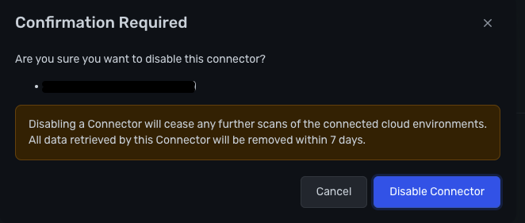

## How to disable a Deployment from within Wiz.io

### Who to contact & where

- Reach out to the Vulnerability Management team via `#g_security_vulnmgmt`.
- Tag `@vulnerability-management` in an open slack channel.

### When would this be required?

In the event where Wiz.io has been identified as the root cause of or contributory to an incident, and other avenues have not provided a solution, we may opt to disable the Deployment to ensure not further harm is caused in the impacted workloads.

### Triage:

1. Wiz.io scanning is implicated or strongly suspected based on investigation to be contributing to or causing an incident.
1. Engage Vulnerability Management team on communication channels noted above.
1. Determine if disabling Wiz is the only solution to unblock the Dedicated incident.
1. Vulnerability Management team to document in an issue [here](https://gitlab.com/gitlab-com/gl-security/threatmanagement/vulnerability-management/vulnerability-management-internal/vulnerability-management-tracker) time and reason vulnerability assessment will be stopped for the given Deployment. This covers all bases for `sec-assurance`.

### Disabling the Deployment within Wiz.io

>Requires Connector Admin or higher
1. Login to [Wiz.io](https://app.wiz.io/login) or via `Wiz` Okta tile.
1. Navigate to `Settings` > `Deployments`.  
    > 
1. Using the `three-dot menu` to the right hand side of the offending connector, select `Disable`.
1. Confirm Disablement of the Deployment connector via `Disable Connector` button.
    > 
1. Screenshot confirmation of disabled state.
1. Update the issue raised during triage with screenshot and confirmation the `Deployment` has been disabled.

