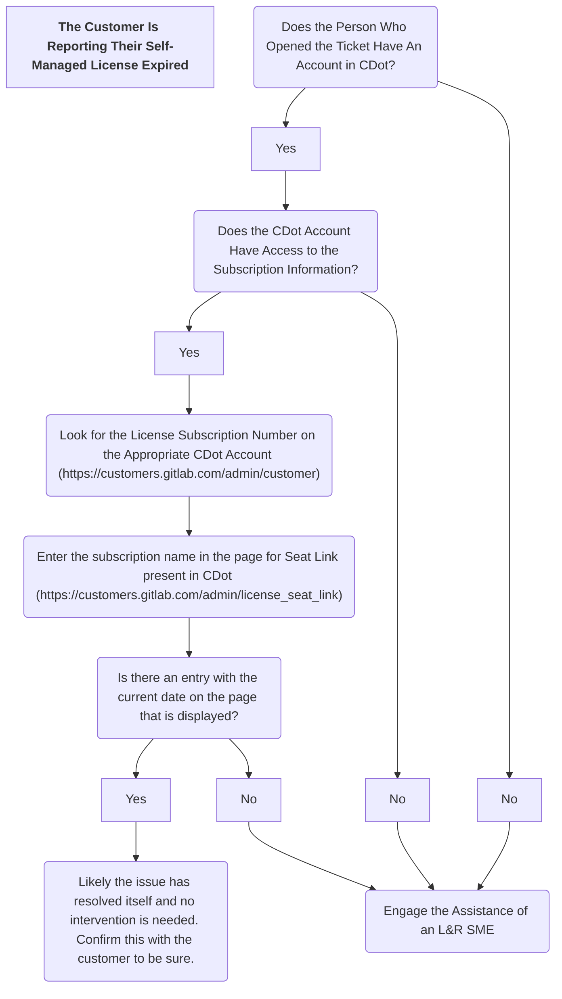

## Overview

When a customer submits an emergency support request for an expired license, it's essential to assess whether the issue can be handled by the on-call engineer or requires the expertise of an L&R SME.

This workflow outlines steps for Support to determine if expert intervention from an L&R SME is necessary.

**NOTE:** This workflow is applicable even if the customer has previously received a
[Sales-generated temporary extension](/handbook/support/license-and-renewals/workflows/self-managed/trials/#how-to-extend-an-expired-or-soon-to-expire-license).

This workflow does not cover SaaS Subscription Emergencies, see [Customer Emergencies Workflow - SaaS License Emergencies](/handbook/support/workflows/customer_emergencies_workflows#saas-subscription-emergencies).

## Scope

License requests for a Self-managed customer with a **paid** plan, where the license's "grace period" (14 days after expiration) ended within the last 3 days from the current emergency's date.

## Out of Scope

1. Organizations without a **paid** plan.
1. Prospects.

---

## Workflow

**Emergency License Replacement Workflow**

To ensure timely resolution for emergency support requests involving licensing problems, follow this step-by-step process:

This workflow is designed to provide a clear guide for Support to determine whether an L&R SME's expertise is necessary to assist with the customer's request.