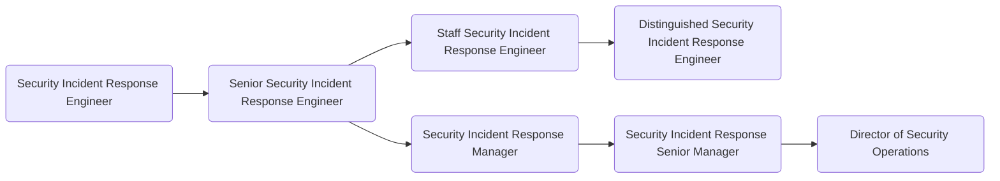

As members of GitLab's [Security Operations department](/handbook/security/security-operations/), the [Security Operations](/handbook/security/security-operations/sirt/) is divided into three focus areas: Security Incident Response, Trust & Safety, and Security Logging, and is operational 24/7 with a follow-the-sun rotation. The Security Operations (SecOps) team detects, manages, and remediates security incidents across GitLab. Members of SecOps are the defenders and firefighters of the GitLab Security division. SecOps works to create and maintain a safe and secure operating environment for the organization and its customers and responds to active security incidents. As a Security Engineer on SecOps you will build and maintain the tools we use to detect and respond to emerging threats in efficient and scalable ways, work to increase our observability over the organisation to catch threats early, respond to security incidents and drive them to resolution, and develop and deploy preventative security measures for the GitLab organization and GitLab.com. Successful Security Engineers thrive in high-stress environments and can think like both an attacker and defender, engage with and mentor more junior Security Engineers, and can help come up with proactive and preventative security measures to keep GitLab and its user's data safe in an ever changing threat landscape.

## Responsibilities

There are three functional responsibilities within the Security Operations team. 

### Security Incident Response

- Detect and respond to company-wide security incidents, coordinating cross-functional teams to mitigate and eradicate threats
- Monitor and analyze emerging threats, vulnerabilities and exploits
- Develop and implement scalable preventative security measures (detection, monitoring, exploitation)
- Incorporate current security trends, advisories, publications, and academic research
- Communicate risks and mitigations across multiple audiences

### Trust & Safety

- Monitor and mitigate abusive activity on GitLab.com
- Triage and respond to Trust and Safety related incidents and reports
- Create, maintain and improve operational workflows in Trust and Safety
- Utilize log ingestion platforms for analyzing and identifying the tactics, techniques and patterns of abusive users
- Assist with training and onboarding of new team members

### Security Logging

- Be part of the architectural direction, administration, maintenance, documentation, and oversight of the Security information and event management ([SIEM](https://en.wikipedia.org/wiki/Security_information_and_event_management)) solution
- Create and maintain integrations and solutions for the log collection, aggregation, indexing, search, alerting
- Manage implementation, enhancement and adoption of the solutions built by the team into operations
- Utilize log ingestion platform for security analytics and identification of tactics, techniques and patterns of attackers
- Collect and review security logs from all systems (Cloud Providers, GitLab, OS, G-Suite, OKTA, IDS, etc.)
- Adequately forecast capacity, cost and log volumes. Ensure log volume and costs remain within budget and avoid overages, communicating capacity risks with plenty of time to plan for financial forecasting.
- Ensure compliance with internal policies, standards, and regulatory requirements

## Requirements

- Ability to use GitLab
- Good written and verbal communication skills, including proficiency to communicate over text-based mediums (Slack, GitLab Issues, Email) and the ability to succinctly document technical details
- Experience working in site-reliability engineering, cloud security, system engineering, or similar positions 
- Experience with designing and implementing processes and tools to improve incident handling and resolution
- Experience with Google Cloud Platform (preferred) or Amazon Web Services
- Substantial knowledge of the Linux operating system
- Technical knowledge of systems in a multi-tenant, cloud environment
- Proficiency with one or more programming languages (Python or Ruby is required, other popular programming languages are a bonus)
- Demonstrated experience with running systems at scale
- You are a team player and enjoy collaborating with cross-functional teams
- You are a great communicator
- You employ a flexible and constructive approach when solving problems
- You are comfortable with moving forward when faced with ambiguity
- You share our [values](/handbook/values/), and work in accordance with those values

## Hiring Process

Candidates for a position in the Security Operations team can expect the hiring process to follow the order below. Please keep in mind that candidates can be declined from the position at any stage of the process.

- Qualified candidates will be invited to schedule a 30 minute [screening call](/handbook/hiring/interviewing/#screening-call) with one of our Global Recruiters.
- Next, candidates will be invited to schedule an interview with Security Operations Manager
- Candidates will then be invited to schedule an interview with 2 SIRT peers, one of which will be a Senior
- Candidates will then be invited to schedule an interview with Director of Security Operations
- Successful candidates will subsequently be made an offer via email

## Levels

### Security Operations Engineer (Intermediate)

This position reports to the [Manager, Security Operations](#manager-security-operations) in your corresponding geographical region.

#### Security Operations Engineer (Intermediate) Job Grade

The Security Operations Engineer is a [grade 6](/handbook/total-rewards/compensation/compensation-calculator/#gitlab-job-grades).

#### Security Operations Engineer (Intermediate) Responsibilities

- Detect and respond to basic security incidents across the organization or GitLab.com
- Implement and monitor security measures for the protection of corporate and production infrastructure
- Utilize log ingestion platform for security analytics and identification of tactics, techniques and patterns of attackers
- Contribute to creation of runbooks
- Contribute to the production and tuning of detection rules
- Participate in the Security Operations on-call rotation
- Digital forensics & incident response (DFIR)
- Identify and mitigate complex security vulnerabilities before an attacker exploits them

#### Security Operations Engineer (Intermediate) Requirements

- A minimum of 2 years experience working with incident response
- Good written and verbal communication skills
- Experience using log analysis platforms such as splunk, ELK, bigquery, etc
- Familiarity with Google Cloud Platform (GCP), AWS, and/or Azure
- Substantial engineering mindset

### Senior Security Operations Engineer

This position reports to the [Manager, Security Operations](#manager-security-operations).

#### Senior Security Operations Engineer Job Grade

The Senior Security Operations Engineer is a [grade 7](/handbook/total-rewards/compensation/compensation-calculator/#gitlab-job-grades).

#### Senior Security Operations Engineer Responsibilities

- Extends Security Operations Engineer responsibilities, plus;
- Detect and independently respond to security incidents across the organization or GitLab.com
- Conduct proactive threat hunting based on threat intel
- Perform forensic analysis of infected hosts independently
- Analyze network traffic and identify attacker activity
- Mentor other members of Security Operations
- Build and maintain scalable log ingestion and analytics platforms and tooling
- Perform root cause analysis (RCA) and incident reviews

#### Senior Security Operations Engineer Requirements

- 5+ years of demonstrated experience in web or cloud security engineering, log aggregation, and/or penetration testing
- A minimum of 2 years experience working with incident response
- Excellent written and verbal communication skills
- Capability to build working relationships with key stakeholders
- Experience with operating system internals and hardening, web application and browser security, and monitoring and intrusion detection

### Staff Security Operations Engineer

This position reports to the [Manager, Security Operations](#manager-security-operations). 
The Staff Security Operations engineer is an extension of Security Operations leadership and works hand in hand with the manager to solve complex, bigger-picture problems. 

#### Staff Security Operations Engineer Job Grade

The Staff Security Operations Engineer is a [grade 8](/handbook/total-rewards/compensation/compensation-calculator/#gitlab-job-grades).

#### Staff Security Operations Engineer Responsibilities

- Extends Senior Security Operations Engineer responsibilities, plus:
- Subject Matter Expert (SME) in security operations, providing mentoring and training to other members of the Security Operations team
- Lead the design, evaluation, implementation, and deployment of new security technologies to enhance the organization’s security posture
- Maintain up-to-date knowledge of emerging threats, security technologies, and academic research for application in the protection of the organization and GitLab.com
- Participate in on-call duties at least quarterly to maintain an understanding of response operations and provide support, particularly in regions with limited coverage
- Lead efforts to design and collect security operations metrics, and improve the efficiency and effectiveness of incident response plans
- Tackle complex technical issues and problems that cross other teams and significantly impact the business, especially those that other engineers have been unsuccessful in resolving
- Direct the implementation of solutions in collaboration with the team and provide guidance where necessary
- Develop strong relationships with Managers, who should help guide rather than direct staff engineers
- Make critical decisions during incidents, including containment actions, ensuring a timely and effective response
- Build and maintain cross-functional relationships with other Staff Engineers and Managers, acting as an extension of leadership and fostering collaboration
- Evangelize best practices, promote security awareness, and drive continuous improvement within the organization
- Provide cross-training and coverage for Security Logging until adequate coverage is achieved

#### Staff Security Operations Engineer Requirements

- 10 years of demonstrated experience in web or cloud security engineering, log aggregation, and/or penetration testing
- Profound knowledge of attack and mitigation methods
- Experience with secure network design, firewalls, authentication and authorization systems
- Experience with threat modeling
- Experience in the development of security tools and automation

### Manager, Security Operations

This position reports to the [Senior Manager, Security Operations](#senior-manager-security-operations).

#### Manager, Security Operations Job Grade

The Security Operations Manager is a [grade 8](/handbook/total-rewards/compensation/compensation-calculator/#gitlab-job-grades).

#### Manager, Security Operations Responsibilities

- Hire a world class team of security engineers to work on their team
- Help their team grow their skills and experience
- Provide input on security architecture, issues, and features
- Hold regular 1:1's with all members of their team
- Create a sense of psychological safety on their team
- Be your team's role model in terms of positive thinking, de-escalating conflict, and taking time off
- Identify the need to, and drive the implementation of security-related technical and process improvements
- Author project plans for security initiatives
- Draft and successfully deliver on quarterly OKRs
- Train team members to screen candidates and conduct engineering interviews
- Build a substantial, collaborative partnership with Legal, Infrastructure, Development and Product departments
- Assume the role of an Incident Manager during larger security events

#### Manager, Security Operations Requirements

- Proven track record as an experienced member of Security Operations or Incident Response teams - either as an Individual Contributor or as a Manager
- Experience with leading Security or security-focused Site Reliability teams
- Experience with working at a SaaS, or product company
- Excellent written and verbal communication skills, especially experience with executive-level communications
- Capability to make concrete progress in the face of ambiguity and imperfect knowledge
- Being comfortable with often not being in control of their time (because security events don't care about anyone's plans)
- Being comfortable with very frequent context switching
- Willingness to be part of the Security Manager On-Call rotation
- Robust understanding of security issues, mitigations, and a solid grasp of the current global threat landscape
- Experience with the role of an incident manager during medium and large scale security events
- First hand experience with major cloud providers - GCP, AWS, Azure, Digital Ocean
- Alignment with Manager responsibilities as outlined in [Leadership at GitLab](/handbook/company/structure/#management-group)

### Senior Manager, Security Operations

This role reports to the [Director of Security Operations](/job-families/security/security-leadership/#director-security-operations).

#### Senior Manager, Security Operations Job Grade

The Security Operations Senior Manager is a [grade 9](/handbook/total-rewards/compensation/compensation-calculator/#gitlab-job-grades).

#### Senior Manager, Security Operations Responsibilities

- Extends Manager, Security Operations responsibilities, plus;
- Provide tactical oversight of the teams' daily efforts
- Maintain vision for the teams' immediate and near-term future
- Develop and maintain teams' KPIs
- Be your teams' role model in terms of positive thinking, de-escalating conflict, and taking time off
- Help teams prioritise efforts and ensure they align with the overall direction of the company
- Draft and successfully deliver on quarterly OKRs
- Train team members to screen candidates and conduct managerial interviews
- Build a substantial, collaborative partnership with your peers in the Legal, Infrastructure, IT, Development and Product departments
- Being part of the Security Escalation On-Call rotation

#### Senior Manager, Security Operations Requirements

- Experience with leading people managers
- Experience with leading Security or security-focused Site Reliability teams
- Experience with working at a SaaS, or product company
- Excellent written and verbal communication skills, especially experience with executive-level communications
- Capability to make concrete progress in the face of ambiguity and imperfect knowledge
- Being comfortable with rapid context switching
- Willingness to be part of the Security Escalation On-Call rotation
- Robust understanding of security issues, mitigations, and a solid grasp of the current global threat landscape
- Experience with the role of an incident manager during large scale security events
- Familiarity with major cloud providers - GCP, AWS, Azure, Digital Ocean
- Alignment with Manager responsibilities as outlined in [Leadership at GitLab](/handbook/company/structure/#management-group)

## Performance Indicators

- Support the organisation by [ensuring that the Security Engineer On-Call meets SLAs](/handbook/security/performance-indicators/#sirt-former-security-operations-page-volume)

### Career Ladder

For details on the Security division leadership roles, to include the Security Operations Director and VP of Security, see the [Security Leadership](/job-families/security/security-leadership/) page.
