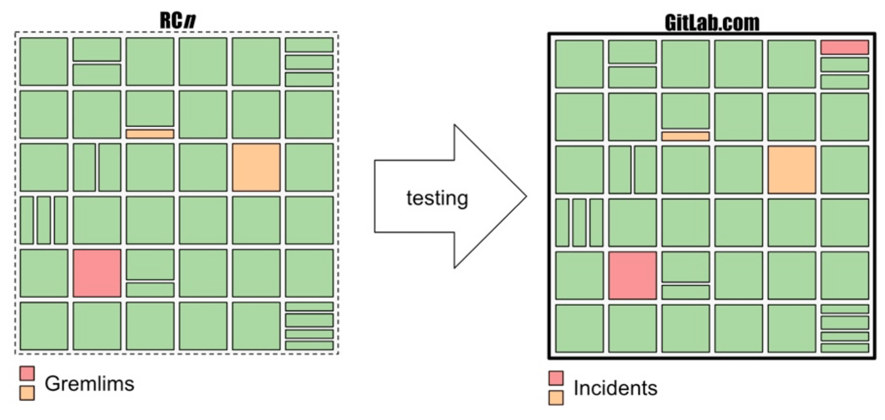
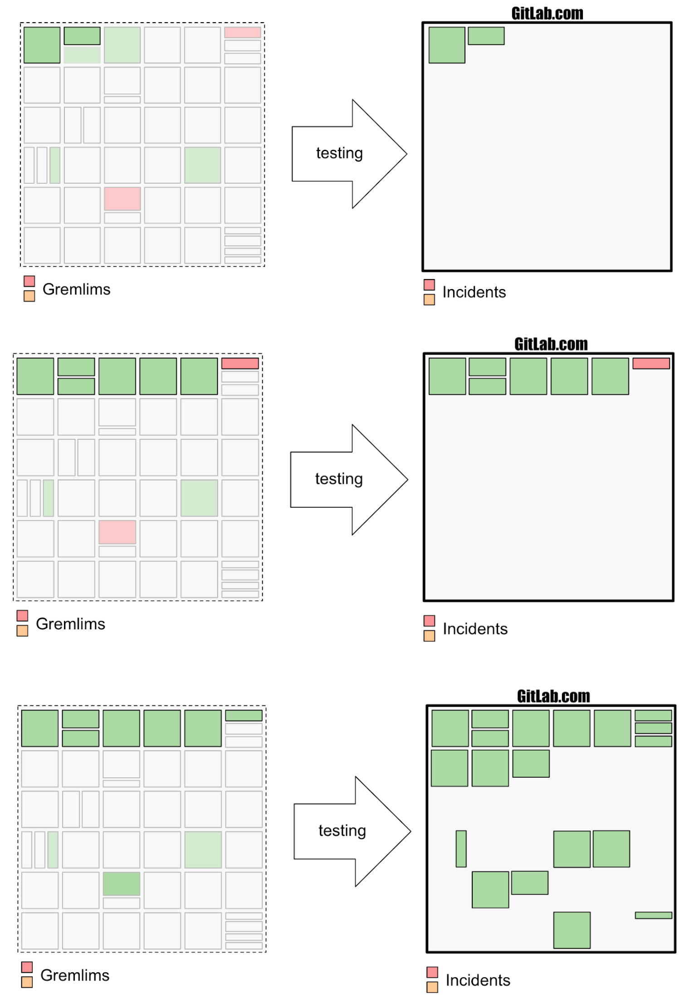

## On this page
{:.no_toc .hidden-md .hidden-lg}

- TOC
{:toc .hidden-md .hidden-lg}

Issue: [`infra/5231`](https://gitlab.com/gitlab-com/gl-infra/infrastructure/issues/5231)

## Overview

**GitLab.com** is the largest installation of GitLab on the planet, and it has traditionally
served as an at-scale test environment for new releases. The current development and release
cycle operates on a monthly schedule and is centered around the release of a new version of
GitLab on the 22 of the month (a deadline GitLab has never missed in its history). After
initial testing and following a deployment to staging, Release Candidates (RCs) are deployed
to GitLab.com to validate them at scale.

This approach presents challenges whenever a Release Candidate introduces instability into
the environment, as they contain large numbers of changes, which can have significantly
adverse effects on GitLab.com’s uptime. Furthermore, mission-critical workloads do not
tolerate such a scheme: a pre-production code base cannot properly support said workloads
consistently.

GitLab.com is a production site with an availability OKR of 99.95% uptime, so a different
approach to drive change into the environment is necessary, one which allows us to:

* dial in an optimal change speed to increase product velocity safety,
* maintain predictable levels of stability to support mission-critical workloads, and
* contain the risk surface area so we can quickly address issues introduced by changes.

The overall strategy to meet this challenge is through CI/CD, which is in fact an important
feature of our product. While there is little or no disagreement on this approach, we have
found it difficult, as an organization, to get started. This blueprint is intended to produce
a first step on the iterations towards CI/CD.

The end goal of this effort is to allow [GitLab Auto DevOps](/product/auto-devops/)
to deploy to GitLab.com.

## Today

Deployments to GitLab.com consist of Release Candidates (RCs) and Hot Patches (HPs).

Release Candidates are, by definition, not fully production-ready code, and contain large
numbers of changes. Hot Patches address issues on GitLab.com that cannot wait for the next
release.

#### Release Candidates

Whenever a RC is deployed to GitLab.com and causes instability, tracking and finding the
source of the problem in such large changesets can be difficult; once the source of a
problem has been identified, a determination is made whether to fix the issue in-place
(through a hotpatch) or to wait for the next release candidate addressing the issue.
In either case, there is a waiting period to actually implement the fix, which happens
under the pressure of an ongoing incident.

Deploying RCs is the equivalent of hitting the production environment with a sledgehammer:
the environment can usually widthstand a hit or two, but it will eventually crumble. And
probability theory is not working in our favor. Increasing the rate of RC deployments
exacerbates the negative effects of this methodology on GitLab.com.

#### Hot Patches

Hot patches are lifesavers in that they allow us to address critical issues on the spot.
Yet their very existence is a sign that our development process is in need of change:
they exist because rolling back a RC is rarely possible and very labor intensive. They
are deployed through an entirely different process and come with their own set of dangers.
Most notably, we have experienced issues in which hotpatches applied to GitLab.com at a
given point in time may:

* be missed on new deployments until they are integrated into a future RC
* be incompatible with incoming RCs and require refactoring

Furthermore, after a RC is deployed, any active hotpacthes must be reapplied, which requires
a window of time in which the fix is not available. Automated hotpatch application has also
proven challenging and problematic.

## Tomorrow

As mentioned in the Overview, our stated strategy to drive change into GitLab.com is through
CI/CD. [Martin Heller](https://techbeacon.com/continuous-integration-answer-life-universe-everything) provides a concise summary of the challenges involved in adopting CI/CD:

> What it really takes for most companies to implement CI and CD is to completely change
> their software development culture, adapt their organization, change their workflow,
> automate the bulk of their testing, and either install significant infrastructure or learn
> to love the cloud. None of that is impossible, but none of that is easy.

GitLab *builds* technology to implement CI/CD, and [we believe in dogfooding](/handbook/values/) our own product, so we already have *most of* the
technical answer and cultural driver to adopt CI/CD. We must contend with the remaining
challenges as outlined above. The first step is to translate those generic challenges
into GitLab specifics.

We also face some special but not entirely unique challenges.

GitLab provides support for both GitLab.com and self-managed. The [Distribution team](/handbook/engineering/development/enablement/distribution/)
builds and ships the tooling to have customers perform their own installations, updates,
and upgrades, which GitLab.com is supposed to (and mostly does) use. GitLab.com, however,
deviates from this process slightly: it uses the same package install as customers would,
but they’re wrapped up in [`takeoff`](https://gitlab.com/gitlab-org/takeoff), which issues
`HUP`s and restarts the environment a bit differently. This methodology does not inherently
support hotpatches: self-managed customers do not require it as it is primarily used to
address significant issues on GitLab.com. Customers get security releases. The challenge
of adopting CI/CD is that it will likely entail breaking up this notion entirely in one
of two ways:

* GitLab.com and self-managed use completely different deployment methods
* Self-managed's delivery method changes to mimic that of GitLab.com

Both approaches present challenges.

### Speeds

GitLab.com and self-managed customer operate at different speeds. GitLab.com exists in the
**now**; self-managed customers exist in the realm of the current development cycle
methodology, which culminates with a release on the 22nd of every month. By necessity, the
solution to this challenge must support both speeds of delivery.

### Fail-Safe Mechanisms

Dogfooding is important to us but we must make a clear distinction between **dogfooding
the product** and **dogfooding the actual instance of the product**. Managing GitLab.com
through GitLab.com requires fail-safe mechanisms to allow us to recover GitLab.com in
case of a failure that would prevent us from operating GitLab.com itself. We have already
made some progress on this front, where our automation framework no longer depends on
GitLab.com itself to operate but on a separate GitLab instance.

## Fundamental Questions

### The First Fundamental Question

The first fundamental question we must answer and commit to with regards to GitLab.com is whether GitLab.com is always on the leading --**not** *bleeding*-- edge of our development
cycle: as soon as **production-ready** code (for a new feature or a fix) is available, it
is deployed to GitLab.com. The answer is significant because it is directly related to speed
differences between GitLab.com and self-managed, and will have an impact on our approach.

From an Infrastructure perspective, the answer is a resounding **yes**. This is particularly true for fixes that address broken functionality on GitLab.com, especially those related to security or critical features (e.g., pushes), which would remove the need for hotpatches as a duct-tape type of release.

Furthermore, our confidence on the product we ship to self-managed is directly related to the amount of time the code has been in production at GitLab.com. The earlier the code is running on GitLab.com, the more confidence we gain on its trustworthiness.

### The Second Fundamental Question

The second fundamental question is to determine if there is indeed a single solution that can operate at both speeds. The Cloud Native initiative, based on Kubernetes, is headed in that direction but it has not yet provided a final answer, and its implementation is not trivial. We may have to build a bridge solution to manage our current operating scale until Kubernetes is introduced in the environment and GitLab can fully operate under said environment.

# CI/CD

Quoting [ourselves](/blog/2016/08/05/continuous-integration-delivery-and-deployment-with-gitlab/):

> **Continuous Integration** is a software development practice in which you build and
> test software every time a developer pushes code to the application, and it happens
> several times a day.

> **Continuous Deployment** is a software development practice in which every code change
> goes through the entire pipeline and is put into production automatically, resulting in
> many production deployments every day. It does everything that Continuous Delivery does,
> but the process is fully automated, there's no human intervention at all.

There is ample literature on the benefits of adopting CI/CD. One particularly relevant quote for Infrastructure is from Martin Fowler:

> Continuous Integration doesn’t get rid of bugs, but it does make them dramatically
> easier to find and remove.

This is, of course, aligned with our most important OKR for GitLab.com: its **availability**.

At its core, **CI/CD involves the frequent release of small batches of new functionality
into the production environment**, which is perhaps the most fundamental change the
Engineering organization must adopt as a whole, as no single department can do so on its own.

The effects resulting from deploying small batches of changes are easier to measure and
understand than that of large changesets (like RCs), yielding faster resolution of problems
and allowing for higher change velocity at higher levels of confidence and safety.

We must adopt development practices such as:

* service versioning,
* rearchitecture through abstraction,
* feature flags, and
* evolutionary database design techniques.

From a cultural standpoint, we must move towards the mindset that **`master` is production**,
which entails understanding that all code in master must be production quality, and as such,
is code that should be able to be shipped to the production environment at any time.

To ensure all code in master is production-ready, we have to implement gated commits to reach
`master`, which requires an automated deployment and testing process. This provides shorter
feedback cycles for developers, helping them improve their code in a time horizon close to
when the code is initially written: context switching is expensive, and having developers
refocus on code written days ago is a significant context switch.

## CI/CD and Self-Managed
CI/CD is squarely geared towards GitLab.com, but it does not exclude self-managed. While we
will no longer be testing the normal distribution process that self-managed uses, it will
ensure the code has been extensively validated on GitLab.com, which is significant plus.
We can and will continue to support self-managed installation, upgrade and updates tools,
and we can and will continue to test them extensively, just not on GitLab.com.

## Alignment

Marin Jankovski has given significant amounts of thought to this transition, perhaps with
an even wider perspective than the one outlined in this blueprint (which, as noted at the beginning, is very Infrastructure centric). See [framework/issues/1](https://gitlab.com/gitlab-com/gl-infra/delivery/issues/1) for details.

# Commit

Rather than putting together a grand plan to dogfood CI/CD, let's deploy our [values](/handbook/values/) to help us navigate through this transition:

* **Collaboration: Dogfooding** Let's dogfood GitLab's top-of-class CI/CD features.
* **Results: Write Promises Down** Let's commit [OKRs](/company/okrs/) on best-practice items we
  know we must start thinking about: service versioning, feature flags and evolutionary
  database design techniques, to name a few.
* **Results: Tenacity** Let's commit to this transition.
* **Results: Ambitious** This is a significant change to our development culture, a worthy
  challenge to pursue as we scale GitLab and GitLab.com.
* **Results: Bias for Action**
* **Efficiency: Boring Solutions** Using GitLab CI/CD *is* a boring solution.
* **Efficiency: Minimum Viable Change** Let's identify and deliver on MVCs.
* **Iteration: Make a Proposal** [Recursive](./).
* **Transparency: Public by Default** [Also recursive](./).
