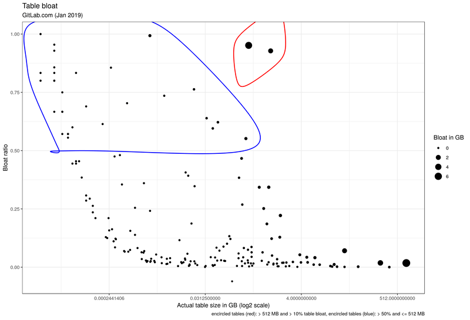
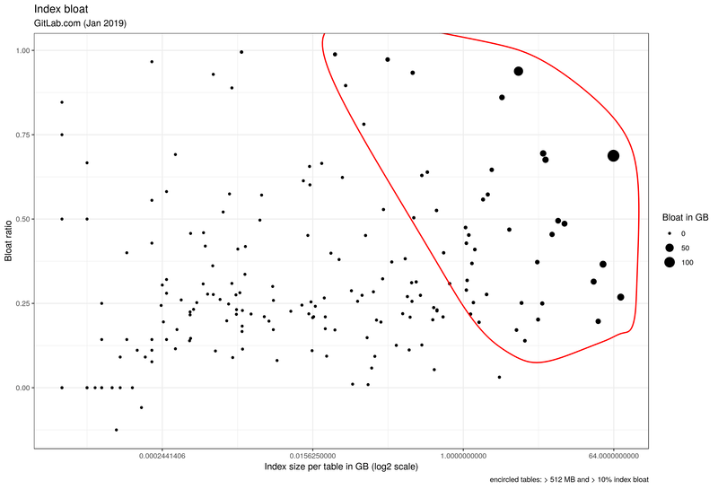
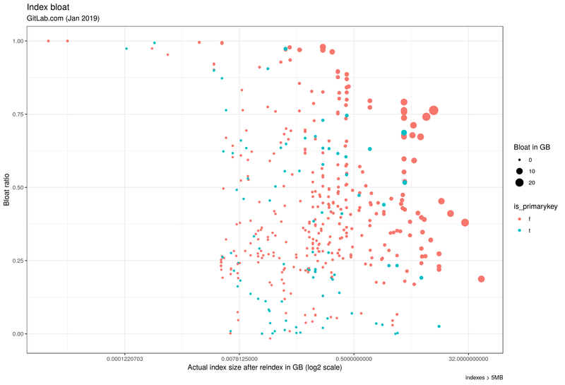

## On this page
{:.no_toc .hidden-md .hidden-lg}

- TOC
{:toc .hidden-md .hidden-lg}

## Design

## Resources

Epic: [gl-infra/29](https://gitlab.com/groups/gitlab-com/gl-infra/-/epics/29)

Blueprint: [Database bloat analysis](/handbook/engineering/infrastructure/blueprint/201901-postgres-bloat/index.html)

[FY20-Q1 OKR](/company/okrs/fy20-q1/): *Implement 4 significant availability features to improve database reliability (autovacuum, masterless backups, pgrepack, replica on ZFS)*

## Idea/Problem Statement

There is a [considerable amount of bloat](/handbook/engineering/infrastructure/blueprint/201901-postgres-bloat/index.html) in the PostgreSQL database for GitLab.com. In short, we have accumulated 51% of index bloat and also see elevated levels of bloat in at least two tables. The total amount of bloat measured is at ~450 GB.

Here, we describe our approach to reduce the level of bloat and also maintain it over time.

## Design

The design is based on [pg_repack](https://github.com/reorg/pg_repack). It is a PostgreSQL extension that needs to be available to the database instance and also comes with a command line for it.

We are going to provide a ruby implementation that interacts with pg_repack through a command line. This is going to ship with GitLab Community Edition and can be interacted with through a rake job.

The command line is a basic wrapper around pg_repack functionality for comfort reasons. Additionally, it provides bloat estimation and a recommendation which data structures need to be repacked.

We are going to ship this solution with the product and also apply it for GitLab.com.

For GitLab.com, we plan to add continuous monitoring of bloat levels based on an estimation process.

### Command line tool to clean up database bloat

The idea is to implement a command line tool and integrate that into GitLab as a rake job. Rake just serves as an example method here, we may decide to integrate it differently further down the road (but the idea is the same).

The primary user of the command line tool is an engineer of GitLab.com or an admin of the GitLab installation (for self-hosted). It can be used to determine bloat levels and execute maintenance in order to reduce bloat.

```
Action: estimate

The estimate action provides an estimate of total table and index bloat. It also comes with a recommendation on which repack actions are going to be needed in order to reduce bloat.

Action: repack

The repack action actually executes maintenance for specific structures in the database. It can be called with a list (comma separated) of tables and/or indexes. In case of failures, the internal state is going to be cleaned up automatically.

Options:
    --auto            Repack based on the estimate recommendation
    --indexes=LIST    Repack given indexes
    --tables=LIST     Repack given tables
    --dry             Print what would have been executed and exit
```

The recommendation in `estimate` is based on a bloat estimate (see below). It may exclude tables and indexes due to their small size or low level of bloat.

### Estimating Bloat

Bloat can be measured exactly by comparing sizes of indexes and tables before and after a `VACUUM FULL`. However, this is a costly operation that cannot be done online.

We estimate bloat by using a standard method, for example with queries from [pgsql-bloat-estimation](https://github.com/ioguix/pgsql-bloat-estimation). This provides a heuristic only but can be used to derive conclusions about which tables or indexes need maintenance.

### Implementation Considerations

#### Testing

Testing will be executed on staging.gitlab.com, at best during a high-traffic time. For staging, this is the time when we do QA testing for a release. Alternatively, we can trigger automated QA testing to add some traffic.

As a next step, we can execute the maintenance on other installs like dev.gitlab.org or ops.gitlab.net.

However, we don't have a test instance of GitLab with the same level of traffic as GitLab.com sees. For this, it may be worth to execute maintenance on a production-sized database while replaying workload with pgreplay.

#### GitLab.com and Self-managed

For GitLab.com, we'll ship pg_repack through chef/apt. The rake task can be executed through the deploy node since it needs to directly connect to the PostgreSQL database (and not go through pgbouncer).

For self-managed installations, we ship pg_repack along with the omnibus package. We are going to ship documentation along with the product on how to execute index maintenance through rake.

### Operational Considerations

#### Automation

We don't want the maintenance to be executed automatically.

Once we gather more experience with executing the maintenance, we can consider executing database maintenance automatically after a version upgrade, for example. This would allow us to also improve database bloat levels for self hosted installations. However, this is not strictly required for now.

####  Monitoring

We are going to implement monitoring of database bloat levels through prometheus. Ideally, we report a bloat metric for indexes and tables separately and maybe even on a per-index and per-table granularity. This is based on a bloat estimate (see Estimating Bloat) and not an exact measurement.

It is acceptable if the bloat estimate is run only at low frequency (e.g. daily or hourly) if required.

Monitoring can be implemented through [postgres_exporter](https://gitlab.com/gitlab-org/omnibus-gitlab/blob/master/files/gitlab-cookbooks/gitlab/templates/default/postgres-queries.yaml) or by pushing information to the prometheus push-gateway with a cronjob.

We don't intend to add alerts on bloat levels but rather add means to observe and track how bloat accumulates and levels change over time (e.g. through Grafana).

#### Execution on GitLab.com

As shown in the [analysis](/handbook/engineering/infrastructure/blueprint/201901-postgres-bloat/index.html), 95% of database bloat comes from regular indexes. Once we have the solution deployed to GitLab.com, we'll perform a three step maintenance to reduce overall bloat levels to below 5%:

1. Repack indexes (regulars and primary key indexes)
2. Repack tables `snippets, services`

This will produce a bloat level well below 5% in total. With the state today, there is no need to repack other tables.

### Additional Considerations

### Alternatives

As discussed in the [analysis](/handbook/engineering/infrastructure/blueprint/201901-postgres-bloat/index.html) , the majority of bloat we see today is from regular indexes (not from primary keys and not from tables). In this situation, it's also be possible to just ship a standard migration that re-creates those indexes (see the analysis for details) without using pg_repack.

We are going down the road of shipping pg_repack because we anticipate a future need to repack tables and primary keys.

## Blueprint: Postgres Database Bloat Analysis

PostgreSQL maintains consistency across concurrent database sessions using [multi-version concurrency control](https://www.postgresql.org/docs/9.6/mvcc-intro.html). Most modifications to records result in a new version of the record that obtains additional space. The old version is considered a *dead tuple* until the space is marked for re-use. This space can be re-used for new records (created by update or insert queries) and is generally referred to as *bloat*. All relevant data structures (heap, index, toast) can suffer from bloat which has an impact on query performance and space usage. We refer to this as *index bloat* or *table bloat* and similar.

A background process called *autovacuum* sweeps dead tuples and marks the space for re-use. Bloat is reduced, if the space is successfully re-used later. Over time, all data structures may accumulate bloat that cannot be removed with regular background autovacuuming. For example, index pages are only reclaimed if they became completely empty. That is, an index page is [kept around](https://www.postgresql.org/docs/current/routine-reindex.html) also if only a few keys remain on that page. Here, additional strategies have to be implemented to reorganize data structures in order to remove bloat.

The PostgreSQL database for GitLab.com is 2.6 TB in size as of January 2019. The amount of bloat is measured to be at 18 % of the overall database size, ranging at up to ~450 GB of bloat (see Analysis).

The problem with bloat is that it may slow down scan operations on relevant data structures. These can be indexes (index scans) and heap (table scans). Generally, index bloat is considered to have higher impact than heap bloat (because indexes are likely more often used to retrieve records from the heap than sequentially scanning a full table).

### Analysis

In order to estimate bloat, we used a database instance from the backup restore pipeline (in January 2019). This comes with the exact same data as the production cluster but is otherwise detached and read/write. On this instance, we measured table, index and toast-table sizes separately before and after performing a `VACUUM FULL` on the database. The difference is what we consider bloat (see below table). The full [vacuum](https://www.postgresql.org/docs/9.6/sql-vacuum.html) run took nearly 24 hours to complete.

| Data structure  | Before      | After       | Bloat in GB | Bloat in % of current size (Before) |
| --------------- | ----------- | ----------- | ----------- | ----------------------------------- |
| Table           | 1210 GB     | 1186 GB     | 24 GB       | 2 %                                 |
| **Index**       | **843 GB**  | **410 GB**  | **433 GB**  | **51 %**                            |
| Toast           | 509 GB      | 502 GB      | 7 GB        | <2 %                                |
| **Total (all)** | **2556 GB** | **2104 GB** | **452 GB**  | **18 %**                            |

From this analysis, it is clear that overall table and toast bloat is negligible for GitLab.com. This means that autovacuum performs really well and frees up space that is later reclaimed by new record versions. However, there are a few outlying tables that have elevated levels of bloat (see "Table Analysis").

### Table Analysis

Here we examine table (heap) bloat more closely. The analysis is based on a table size comparison from before and after a `VACUUM FULL` ([source](https://gitlab.com/gitlab-com/gl-infra/infrastructure/issues/5994#note_137015232)).

Below we can see that most of the tables are either small or show low levels of bloat.

{: .shadow}

The encircled tables in red have a bloat level above 10% and more than 0.5 GB of bloat accumulated. Those tables are

* `services` (5.8 GB total table size) and
* `snippets` (4.3 GB total table size).

Rewriting these tables with [`CLUSTER`](https://www.postgresql.org/docs/9.6/sql-cluster.html) takes about 40-50s and removes 7.4 GB of table bloat (30% of overall table bloat). During this time, the table is locked exclusively and other queries are going to be blocked. Depending on the access patterns, it may be a viable approach to do for GitLab.com. It has been pointed out though that `services` is a rather actively used table which may not tolerate being locked for up to a minute. For `snippets` however, we should be able to just lock it exclusively for a minute without much impact.

There are other tables (marked in blue) with a high bloat ratio that are relatively small in total size. For those, it may be interesting to tune autovacuum settings. Given their comparably small size, those can be rewritten with `CLUSTER` as well causing only very short lock situations.

For those two tables, we may want to dig deeper into why we see these amounts of bloat. We may be able to change the access pattern for the application in order to improve this, so that we don't have to deal with a lot of bloat in the first place.

### Index analysis

*Note that a different database state was used to perform the index analysis vs the table analysis. Both database snapshots were a few days apart only, but their total size differs.*

Let's dissect where 51% index bloat is coming from. Below is a distribution of overall index size per table and their related bloat levels. There are quite a few bigger indexes with high levels of bloat - this is where we should target at.

{: .shadow}{: .shadow}

Going one step further, we look at individual index sizes and their respective bloat. The below graph shows the distribution per index and blue color indicates the index is a primary key.

{: .shadow}

Based on these statistics, we arrive at this picture:

| Data structure      | Actual size | Bloat in GB | % of overall index bloat |
| ------------------- | ----------- | ----------- | ------------------------ |
| Primary key indexes | 44.4        | 24.1        | 5.4                      |
| **Other indexes**   | **379.6**   | **423.1**   | **94.6**                 |
| Overall             | 424         | 447.2       | 100                      |

**Indexes that do not serve a primary key constraint make up 95% of the overall index bloat**. Rebuilding those indexes can be accomplished with normal DDL in a regular background migration.

If we rebuild regular indexes only, this would free up 423.1 GB of space and get us at 5.7% overall index bloat (down from 51%).

Zooming into the index dataset, we can examine the biggest offenders in terms of index bloat more closely. The [export](https://gitlab.com/snippets/1812014) contains data for indexes that are above 70% of bloat with more than 1 GB worth of bloat space.

An interesting example are indexes in `users` on boolean columns `ghost` and `admin` and similar for the enum-varchar `state`. Let's look at the table and index definitions:

```
                                                      Table "public.users"
                    Column                    |            Type             |                     Modifiers
----------------------------------------------+-----------------------------+----------------------------------------------------
 id                                           | integer                     | not null default nextval('users_id_seq'::regclass)
 ...
 admin                                        | boolean                     | not null default false
 ghost                                        | boolean                     |
 state                                        | character varying           |
 ...

Indexes:
    ...
    "index_users_on_admin" btree (admin)
    ...
    "index_users_on_ghost" btree (ghost)
    ...
    "index_users_on_state" btree (state)

```

Their net size is 70 MB but they range at 2.2 GB each. Note there is generally only one entry with the `ghost` flag set. Similarly, there are only a few users with `admin` flag set compared to normal users. We may be able to redefine those indexes, for example by making them partial. This avoids bloat because the index contains only very little records and does not change that often.

We may want to conduct a more thorough analysis of indexes, their definition and also their actual usage on GitLab.com (but this is a separate effort). For example, we might be able to remove [indexes that are not used at all](https://gitlab.com/gitlab-com/gl-infra/infrastructure/snippets/1812320).

### Storage cost

The level of bloat is the same across all replicas in the cluster (physical replication).

We use SSD persistent disks for database storage in Google Cloud Engine (us-east1 region). With currently 8 replicas for production, the overall bloat ranges at roughly 3.5 TB which comes in at 595 USD per month. There is additional associated cost for increased size of backups and by other similar environments (e.g. staging).

### Positives aspects of bloat

There are also positive aspects of (table) bloat: [HOT](https://git.postgresql.org/gitweb/?p=postgresql.git;a=blob;f=src/backend/access/heap/README.HOT;hb=HEAD) updates can only take place if there's enough room on the page (plus other requirements). Hence, bloat space can have a positive impact on update performance as well - best if it is uniformly distributed across the table.

This is also why it makes sense to explicitly bloat a table while it is being populated. This is what `fillfactor` does: PostgreSQL reserves some space on each page for updates.

### Strategies to remove bloat

Generally, database bloat can be reduced by rewriting relevant data structures (heap or index files). There are straight-forward ways of executing this as an offline operation: `REINDEX`, `CLUSTER` and `VACUUM FULL` are all sufficient to remove bloat from index and/or table structures, but require holding an exclusive lock for an extended period of time.

Since we require an online solution that does not interfere with ongoing traffic, we need to look at more elevated approaches.

#### Standard migration with DDL to rebuild and swap indexes

Here, we use a standard migration to rebuild indexes concurrently using standard DDL statements. This migration is similar to creating new indexes and as such can be done without impact on the live system.

The steps are:

1. `CREATE INDEX CONCURRENTLY` - recreate an index on the sides
2. `DROP INDEX` and `ALTER INDEX ... RENAME`  - in a single transaction, drop the old index and rename the newly created one to the original name. As with all other approaches, we need an exclusive lock on the table in order to swap indexes (however, this is a quick operation).

Since the new index is freshly rebuilt, it contains no bloat.

This method is only applicable to cleaning up indexes that don't participate in a primary key constraint. As pointed out in the analysis, we can clean up 95% of all index bloat with this method arriving at 5.7% total index bloat.

After the migration, we'd arrive at

| Data structure                  | Actual size in GB | Bloat in GB |                         |
| ------------------------------- | ----------------- | ----------- | ----------------------- |
| Primary key indexes (untouched) | 44.4              | 24.1        |                         |
| Other indexes (rebuilt)         | 379.6             | 0           |                         |
| Tables (untouched)              | 1186              | 24          |                         |
| Toast (untouched)               | 509               | 7           |                         |
| **Total**                       | **2119**          | **55.1**    | **2.5 % overall bloat** |

The benefits of this method are:

1. **Efficient**: Cleans up vast majority of the overall bloat for GitLab.com
2. **Dogfooding**: Ships easily with the product as a standard background migration
3. **Low technical risk**: Safest method we have available (no need to include PostgreSQL extensions)
4. **Boring**: Low implementation effort.

The effort to implement this method is fairly low: It can be delivered with the product (to self-hosted installations and GitLab.com) using a standard background migration or a rake task without additional dependencies.

#### Use pg_repack for index and table maintenance

pg_repack is a PostgreSQL extension that implements repacking of table and index structures. It can be run on-line because it provides a trigger-based solution to rebuild the data structure on the sides and later swaps data files instead of logically swapping the index or table.

Since pg_repack is based on physical file swapping, it can be used to

* repack tables (frees up 31 GB of space for GitLab.com),
* repack primary key indexes (frees up 24 GB of space for GitLab.com)
* repack regular indexes (frees up 423 GB of space for GitLab.com).

As such it is more versatile than the standard index rebuild method above.

Benefits are:

1. **Versatility**: Ability to repack tables and primary key indexes (not needed today)

Low lights are:

1. **Risk**: Additional compiled extension that is included in PostgreSQL runtime
2. **Effort**: Additional work required to ship to customers (omnibus) and apply for GitLab.com (chef/apt setup)

------

Author: [Andreas Brandl](https://gitlab.com/abrandl) {: .note}
