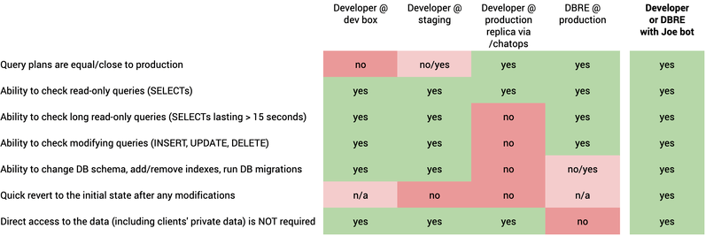

## On this page
{:.no_toc}

- TOC
{:toc}

## Overview

This blueprint addresses the following problems:
- how database-related changes created by GitLab developers are verified,
- how the reviewing MRs from the database (Postgres) perspective is organized,
- SQL query micro-optimization in general, including work on the existing and
new SQL code and ActiveRecord (Ruby on Rails) code.

SQL query micro-optimization is a process of optimization of an SQL (or the
corresponding Ruby on Rails code), involving only one or a few SQL statements,
usually executed one by one.
The goal of such a process is achieving better performance and scalability of
particular SQL queries without significant degrading of these characteristics
for all other SQL queries that are executed in the database. (In contrast,
SQL query macro-optimization addresses the top-down performance and scalability
analysis of a particular database and its workload, usually done using some
statistics collecting tools and/or logs analysis. This kind of optimization is
beyond the scope of this article). SQL micro-optimization involves changes in
the index set, query re-writing, DB schema re-design, and, less often,
local changes in database configuration parameters.

Further, we discuss the drawbacks of the current (as of June 2019) SQL
micro-optimization workflow used in GitLab development, such as:

- higher likelihood of having performance and scalability issues not determined
before the deployment to production,
- complications of verification of performance troubleshooting of
UPDATE/DELETE/INSERT queries,
- complications of verifying of index ideas,
- delays in MR approval.

We propose a new approach which is a successor of the existing one.
In particular, we propose switching to a new Slack bot called "Joe bot",
built on top of a special framework, "Database LaB". Working in pair,
Joe bot and Database Lab are capable of performing a series of
`EXPLAIN (ANALYZE, BUFFERS)` requests on a full-sized fresh production DB clone
provisioned during several seconds, and allowing work with any types of queries
including modifying ones. Working with an independent cloned database, Joe also
allows to change database schema anyhow, create indexes, and reset the database
to its initial state within a few seconds, being ready for a new
micro-optimization session.

Both Joe bot and Database Lab are open source projects developed and maintained
by [Postgres.ai](https://postgres.ai), and adapted for use in GitLab.com
infrastructure by [Nikolay Samokhvalov](https://gitlab.com/NikolayS/).

## Analysis

When code changes involve a multi-terabyte database, it is not uncommon to have
the following problem. A developer has an SQL query (or the corresponding ActiveRecord code),
that is known to be problematic, or that is new, and she/he wants to check its
performance and Postgres query optimizer behavior at production scale, but it is
impossible because one or more of the following reasons (and sometimes most or
even all of them):

1. The query is time/resource-consuming and might negatively affect the
production system's performance.
1. The query is a modifying one, changing the database state, in extreme cases
changing heavily (and resulting in a lot of I/O operations) or even ones that
are not transaction-safe (such as `TRUNCATE`).
1. Some DDL (example: `CREATE INDEX`) needs to be executed, and doing so on
production just for development and testing purposes seems exceptionally unreasonable.
1. Most developers do not have access to the production database servers or have
only read-only access.

### The Existing Solution

GitLab employees can use a [special tool](https://docs.gitlab.com/ee/development/understanding_explain_plans.html#chatops),
available in Slack: `/chatops run explain` command. It works great and partially solves
the last problem in the list above (providing developers indirect read-only access to
production databases), but does not address any of the others. It works with one
of the actual production replicas. Therefore, heavy, prolonged, and/or modifying
operations are not allowed at all.

All this brings us to the position when even for a simple check, developers need
to ask DBREs for help, which becomes a significant bottleneck in the development
process.

### The Staging Environment: Single, Differs from Production

The separate problem is that MRs that involve database-related changes are often
not verified on production-scale data volumes at all due to the complexity of
such checks implying enormous amount of DBRE's manual efforts.

Currently (June 2019), the staging database size is only ~0.5 TiB
([postgres-checkup report for GitLab.com staging](https://gitlab.com/gitlab-com/gl-infra/production/snippets/1866829)),
while the production DB exceeds ~3 TiB
([postgres-checkup report for GitLab.com production](https://gitlab.com/gitlab-com/gl-infra/production/snippets/1862519)).

This means that table and index sizes on the staging DB nodes are
significantly smaller than those on the production DB nodes, so SQL query
behavior differs significantly (planner might choose very different plans,
timings are smaller, and so on).

Additionally, as of June 2019, there is only one single staging
environment, so it is not trivial to test the same modifying change multiple
times, and it is extremely difficult if not impossible to parallelize various
kinds of checks (for example, verifying various MRs in parallel).

### Problem Statement

1. As for June 2019, most MRs are **never** verified on a full-size DB copy.
Database code reviews are done based only on the code check, without
analyzing SQL statements on production-scale data sets.

1. Most of the time, engineers develop changes using only tiny-size
databases.

1. Database-related review processes are often slowed down. Among the main reasons:
    - too few active database reviewers, and they are too busy (June 2019),
    - lack of data leading to multiple iterations of question/answer.

1. Checking of modifying SQL statements and migrations is difficult for a DBRE,
and impossible for a developer:
    - usually, there is no a full-size DB instance ready for that,
    - during development, the statement/migration under question needs to be
analyzed multiple times, in iterations. Without special means (ability to
quickly start from scratch), it becomes extremely difficult, often leading
mistakes and development process slowdown.

## The Proposed Solution

I propose using the new-generation of Slack bot, providing any engineer with
the ability to do SQL query micro-optimization on a full-size production clone,
running any kinds of queries without short timeout limits, with the ability to
quickly restore the database state after any changes and without interfering
with other developers.

My team ([Postgres.ai](https://postgres.ai)) implemented these ideas in two
open-source projects written in Go:

1. [Joe bot](https://gitlab.com/postgres-ai/joe),
1. [Database Lab](https://gitlab.com/postgres-ai/database-lab).

Joe is integrated with Slack and supports the following commands
(preferably in a public channel):

- `explain` – run a query on DB and see a detailed plan with performance advice,
- `exec` – run a DDL statement (create tables, indexes, etc.),
- `reset` – restore the state of DB instance (discard all changes),
- `status` – get information about the current session and queries status,
- `\d`, `\d+`, `\dt`, `\dt+`, `\di`, `\di+`, `\l`, `\l+`, `\dv`, `\dv+`,
`\dm`, `\dm+` — psql meta-information commands.

{: .shadow}

Currently (June 2019), the command `reset` is based on ZFS snapshots. Joe now supports AWS,
but GCP support would be implemented similarly. Using GCP snapshots instead of
ZFS may be an option too.

This approach can help to:

- reduce the delays analyzed in the Analysis section,
- provide both MR authors and database reviewers with useful information about
database changes and performance, and optimize their queries and migrations,
- help avoid cases when database-related changes are deployed to production
without verifying them against full-sized data sets.

Estimated time needed for the PoC implementation: 2 weeks. Resources needed:

- `n1-highcpu-64` or `n1-highcpu-32` GCP instance with GitLab.com DB production
database copy (available using [gitlab-restore project](https://ops.gitlab.net/gitlab-com/gl-infra/gitlab-restore/postgres-gprd)),
- participation in PoC reviewing by an engineer who has experience in
development of database-related MRs.

## Comparison of SQL micro-optimization methods

{: .shadow}

## Further reading

Continue reading: [the Design document](/handbook/engineering/infrastructure/library/database/postgres/query-optimization-bot/design/),
describing th implementation and results of using the proposed solution in
September 2019 – January 2020.

------

Author: [Nikolay Samokhvalov](https://gitlab.com/NikolayS) {: .note}
