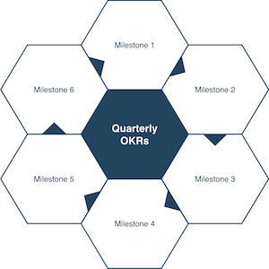
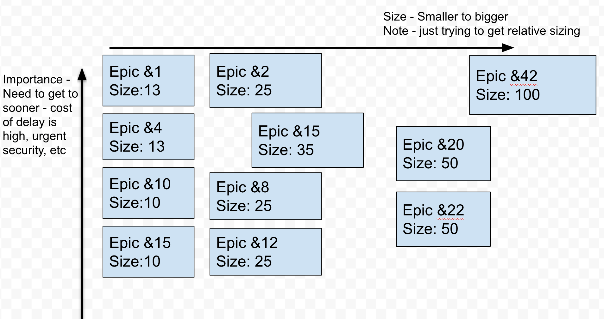

## On this page
{:.no_toc .hidden-md .hidden-lg}

- TOC
{:toc .hidden-md .hidden-lg}

## Planning in a DevOps / SRE team

There are multiple levels of planning.  This blueprint will start with the smaller level and work to the bigger picture.

### Milestones  

A DevOps team can work in short timeboxes - typically 2 weeks from a Kanban board.
Working from a Kanban style board is useful since it allows a team that handles interrupts to interleave unscheduled work into view of the work to be done.
The "ready" column on that board should generally have issues/stories that are ready to be worked.
Issues should be short lived and should have a clear set of actions and scope to be done typically inside of a week.

We will organize roughly six 2 week milestones around a quarter's work.  Those milestones will have work that align with our OKRs for the quarter.

### Measuring

By using the milestones as a timebox, we can start to measure and learn about our team flow.

At first, we can just measure our velocity - issue count and weight completed per milestone.

From this data, we can start to get input on:
1.  How much work do we do for toil related work?
1.  How much of our work is unscheduled?
1.  Are we overloading our upcoming milestones?

For example, if we figure out our team's velocity per milestone is 100 weight at approximately 50 issues completed.  We can start to make sure that milestones are not overloaded before we start.  A typical guideline is 50-60%, so we would want to start with no more than 30 issues in the Milestone to leave room for unscheduled work.

### Requirements for issues scheduled in a milestone

1.  The issue must be able to be completed within the milestone itself.  Preferably less - a few days to a week.
1.  Small items should have issues or a bucket issue for the milestone - it is important to collect and record as much of the team in the milestone so we have an accurate measure of what we are doing.
1.  If an issue is too big, it should be broken apart.  If the area of work is large and will have many issues, make and Epic and group the issues for all of the work to that Epic.  Labels on the related issues in the Epic will also help with visibility and making sure we prioritize the work appropriately.  Make a label name with the theme of the Epic and have each issue labeled the same.  This is typically a good point to also think about a [design MR](../../design/).

### Looking ahead to future Quarters and OKRs

As the team gets more data from a set of milestones in a quarter, it can start to look ahead at future quarters and OKRs.
Larger, future bodies of work, like OKRs or areas to the team sees for improvements can start as Epics.

The team can then use an estimate board to help evaluate both size and importance of those items.  This helps the team and leadership shape future OKRs.

With a rough estimate on bigger items, we are able to get ideas on what plans we can make for a Quarter and OKRs.
Continuing the example from earlier.  If the team has a milestone velocity of 100, we can estimate a velocity of 600 for the quarter.  Given again that this is a team that will face interrupts in the form of issues with production, security, etc, we usually would start with a 50% commit for the quarter of roughly 300 points.

With the Epics listed in the picture, there are more than 300 points worth of work in those items.  We also know those items are roughly estimated and they may grow in some cases if they have higher levels of uncertainty.  Having this data, the team and leadership can now engage in tradeoff decisions for the OKRs for the quarter and make sure that the most valuable work will get scheduled for the quarter.  In the case of the pictures, the bigger low Priority epics may be chosen to wait.

### How does this fit with Design docs?

We have [designs](../../design/) for bodies of work that are larger.

Since we are a globally distributed team, there is no time that will be convenient to do traditional planning meetings.  Nonetheless, some level of planning can be done by design owners.  Once a design is reaching a final level, its owners can make an Epic and break down the work into issues that will fit in the milestones for a given quarter.  The process of making these designs and breaking them down can happen with just the owners and they can get input from other team members as needed.  We can then track progress on the Epics outside of the milestone timeboxes.
