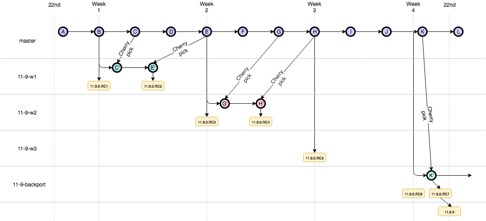
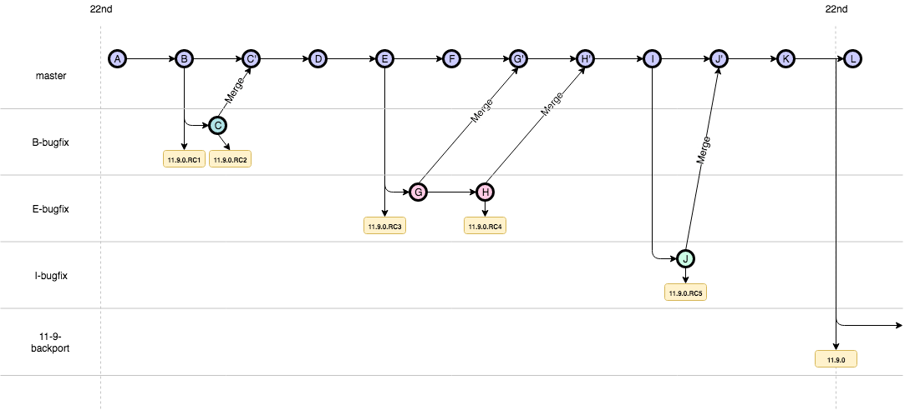
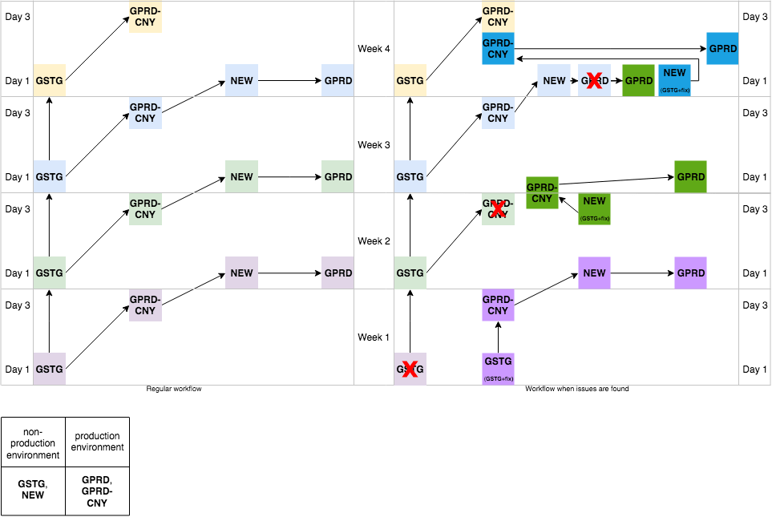

## On this page
{:.no_toc .hidden-md .hidden-lg}

- TOC
{:toc .hidden-md .hidden-lg}

### Resources

Blueprint: [Engineering release workflow]

Epic:

* [gitlab-org/release/epics/13](https://gitlab.com/groups/gitlab-org/release/-/epics/13)

## Overview

Design for [merging CE and EE codebases] explains how working in two codebases affects our speed for getting a feature or a fix **ready** for deployment.

This document will describe how we plan to increase the speed of getting the feature or a fix that is ready for deployment, and make it available for public consumption on GitLab.com.

**Important:** This document was [a design](https://about.gitlab.com/handbook/engineering/infrastructure/library/#overview) created in October CY2018 as a roadmap and
it does not reflect the latest state of the release workflow. For more information about the current
release process, please refer to the [official documentation](https://about.gitlab.com/handbook/engineering/releases/).
{:.alert .alert-info}

## Description of the current situation

Design: [CI/CD Pipeline] describes the situation as seen in October CY2018.
Since then, we've addressed a number of items raised in that design:

* New [deployer tool], running inside of GitLab CI, triggered by [GitLab Chatops] deploying GitLab to all GitLab.com environments
* [Automated deployment to the staging environment](https://gitlab.com/gitlab-com/gl-infra/delivery/issues/54) using a manual trigger from [GitLab Chatops]
* New [post deployment patcher], running inside of GitLab CI, used for hot-patching in all GitLab.com environments
* New [traffic generator tool], running inside of GitLab CI, continuously generating artificial load and executing GitLab QA against staging and production canary environments

At the moment of writing of this document (February CY2019), [version rollbacks] is in development.

Items that still require work are:

* Detach deployments to the GitLab.com environments from self-managed tagged releases, using commit from the `master` branch
* Fully automated and scheduled daily deployment to staging environments
* Automatically created deployment to production environments, requiring manual approval

## Detaching deployments from self-managed tagged releases

### Working with self-managed tagged releases

Currently, GitLab.com deployments are tied to [release process for self-managed GitLab installations](https://gitlab.com/gitlab-org/gitlab-ce/blob/11-8-stable/PROCESS.md#feature-freeze-on-the-7th-for-the-release-on-the-22nd). This process has two critical dates, 7th and the 22nd.

7th of the month is the so-called, feature freeze. At that point in time, a new slower running branch is created from `master` branch. This branch is named `MAJOR-MINOR-stable`(where MAJOR and MINOR are the version of GitLab to be released).

In the image above you can see that the `stable` branch moves slower than the `master` branch, and
that any necessary critical fixes are cherry-picked from `master` into the `stable` branch.

This setup was created in the early days of GitLab to ensure that brand new features are not introducing
regressions for users on GitLab.com. This system was working fine for as long as `master` branch was not faster than `stable` by orders of magnitude.
Another item worth highlighting is that the slower branch in theory introduces smaller amount of items to deploy between 7th and 22nd to GitLab.com, seemingly allowing for a more "stable" environment.

Neither of the two highlighted items above is true any longer: `master` branch receives a large amount of commits daily, and the first deploy after the 7th introduces a significant, large change into GitLab.com environments.

### Design

As noted in the [CI-CD blueprint], GitLab.com lives in the *now*. Any released feature gets consumed right away. Any bug, regression or security vulnerability is exposed quicker on GitLab.com. The model of having a `stable` branch gives the false sense of security because any improvement or a fix needs a full release cycle time to reach GitLab.com and that is no longer viable.
In the same blueprint, we state that we want to get to continuous delivery model. Jump between the current situation described above and our goal, is too large to execute in one step. The step requires changes in tooling, infrastructure, and even development culture all the while keeping the deployment and the release process of GitLab running.

The changes we need to think about are:

* Change from the current git release branching model with stable branches for development.
* Detach the build tooling from a single stable branch.

With this in mind, we need to think about a *Transition* process on our way to a *New* process.

#### Transition from the current release git branching model

The intermediate step is described in the image below:

While the intermediate step does not look that much different from the current process, it does create a few notable changes:

* The release month is divided into 4 weeks allowing for more continuous development like cycle.
* The feature freeze is no longer on the 7th of the month but moved more towards the 22nd release date.
* The weekly release branches exist only to react to a bug/regression.
* The build tooling is detached from a specific branch, and tied to a specific commit.
* The `stable` branch becomes a `backport` branch for self-managed tagged releases.
* The self-managed tagged release is created from the commit running on GitLab.com on (or just before) the 22nd of the month.
* Both automated and manual Quality Assurance task is spread across the 4 weeks allowing for more time to resolve problems.

To explain how one release month might look like, lets run through image above assuming that we selected a proper transition date and lets assume that the date is one week before the feature freeze date of the 7th for release 11.9.

*Week 1:*

At the time when we used to create `stable` branches, we would create a `11-9-w1`. This branch would still receive features and fixes scheduled for 11.9 release. When that branch is created, the first release candidate would be created and deployed to GitLab.com environments.
The automated and manual QA testing would be executed. Only the smoke tests in our QA suite would be able to "stop the world", the rest would be addressed based on the severity and priority. In case of an highly impactful issue that requires addressing, developers would create a MR with a fix and apply `~"Pick into 11.9"` label. During that first week, several new release candidates would be created and deployed through GitLab.com environments.

*Week 2:*

By the end of Week 1 we had several deployments through GitLab.com environments. Week two would start with a new branch `11-9-w2`, created from `master` repeating the same process as seen during Week 1.

*Week 3:*

In week 3, the `11-9-w3` would be created and due to not having any impactful fixes to be addressed, no additional work was required. At the end of Week 3, a new `11-9-backport` branch is created. This branch would become the feature freeze branch. This branch only receives fixes and a final 11.9.0 release would be tagged from this branch. It is worth noting here that a self-managed tagged release would be created based on the latest commit from the `11-9-backport` branch which is _running_ on GitLab.com.

*Week 4:*

Week 4 is actually Week 1 as a start of the new release cycle, and during this week we would have a new branch `11.1-w1`. We will also have a branch `11-9-backport` for the release cycle that just completed.

#### New git branching model

The git branching model for our deployments and releases is described in the image below:

The new process has several notable changes:

* There is no concept of feature freeze.
* The only long running branch becomes a backport branch.
* Fixes for any regressions are cherry-picked into master.
* Fixes are deployed from a feature branch.

In this model, release artifacts are created out of specific commits from the `master` branch and every commit on `master` is considered stable. This assumption is the primary requirement for complete removal of feature freeze. Commits are deployed from `master` branch when possible each day of the month, and a release for self-managed users is created on the 22nd based on the state in the `master` branch at that time.

In case of regressions and bugs found while the release artifact is progressing through GitLab.com environments, a `bugfix` branch is created out of specific commit. The developers would then resolve the issue in the `bugfix` branch, and a new release artifact would be created out of the feature branch. This artifact would then be deployed to at least one environment, and only when the fix is confirmed to be working would the release artifact propagate through the rest of GitLab.com environments.
Once the fix propagated through the environments, the MR can be merged into the `master` branch.

## Automated scheduled deployments

With the change in our git branching model, in parallel we require a change in our deployment cycles.

The changes we need to think about are:

* How do we ensure schedule automated deployment?
* How do we provide enough time for both automated and manual Quality Assurance.
* Changing the process of deploying regression and bug fixes.

### Design

Similar to the description of a change in the git branching model, the number of changes to tooling and processes is too large to execute in one step.
Here too, we need to think about a *Transition* process on our way to a *New* process.

#### Transition from the current deployment process

To complement the `Transition from the current release git branching model`, the image below describes an intermediate step in deployment process changes:

_Note:_ The colors describe different deployments. For example, light green box is describing the promotion through different environments of the same deployment artifact. Darker green shows that the deployment artifact is based on the light green artifact, with some changes included to address an issue.

The intermediate process has a few notable changes:

* Deployment cycle moves to weekly deploys
* First day of the week has two deploys, one to `staging` and one to `production` environment
* The rest of the week is used to address any issues that are found during automated/manual Quality Assurance tasks
* A `new` (for lack of a better name) non-production environment is created

The image also tries to describe a "regular" workflow where no issues are found during deployments and a workflow when the issues are found in any of the steps.

The "regular" workflow has a clear cadence: Day 1 of the week is reserved for deploying the `master` branch commits to `staging` environment found on Day 1 of the current week. Deployment to `production` environment is also done on Day 1 of the current week but using previous weeks commits, after deploying to a `new` non-production environment. Deployment to production `canaries` is done at the middle of the week, allowing for additional (automated/manual) QA through the rest of the week before promoting to `production` at the start of the following week.

When issues are found during one of the deployment steps, the process complicates a bit. For each of the cases when a problem is discovered in a different environment, we can describe the process:

*Week 1: An issue is discovered after a deployment to staging*

After deployment to the `gstg` environment, an impactful regression is found. In this case, the developers would checkout the commit that was deployed to `gstg` environment and create a fix. When the fix is ready, a new deployment artifact is created and deployed to the same environment. Once the fix is verified on the environment, the rest of the deploy promotion process continues as in the "regular" workflow.

*Week 2: An issue is discovered after a deployment to canary*

Deployment on the `gstg` environment didn't uncover any issues so the deployment promotion continued to the production `canary`. Once that deployment was completed, an impactful regression is found and that stops the progression of further deploys. Developers would need to create a branch based of the deployed specific commit and a new deployment artifact is created.
A new deployment is done on the `new` non-production environment and the fix is verified. Once confirmed, deploy continues to production `canary` and if all goes well again, to `production`.

*Week 3/4: An issue is discovered after a deployment to production*

Deployment process went well during week 3, and no issues were discovered when deploying through each of the environments. Once the deployment artifact was deployed to `production` environment at the beginning of week 4, an impactful regression is found.

In this scenario, the `production` environment is rolled back to the previous deployed version. In parallel, developers create a branch based of the deployed specific commit that was being promoted, and once the fix is ready, a new deployment artifact is created. The deployment is then executed on the `new` environment, and then production `canary`, verifying the fix each time.
Once we are sufficiently confident, the deployment is then executed on the `production` environment

#### New deployment process

The new deployment process would not be different from the transitional proposal created above. The only real change is the frequency of deployments, where the weekly cadence would be changed for daily cadence. This would mean that deployment on `gstg` and production `canary` would be done on day 1, and `new` and `production` environments would be deployed to on day 2.
For this to happen, we need to:

* [Full automated QA suite](https://gitlab.com/gitlab-org/quality/staging) is integral part of the deployment pipelines and we have sufficient confidence in produced results.
* Tried and tested deployment artifact creation tooling.
* Faster turnaround time for both spec runtime and artifact build times.

## Final thoughts

This design document covers a number of topics that are logically independent but
very much depend on each other:

* Engineering development workflows in releases through git branching processes
* Release branching timings and deadlines
* Deployment process through various GitLab.com environments
* Deployment timings and deadlines

Most notable missing peace is how addressing high priority and severity security vulnerabilities affects these deadlines and processes. That process has been omitted from this document only due to the complexity that the security patches bring to each of the topics. That process will be addressed in a separate design document.

<!-- Links -->

[engineering release workflow]: /handbook/engineering/infrastructure/blueprint/engineering-workflows/
[merging CE and EE codebases]:/handbook/engineering/infrastructure/design/merge-ce-ee-codebases/
[CI/CD Pipeline]:/handbook/engineering/infrastructure/design/cicd-pipeline/
[deployer tool]: https://gitlab.com/gitlab-org/release/docs/blob/master/general/deploy/gitlab-com-deployer.md
[GitLab Chatops]: https://gitlab.com/gitlab-com/chatops/
[post deployment patcher]: https://ops.gitlab.net/gitlab-com/gl-infra/patcher
[traffic generator tool]: https://gitlab.com/gitlab-org/release/docs/blob/master/general/deploy/traffic-generation.md
[version rollbacks]: https://gitlab.com/groups/gitlab-org/release/-/epics/6
[CI-CD blueprint]: /handbook/engineering/infrastructure/blueprint/ci-cd/
