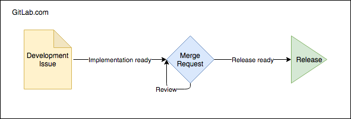
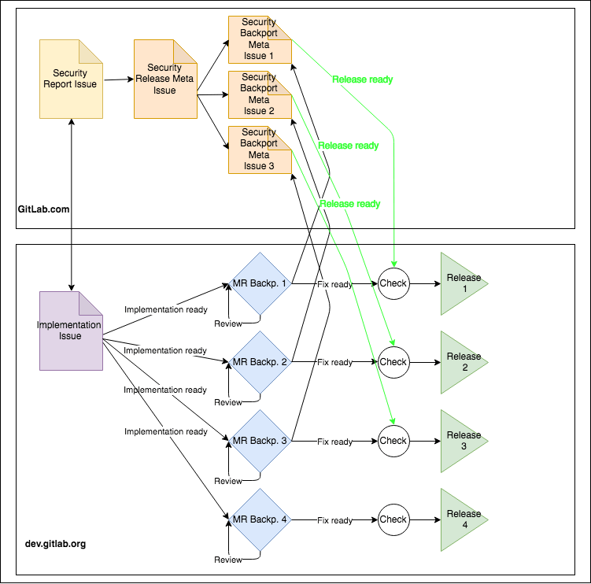
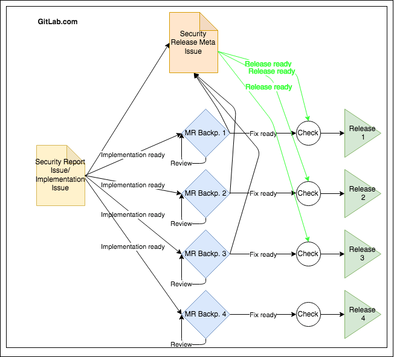

## On this page
{:.no_toc .hidden-md .hidden-lg}

- TOC
{:toc .hidden-md .hidden-lg}

### Resources

[Security release blueprint and design][Security releases blueprint]

Issues:

* [gitlab-ce/55648]

## Overview

As mentioned in our [Security releases blueprint library][Security releases blueprint], the main stake holders involved in
the security triage, development and release process have different workflows.

| Team                | Day to day work | Security release work |
| ------------------- | --------------- | ----------------------|
| Security            | Private         | Private               |
| Development         | Public          | Private               |
| Delivery (releases) | Public          | Private               |

While Security teams workflows do not differ between day to day and security release work,
for the Development and Delivery teams the difference is substantial.

## Development teams release workflows

At GitLab, Development teams work on public projects _by default_ on GitLab.com.



Development starts from a `regular issue` on a `public project` which contains all the research and discussions in the run-up to implementation. When the research is done, a developer will work on a Merge Request (MR) targeting the `master` branch, which will go through cycles of review. When the review is done,
the implementation is ready for merging and is merged by the reviewer. Depending on the milestone in which the implementation was merged, the release with the same milestone will contain the code.

With security fixes however, the workflow changes significantly. Development of
security fixes is done across two GitLab installations, `GitLab.com` and `dev.gitlab.org`.
Projects on `dev.gitlab.org` are private and accessible only to GitLab Inc. staff. Since those projects only see usage during security releases, a number of items that create one workflow might be missing or are out of date (milestones, labels and similar). User accounts can also have different usernames on `dev.gitlab.org` (since there is no rule mandating same username across different instances), increasing confusion and delay when needing an action from people involved.  Additionally,
working across different GitLab instances decrease visibility of work being done by
a developer. This workflow is described in the graph below:



The initial report is triaged in a `confidential issue` on a `public project` on GitLab.com, security report issue. The issue is used by a security engineer together with a developer to discuss the potential impact of the security report. The security report is then included in the security release meta issue, which is then used as a coordination issue between Security, Development, and Delivery
for each of the impacted version of GitLab and its backports. The meta issue is further broken down into security backport issues per version backported, to be used by the Delivery team for coordinating the individual releases.

The security report issue is used by participating developers to discuss ways of resolving the vulnerability. This is the first point where developers need to switch context between
`GitLab.com` and `dev.gitlab.org`. They create a `regular issue` (implementation issue) on a `private project` on dev.gitlab.org. They now also have to ensure that their local development environment now points to the correct instance (dev.gitlab.org) and to the project with the correct name (for historical reasons, GitLab CE is named gitlabhq on dev.gitlab.org).
From here on, they need to create a MR targeting 3 `security branch`es and a `master` branch for a total of 4 MRs. When the review is done, reviewer does not merge the code, but reassigns to the
release manager. This is probably not the last time both developer or reviewer will have to
come back to those MRs. Often, these MR's will conflict when merging to security branches
requiring additional manual conflict resolution. Developer also has to add a link of
each of the `dev.gitlab.org` MR's to the description of the security release meta issue.
This process is repeated by each developer participating in the security release.

When each of the security fixes are ready or the time for security release has ran out,
Delivery team prepares the security release. Per release being made, Delivery team
has to switch between the two instances: merging each of the MRs in dev.gitlab.org, marking them merged in the security backport meta issues on GitLab.com. When the MRs are merged,
Delivery team prefixes all release commands with `--security` in the tooling used for preparing the release. This can get overwhelming pretty quickly, take one of the releases where the team needed to take care of:

* Working across 6 repositories for 3 projects
* Approximately 150 MRs
* 36 tagged releases
* 12 branches
* Hours of failing pipelines
* 6 unreleased patch releases because of errors found during QA

## Developing only on GitLab.com

A number of these issues can't be resolved easily/quickly, but we can look at what impact removing the context switching between two instances would have.



By comparing this graph with the graph showing current security release workflow,
a few very obvious savings can be made:

* Security report issues can be used as the implementation issue keeping a SSOT
* Security backport issues are no longer needed

A number of other improvements are instantly gained:

* All stakeholders use the same accounts between regular and security development workflows (separate accounts on dev.gitlab.org no longer needed for this purpose)
* There is no need to manually edit descriptions of multiple issues to link to MRs because this is automatically handled by GitLab related issues/MR feature
* Issues and merge requests can re-use the existing labels, milestones and similar workflow related items
* Issue boards can be reused allowing teams visibility into developers workloads
* Reuse existing established GitLab.com CI infrastructure
* Pipelines between private projects for each of the components will be able to use deploy keys allowing green pipelines when prepping security release affecting multiple components
* We can lead by example showing that we have sufficient confidence in GitLab.com as a platform which is serving our security workflow needs

Additionally, automation can be easily achieved when development is done in one location.

## Design

Create a new subgroup that will contain repositories used by GitLab, example:

* `gitlab.com/gitlab-org/security/community-edition`
* `gitlab.com/gitlab-org/security/enterprise-edition`
* `gitlab.com/gitlab-org/security/gitaly`
* `gitlab.com/gitlab-org/security/gitlab-shell`
* `gitlab.com/gitlab-org/security/workhorse`

The group, and all projects would be **private**. The access to this project would be inherited
from the `gitlab-org` group. Access to `gitlab-org` group is granted during onboarding and apart from GitLab Inc. employees, Core team has access as well.
Given that the Core team has access to confidential issues, this change would have no real impact.

Each of these projects would have a _push_ mirror setup from the canonical repositories.
This means that projects in the `security` group would **receive** updates only from their source repositories.
Mirroring in the other direction would not be enabled.
Projects on `dev.gitlab.org` are also receiving updates from a _push_ mirror on GitLab.com.

Security report issues could be created in these repositories as `confidential` issues and then moved to canonical repositories when we are ready to open them up to public. This would allow us to localise all security related workflows under a single group.

We can then either reuse `@gitlab-bot` issue triaging bot or create a new one that would automate and enforce
some of the workflows. For example, we could look into having the bot enforce the following:

1. When the issue gets a `security` label applied, check if milestone and assignee are set
1. When someone gets assigned to the issue, bot user would check the milestone and automatically create a branch with predefined name in the security private repositories, and the MRs assigning it to the developer working on the fix
1. When these branches are created, leave the comment in the security report issue `@-mentioning` the assignee with copy-pasteable commands that developer needs to run, for example:
  ```
  Hi @assignee, copy the block below to start your work:
  scripts/security-harness prep
  scripts/security-harness branch security-1111-fix-the-vulnerability
  ```
This type of automation would greatly reduce the risk of accidentally pushing the changes to public repositories,
which still currently happens periodically.

Summarising the proposed **change in the workflows** with the table below:

|  Workflow                              | Current                                     | Proposed                                     | Change                        | Impact |
| -------------------------------------- | ------------------------------------------- | -------------------------------------------- | ----------------------------- | ------ |
| Projects used for security development | Private in .org                             | Private in .com                              | Projects hosted on GitLab.com | Reuse of GitLab project features, reuse of the employee usernames, simpler progress tracking   |
| Projects mirrored from public projects | Mirror from .com to private project in .org | Mirror from .com to private project in .com  | Projects hosted on GitLab.com | None   |
| Security report issues                 | Created as confidential issues on .com      | Created as confidential issues on .com       | No change                     | Reuse of GitLab project tracking features, issues linked automatically  |

## Compliance and security requirements

Before the change can be considered, we need to consider compliance and security requirements raised in [gitlab-ce/55648].

### Compliance

Information security/IT General Control frameworks (e.g. NIST, ISO, COBIT) outline several security requirements regarding the development lifecycle:

1. production environments must be segregated from non-production
1. newly developed code/features/configurations must be tested (in a non production environment) prior to being pushed into a production environment

GitLab.com is our production environment and our development is carried out on developers local machines and on GitLab.com. Before any of the items get deployed to GitLab.com, they go through non-production environments.
Basically, GitLab.com has two roles in our flows:

* As a tool for development
* As an environment for deployment

This means that security fixes are developed in developers local machines and reviewed using **GitLab.com provided tools**. When the fixes are ready, they get applied on non-production environments before they reach **GitLab.com production environment**.


### Security requirements

Comments in issue [gitlab-ce/55648] raise a couple of concerns:

* Availability during an active incident on GitLab.com (Disaster or other recovery plans)
* Development on a separate instance as a defense-in-depth measure
* Disclosure of information due to mistaken @-mentions or overeager auto-complete.
* How is the process of developing, reviewing, and building a security release isolated from the production load of non-GitLab users and projects? (Isolation)
* How is authentication and authorization to the security fixes controlled? (Access Control)
* How does the move affect the number of admin and privileged users with access to repository?

**Availability during an active incident on GitLab.com**

In case GitLab.com is unavailable, or there is a regression preventing use of feature required to develop a fix,
we can fall back to the development on `dev.gitlab.org` or `ops.gitlab.net`.
These would be exceptional circumstances, and in exceptional circumstances it would not be unreasonable to expect
that the number of fixes developed at the same time would be in single digits meaning that the impact of workflow changes
would be not high.

It is important to note here that the above discussion only relates to **development**. **Building** the security
release artifact (package, image) is out of scope of this discussion and remains **fully independent** from GitLab.com.
This is due to the fact that GitLab.com uses the release artifact for deployment in all its environments, requiring independence from GitLab.com.

**Development on a separate instance as a defense-in-depth measure**

It is reasonable to conclude that developing on a separate instance is a good defense-in-depth measure.
One of the challenges we are experiencing is that we are using GitLab to build GitLab, dogfooding all of our
features. All of our development workflows are tightly coupled to GitLab.com projects, groups and items.
Because of such high dependency on workflows that are on `GitLab.com`, `dev.gitlab.org` isolation appears like a good measure.

This is why we need to look into our current workflow dependencies:

* Initial security report issue is created on GitLab.com. This issue contains all the information necessary to take advantage of security vulnerability, without any code being created
* We depend on developers to push the fix to the correct remote. This is partially addressed by providing tools and processes but can never be resolved as long as all developers have permission to push to projects
* Separate configuration of projects on `dev.gitlab.org` and `GitLab.com` cannot be fully synced because of different editions of GitLab used (Community Edition vs Enterprise Edition) and the lack of tools to enforce that a change in a project is reflected in another (regardless of the location of the project)
* `dev.gitlab.org` runs a nightly installation and it does not receive security hot-patches as quickly as GitLab.com

Given that this separate instance is exposed to the public internet, the usual tools that would allow better access control such as VPN access and similar means that work separation
has limited benefits.

Development of security fixes on a separate instance might also have some drawbacks.
We put a lot of effort into making gitlab.com secure. Because we develop critical
security fixes on dev.gitlab.org we now need to divide our focus by two instances.

We do not have any data to support a claim that malicious actors determined to
get access to 0-day vulnerabilities in GitLab exist, however it might be a
reasonable approach to assume that they do exist. Because dev.gitlab.org
is a publicly accessible instance, and we are not hiding its existence, we should
also assume that malicious actors know that this instance exists, therefore
dividing our focus and spending time and effort on making two instances secure,
makes a job of a malicious actor easier.

dev.gitlab.org also runs GitLab Community Edition, and does not have some
important features available (like push rules, for example).

**Disclosure of information due to mistaken @-mentions or overeager auto-complete**

Private repositories in GitLab will allow you to only `@-mention` users who are members of the project or
the group project belongs to. This means that the accidental information disclosure is more likely to happen in a public project like `gitlab-org/gitlab-ce`.
The possibility always exists that a feature regression exposes information to unauthorised personnel but that would affect security development the same way it would affect the rest of the confidential/private information stored on GitLab.com for all users (not only GitLab Inc.).
Given that we are making GitLab.com ready for mission-critical customer workloads, dog-fooding in these cases also matches the general company philosophy.

Another point is this discussion might be that accidental exposure of
confidential information to random users may be less of concern than making it
easier for malicious actors to gain access to 0-day vulnerabilities.

**How is the process of developing, reviewing, and building a security release isolated from the production load of non-GitLab users and projects?**

The isolation is done through project and group permissions. GitLab has three visibility levels for projects/groups and the proposal suggests setting private level for both.
With private visibility levels, only project/group member have visibility into the project repositories and metadata. As stated earlier, proposed changes in this document
only apply to **development and review workflows**, building security releases is a separate workflow.

In the event of data breach on GitLab.com, an unauthorised person would be able to gain access to private projects/groups through a security vulnerability inside of GitLab.
GitLab.com does not run a special version of GitLab, and that would mean that the breach would be possible for any instance of GitLab exposed to the public internet.
dev.gitlab.org also runs unaltered version of GitLab and is exposed to public internet, and due to all our documentation including project names on dev.gitlab.org being public,
the same risk applies to a separate instance.

**How does the move affect the number of admin and privileged users with access to repository?**

GitLab.com has larger number of admin users than dev.gitlab.org instance.
All GitLab.com admin users are GitLab Inc. vetted users, and having admin access on GitLab.com gives admin exposure to all customer information.
This case also covers the proposed move of development of security fixes to dev.gitlab.org.
The number of admin users on GitLab.com is 30% higher than the number of admin users on dev.gitlab.org.
This fact however, should not have direct impact on the proposed workflow given that all admin users are also members of `gitlab-org` group on
GitLab.com which contains the `confidential` security report issue.

## Conclusion

With the details provided above with description of the current situation, proposed change in the workflow and the security requirements we need to
draw conclusions on whether the proposed change brings additional security risks.

If the change does impose new risks that we (GitLab Inc.) are not willing to take, we need to:

* Dedicate more resources (time, engineering hours) to address the very difficult current workflow with *the highest urgency*
* Re-evaluate the security of the current workflows

If the change does get approved, Delivery team will start working on migrating the projects and change the process.
This change would be done together with Security team as a final approver of the change.

[Security releases blueprint]: /handbook/engineering/infrastructure/library/release/security/
[gitlab-ce/55648]: https://gitlab.com/gitlab-org/gitlab-ce/issues/55648
