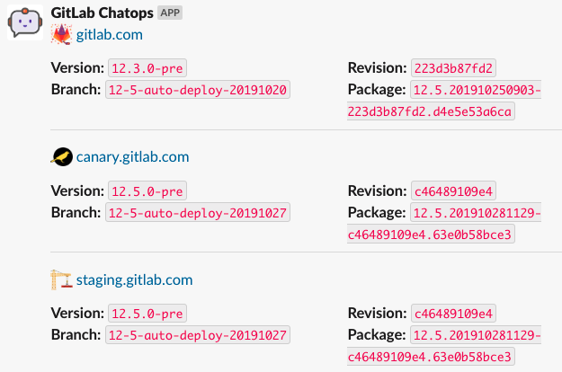

## On this page
{:.no_toc .hidden-md .hidden-lg}

- TOC
{:toc .hidden-md .hidden-lg}

## Overview

This page lists a number of tips and tricks we have found useful in day to day Quality Engineering related
tasks.

## Running Gitlab-QA pipeline against a specific GitLab release

While working on the [GitLab-QA codebase](https://gitlab.com/gitlab-org/gitlab-qa), it is sometimes helpful to run the GitLab-QA pipeline
against a specific release of the [GitLab project](https://gitlab.com/gitlab-org/gitlab). This could be
due reasons such as that particular GitLab release containing specific code needed for validating the changes made
in Gitlab-QA. To run a [GitLab-QA pipeline](https://gitlab.com/gitlab-org/gitlab-qa/pipelines) against
a specific GitLab release, we need to know the GitLab release version created and tagged by the omnibus pipeline.
This can be found by either observing the `RELEASE` variable in any of the `package-and-qa` test jobs or
in the last output line of the `Trigger:gitlab-docker` job triggered by the `package-and-qa` job. Here is an example of what the `RELEASE` string
looks like:

```bash
registry.gitlab.com/gitlab-org/omnibus-gitlab/gitlab-ee:41b42271ff37bf79066ef3089432ee28cfd81d8c
```

Copy this string and create a new [GitLab-QA pipeline](https://gitlab.com/gitlab-org/gitlab-qa/pipelines)
 with a `RELEASE` variable and use the copied string as its value. Run the pipeline against the branch that
 has your changes.

## Determine the version, revision, branch and package deployed in GitLab environments:

To find out the version, revision, branch and package deployed in gitlab.com, staging and canary environments,
run this in the #chat-ops-test Slack channel:

```bash
/chatops run auto_deploy status
```



You will [need access to the https://ops.gitlab.net/gitlab-com/chatops](https://docs.gitlab.com/ee/development/chatops_on_gitlabcom.html#requesting-access) project to run `/chatops` commands.
Ask to be added to this project in the #development Slack channel.

## Determine if a change has been deployed to an environment using revision SHA

If you have a revision SHA that is deployed on an environment, you can find out if a change has made it to that environment.
For example, if the revision SHA deployed on an environment is `c46489109e4` and you want to find out if a change in
`restrict_by_ip_address_spec.rb` has made it there, you can use:

```bash
git show c46489109e4:qa/qa/specs/features/ee/browser_ui/1_manage/group/restrict_by_ip_address_spec.rb
```

You can determine the revision SHA deployed on a GitLab instance by either navigating to www.example.com/help,
by calling the `http://www.example.com/api/v4/version` API or by running `/chatops run auto_deploy status` in a Slack
channel such as #chat-ops-test.

You can also determine if your commit has been deployed on a GitLab environment using [ChatOps](https://docs.gitlab.com/ee/ci/chatops).
For example, if your commit ref is `347e530c5b3dec60c0ce2870bc79ca4c8273604d` you can run this command in a Slack
channel such as #chat-ops-test:

```bash
/chatops run auto_deploy status 347e530c5b3dec60c0ce2870bc79ca4c8273604d
```

## Determine the commit SHA of a nightly image

The commit SHA for a nightly pipeline can be determined in the following ways:

### By visiting the /help page or calling the `/api/v4/version` API

Run the nightly docker image

```bash
docker run \
    --hostname localhost \
    --publish 443:443 --publish 80:80 --publish 22:22 \
gitlab/gitlab-ee:nightly
```

The commit SHA can be determined by visiting the http://localhost/help page after sign-in
or by calling the [`/api/v4/version` API](https://docs.gitlab.com/ee/api/version.html#version-api) where it is displayed as a value of the `revision` attribute.

### By inspecting the pipeline that created the nightly image

Nightly images are created by scheduled pipelines here: https://dev.gitlab.org/gitlab/omnibus-gitlab/pipeline_schedules

You can look at the last pipeline by clicking the pipeline number for CE nightly or EE nightly under
the "Last pipeline" column.

In the pipeline view click a job under the "Gitlab_com:package" column. The SHAs for GitLab Components
are listed towards the end of the logs. The GitLab commit SHA is displayed as a value of `gitlab-rails`.

## Configure VS Code for gitlab-qa debugging

The [Ruby VS Code extension](https://marketplace.visualstudio.com/items?itemName=rebornix.Ruby) adds a few Ruby-related capabilities to VS Code, including the ability to debug Ruby code.

After you install the extension you can use VS Code to debug end-to-end specs running against your local GDK. You will need to add a Run configuration to `launch.json`. For example, the following `launch.json` will add a configuration named `Debug Test::Instance::All current file` to the list in the Run view of your Sidebar. Then, with a spec file open in the editor you can start debugging (F5) and VS Code will run the tests in the spec file.

```json
{
  "version": "0.2.0",
  "configurations": [
    {
      "name": "Debug Test::Instance::All current file",
      "type": "Ruby",
      "request": "launch",
      "useBundler": true,
      "pathToBundler": "<path_to_bundler>",
      "cwd": "${workspaceRoot}/qa",
      "program": "${workspaceRoot}/qa/bin/qa",
      "env": {
        "CHROME_HEADLESS": "false",
        "QA_DEBUG": "true"
      },
      "args": [
          "Test::Instance::All",
          "http://localhost:3000",
          "--",
          "${file}"
      ]
    }
  ]
}
```

You can include multiple configurations, and any environment variables or command line options can be included. For example, here's one that will debug smoke tests while running them on Staging:

```json
{
  "name": "Debug Staging Smoke tests",
  "type": "Ruby",
  "request": "launch",
  "useBundler": true,
  "pathToBundler": "<path_to_bundler>",
  "cwd": "${workspaceRoot}/qa",
  "program": "${workspaceRoot}/qa/bin/qa",
  "env": {
    "CHROME_HEADLESS": "false",
    "QA_DEBUG": "true",
    "GITLAB_USERNAME": "gitlab-qa",
    "GITLAB_PASSWORD": "from 1Password",
    "GITLAB_QA_ACCESS_TOKEN": "from 1Password"
  },
  "args": [
      "Test::Instance::All",
      "https://staging.gitlab.com",
      "--",
      "--tag", "smoke"
  ]
}
```
